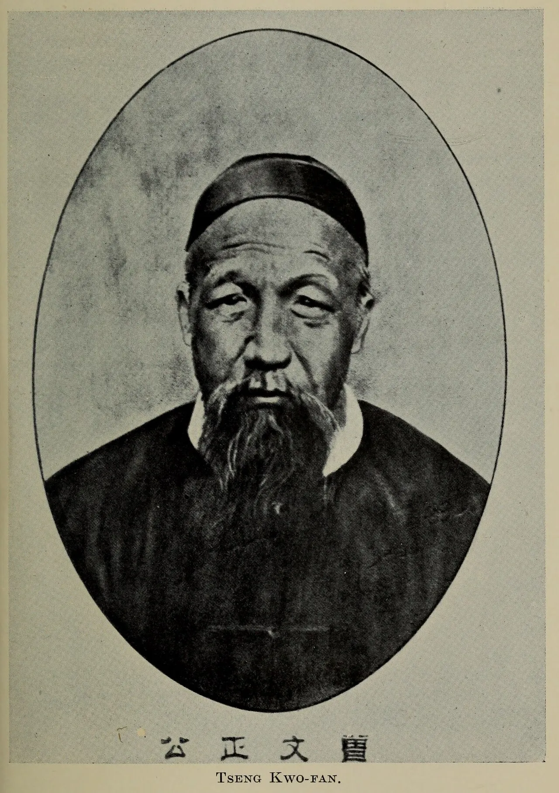
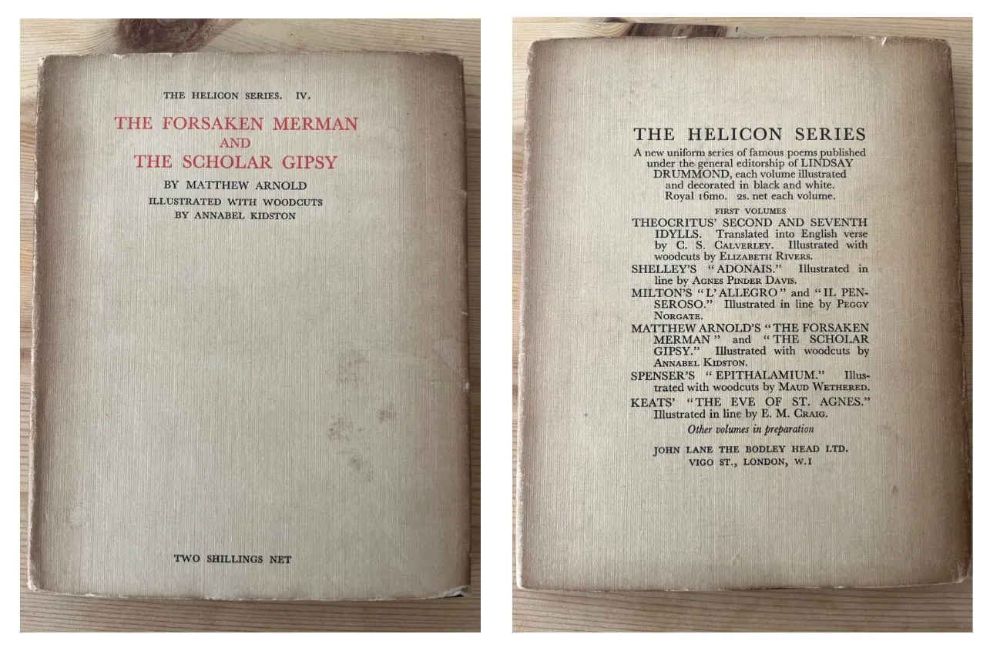

# Against the brainrot

**Date:** 2025-11-07  
**Author:** Kamil Kazani  
**Source:** https://kamilkazani.substack.com/p/against-the-brainrot  
**Copied to Keg:** 2026-06-09 

---

Reading the Autumn in the Heavenly Kingdom by Stephen Platt (highly recommended), I was particularly impressed by the rules of life of Zeng Guofan, the conqueror of Taipings. This scholar turned general developed some really interesting intellectual routines.

Read the classics. Read it slowly, there is nowhere to rush. Take notes, when reading. Always finish one book, before starting another. Keep the diary. Take an hour meditating, every morning.

I really liked these guidelines, liked their whole spirit. By and large, their logic resonated with my own conclusions, and observations. So, I took this occasion to write them down, and explain some of the intellectual practices that I find particularly useful, especially in our age of internet and social media.

Were I to summarise their general idea, I would put it in the following way:

### You should be doing the slow, pensive reading of time proven classics

The point is not even about reading good books. The point is that you should be reading them slowly.

It is crucially important that you do not rush anywhere. The point of reading is not in swallowing as many words per minute as possible. Nor it is in scanning the text for any particular bit of information[^1]. The point of reading is in having a quality conversation with a smart, cultured person from long ago, a conversation that ought to cultivate your own conscience, and sow the ground for your own mental work.

### Reading, is how you are getting your own ideas

Not even in a sense that you steal or borrow them from the long dead authors (this, too). But also, and more importantly in a sense that the very process of reading serves as a high quality meditation that tunes your brain in a certain way, setting it on a smarter, and a more creative mode.

That is why the process of reading, in a proper sense, must be slow, and must be meditative. If you want to cultivate your intellect, and your own ideas, you need to do some groundwork. Abandon all the nonsense of “efficient reading”, and read inefficiently. Focus on few texts, and read them slowly, without any rush.

### Quality > Quantity

What books to read though?

Notice that I am not preaching you to read the high brow “intellectual” stuff. In fact, I think that lots of people are overdoing just that. There is a huge danger that consuming too much of the over-sophisticated, nerdish content will give an ugly, overly lopsided turn to your own thoughts and conscience. Over-sophistication is just another form of grinding, something that I would certainly warn you against.

Not a good look

A lot of people are hitting the gym, while what they really need is just move. Jump, run, dance, box, play some team sports. A lot of people are diving into the over-sophisticated “intellectual” stuff, while what they need is some kind of artistic, aesthetic impression in their lives.

If I were to give you an advice regarding your intellectual routine, I would recommend to start your morning (or finish your day, whatever your prefer) with a poem.

Why?

Well, first because poetry is fiction, and fiction is - of course - more real than non-fiction. Like, if you want to learn something about modern China, you can skip like 99% of modern “scholarship”, and just watch some movies of Jia Zhangke, with subtitles. That will give you a deeper and a better understanding of the country, and its recent history that almost any foreign commenter on China has.

(Fiction is factual, and non-fiction is nearly always not. If you, for example, need some quality advice on dating and relationships you can safely skip the entire modern discourse and go straight to Ovid)

Second. I would say that poetry is more basic, more fundamental, and certainly more ancient form of art than prose. Its demise happened relatively recently, in history and coincided with the general decline in verbal intelligence. So, when you consume old poetry, you almost certainly consume the product of verbal culture far higher than your own.

(And if you interact with that culture, you, too, become smarter)

Third. A great thing about poems is that they tend to be short. Like, yes, of course, in practice their length can vary. Still, what unites them is that they present a lot of information, in a highly condensed form. Poems are not just informative, they are also compact.

(And that means you can read great many of them, and read them slowly)

Now that is why I recommend to start the cultivation of one’s own literary taste, and of one’s own conscience, with poetry rather than anything else. Poems are short, and that means you can realistically devour a short, beautiful piece of literature in a very short time. Again, poems are short. And that means that you can try out a broader range of texts, and a broader range of authors than you could do with prose.

(Like, it may not be realistic to get a decent understanding of English prose within a year of reading for like 30 minutes a day. But it is absolutely possible to get a good grasp of English poetry, doing just that)

Even more importantly. If you try out many poems, and many authors - and that is easier to do with poetry than with prose - that gives you a greater chance to find something that resonates with you, personally.

Now why would you want that?

Well, first, because it’s cool & because it is pleasant. There is hardly anything more satisfying than connecting with another soul, from centuries and millenia ago.

But there is another explanation, too. The thing with your style is that you cannot build it out of nowhere. You cannot just create it out of the void. Nope. To develop it, you need some model, some example you would love so much, you will want to emulate it. And it is by emulating what you love and enjoy, that you build your own style and your own mode of expression.

(That is what I always advice to those new to English. Best thing you can do, is find the author you love, whom you will want to copy. How do you think did the Renaissance artists develop their style of visual expression? They discovered the ancient works they enjoyed, and copied them. You must do the same)

Long story short, reading a range of old poets, and reading them daily or so, will give you a broad, and comprehensive understanding of the old literature, and with relatively little effort. And that serves as a critical groundwork, now for developing your own taste, and your own style. By and large, you can assume that the old literary culture is just better, and consuming it will make you good, very good.

Some kind of short poem, few pages a day will be enough. For that, of course, you need to keep a fresh supply of poetry at home, so you will always have it at hand in the morning. Again, I highly recommend having it all in paper form and, ideally, the form should be beautiful. If you can, start your day with interacting with a nice work of art.

One of my recent acquisitions in that regard, Helicon series. Beautifully printed, a broad range of the English (mostly) poetry from the 16th to late 19th cc. And that the range is broad is good, for it is much more important to read widely than deeply, and more important to taste a range of authors rather than to dig into one.

At this point, there is no need to “analyse” them, or approach them critically. Simply enjoy, try to understand, absorb the vibe, and the general context. Who is the author. When did he write, what did he write. Why. What was the culture, and what was the age he was working in. How did the discourse of the era look like. What were its cultural and the intellectual premises. I believe that this kind of effort must precede any serious approach of more fundamental, or more theoretical works.

(There is no point in studying some general theory, if you simply lack erudition)

But what if you struggle to understand this kind of texts? Well, that is a good thing, actually. It is perfectly normal for them be hard or incomprehensible because again, the whole point of it all is in interacting with some other consciousness, different from your own. And, by and large, you must assume this conscience to be higher. That is important for no kind of learning and self-cultivation is possible without a certain degree of humility.

## Footnotes

[^1]: like this is a whole different practice that has nothing to do with what I am talking about

