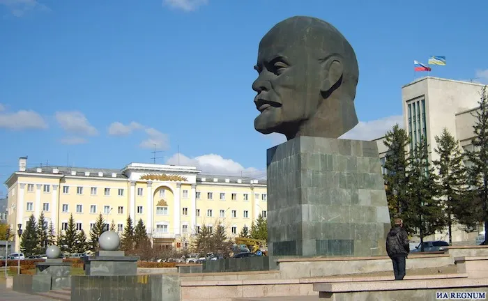

# Against the brainrot

**Date:** 2026-06-05  
**Author:** Kamil Kazani  
**Source:** https://kamilkazani.substack.com/p/the-wisdom-of-vladimir-lenin 
**Copied to Keg:** 2026-06-09 

---

There is a common wisdom that men of thought want to be the men of action and men of action want to be the men of thought. I think there’s lots of truth in that. Because there’s little overlap between the two, and, yes, of course, the grass is always greener on the other side.

### Vladimir Lenin was a man of action

Although praised, and canonised as a theoretician, he was first and foremost a **practical politician** of the enormous calibre. And the correct way of reading his works, is through the practical, pragmatic lenses.

Will you find there some deep theoretical insights about the fates of humanity? Well, yes, but not many, and not very deep ones. In this particular regard, he was okayish, but not spectacularly good. Second, or third rate thinker. No more.

What he was spectacularly good at, is sharp & deep observations on the practical issues of political struggle. What you can find in his works, is some extremely good practical advice (and not only on politics)

For example. There is a short article, named Where to start? (1901) summarising the plan for his future party (or rather, his faction within the Russian social democrat party). Where should you start, what will be your step one when launching a new movement?

And Lenin’s answer is:

### Start with a newspaper

There are many reasons for that.

But the real reason is: when you start propagating your creed, that will force you to **formulate that creed in the first place**. So, although you are writing to persuade others, in the process of writing you will discover what you yourself believe in. Because although you have some views, of course, they are vague, unclear, obscure, even to you. Writing and publishing, writing and publishing - that’s how you will sort it out.

*(That is also a reason, why you should be cautious with generative models. The process of writing is a process of self-discovery, of figuring out what you think of this or that. If you delegate it all to the model, you are discovering what the model thinks, and not you. “Writing is thinking” is seen as a generic, boring commonplace, but yes, from Lenin’s perspective it absolutely is a necessary step of figuring out what your personal views even are)*

So, ideology, and political stance is not something that precedes propaganda. It is something that is being figured out, in the process. Preaching to the flock, that’s how you discover your own symbol of faith.

And that is important, because you need a coherent system of views to persuade anyone. Nobody will listen to you if you are preaching some incoherent mess. BUT to work out a coherent system of views, you must put yourself in a position that will force you to sort it out. Otherwise, you will never do it, practically speaking

So, what would Vladimir Lenin advice today, in our age? I think his advice would be:

### Start with a podcast

Start with a YouTube. Start with videos.

Start with the ‘low’ genres, and with the formats that the audience does actually consume. Start with the fast to create products, that will allow you to speed up your feedback loop from the audience. The platforms that will allow you to scale up.

*Notice that Lenin was writing tl;dr books as well. But he did not recommend to start there. That is because he was a practical thinker, and recommended focusing on something with the low entrance barrier, scaleable, and, last but not least, something allowing you to accelerate your learning process by collecting the feedback both positive and negative.*

In his day and age, newspapers and broadsheets were a low status product. Not something very important, not perhaps something very respected. But that was a kind of product that was absolutely booming, and that meant - people were reading it. People were listening. And a public intellectual with the political ambitions (= who Lenin was) had to come out to the people, had to find out where they were, and come there.

Everyone is starting a newspaper → You, too must start a newspaper

Everyone is starting a podcast → You, too must start it

You have to come out to the agora, to the market square, and there talk with people on their own terms, and in a language they will understand. That's what you should be doing as a public intellectual.

And Lenin understood it better than anyone

---

In this context, I cannot help but to draw a comparison with Plato

Plato was an impossibly good man of thought, perhaps, the single best one in the recorded history. His insights, are incredible, divine.

But as a man of action, and as a practical politician, he was a child. Absolute toddler. In (political) action, Vladimir Lenin towered above Plato just as much as Plato towered above him in thought.

Plato of course wanted power. Nearly all intellectuals do. But - wanting power - he was childishly naive and childishly delusional about how he will get it. For what was his plan?

1. Approach a tyrant, a man in power
2. Become his advisor, a power behind the throne
3. Use the tyrant to execute your plans & your agenda

The plan is incredibly common (countless intellectuals would try it in centuries after Plato), and incredibly naive. Because obviously no man in power needs a 'philosopher’ who would be telling him what to do. That is an absolute self delusion on behalf of a philosopher. A tyrant needs servants, he needs slavs, he - if he is mentally healthy - needs a jester. But philosopher? No, he does not really need one.

What is more, Plato's plan was sort of… undignified. I mean, in a childish way. He does not want to seize power, he does not want to fight for power. He wants to find a man who already has what he wants, and use his resource as if it was his own.

The audacity. No wonder the guy sold him to slavery, in the end

Lenin, the practical man, approached this problem with clear sightedness, and with dignity that Plato, the thinker, seemingly never acquired. I cannot find a man who will just give me away his power thought Lenin. Nor will I find anyone who will just obey me, and do what I tell him to do. If I want power, I must be self reliant, and rely on my own forces, and build it bit by a bit, step by step, from almost nothing.

There is much more dignity in Lenin's scheme, than there's in Plato's. Much more self reliance. In this, practical regard, Lenin compares to Plato, like an adult would to a child.

