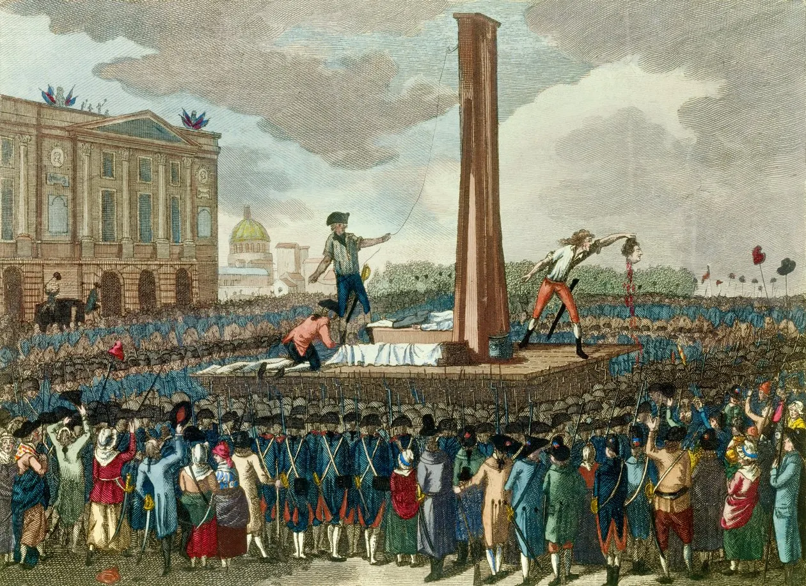

# Document Title

**Date:** YYYY-MM-DD  
**Author:** Author Name
**Source:** www.source_url.com
**Copied to Keg:** 2026-06-24 

One-line tagline

---

First paragraph. 

Paragraph with footnote.[^1] Can continue paragraph

Another paragraph.

Another paragraph and then a longer quote.

> Concepts of economists and political philosophers, both when they are right and when they are wrong, are more than is commonly understood. 

### Important note that should stand out from the surrounding text.

Fin. Statement connects to tagline.[^2]

---

## Footnotes

[^1]: Supporting information, citation, reference, or additional context.

[^2]: Additional detail that would interrupt the flow if placed in the main text.