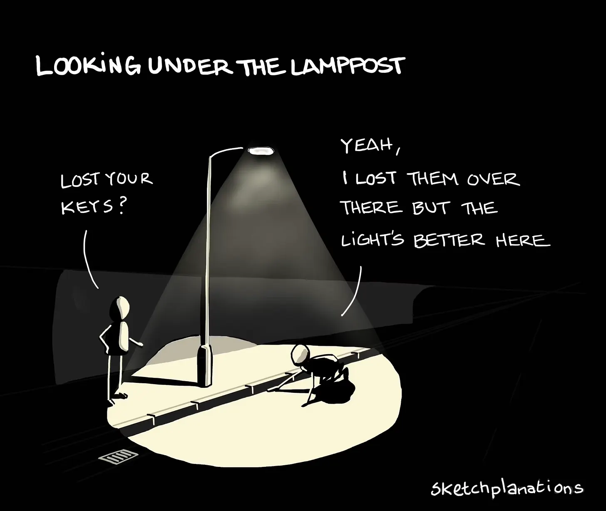
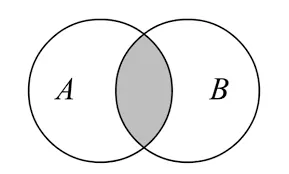

# AI and Bureaucracy

**Date:** 2025-06-12  
**Author:** Kamil Kazani  
**Source:** https://kamilkazani.substack.com/p/ai-and-bureaucracy  
**Copied to Keg:** 2026-06-12 

---

There’s been a lot of anguish & moral panic about the AI writing, recently. I see most of it, as stupid and hypocritical. AI generated stuff is clearly superior to the human-created one. Much and much superior. Today I will show you how.

First, we need to understand the culture we live in. Most of our life, we spend within the confinement of large, bureaucratic structures. School. University. Corporation. All of that under the umbrella of a yet greater and more Leviathan-ish bureaucracy of the state machine.

It is the bureaucracy that sets the rules, and it is the bureaucratic preferences that we must (and will) adjust to, and not the other way around. It is very important to understand that. Now one thing you need to realise about bureaucracy is that it has a strong (extremely strong!) preference for **monotony.**

That is only natural. Bureaucracy does not know reality, and cannot process reality in all of its complexity (no one can). All it can work with is very simple mental models, based on a few standard categories, and few parameters you need to optimise for. Now what you need to know is that bureaucracy does not choose the most accurate model (also, how does it know it is the most accurate), but the more scaleable one.

When I say scaleable, I mean that you can give this model to an average, or somewhere below the average executors, and they will understand it more or less correctly, and will perform standard, predictable actions based on it. And that the upper management high above will understand what these executors are doing, again, more or less correctly. And that is only possible when you are doing standard operations, with standard objects, based on the transparent (important!) criteria.

Bureaucracy hates variation, and does not know what to do with it. Everything it knows it how to works with a few categories of objects and optimise for a few parameters. That is the perfect world from the bureaucratic perspective. That’s what informs its preferences. Consequently, whenever possible it will be selecting for monotony, and against variation, over the long run creating the most monotonous landscape possible. Physical. Social. Intellectual.

You have a preference for monotony. You are selecting for monotony. And, in the end, you end up with monotony, as all types of actors (including humans) will be adjusting themselves for your preferences.

This largely comes from necessity. Everything outstanding, unusual, bizarre - puzzles bureaucracy, as its mental models are simply not fit to deal with it. The most it can do, is to classify the object not in any of its standard categories, into the separate category of ‘bizarre’, and throw it all away, into the trashbin.

> That is a major reason, why the large institutions always ultimately fail. They fail, because they have missed too many opportunities, and the trashbin in their storage is full of diamonds. Which they cannot see, and recognise as such

Bureaucracy is based on transparency, it is based on objectivity, because otherwise it will simply not work. It can work only with what is transparent and legible. **It can work only with the well known.** Now a great deal of stuff is not very well known, and much of what is not well known is important.

*Frame it this way, and you will realise how a great mighty industrial company from the US or Europe suddenly loses everything to a palaeolithic workshop from China. The great and mighty are strictly limited to what is under the lamppost. The shameful and deplorable can venture outside. In fact they must, because everything under the lamppost has been already devoured by the great and mighty. They HAVE TO venture outside, into the epistemological darkness*

Now one major preference of every bureaucracy in the world, is the preference for quantification, and for the decision making based on quantitative measurements.

That is only natural. Bureaucracy is naturally pretty good in evaluating quantity of stuff, but is very bad in evaluating quality of it. I don’t even mean good vs bad, I mean - qualitative differences between things. Bureaucracy cannot judge them very well. Consequently, any kind of qualitative-based decision making will be failing, and the larger the organisation, the greater will be the fail.

Criteria of decision making within a bureaucratic structure must be legible, objective, and quantifiable, or nothing will be working at all. Naturally, bureaucracy will be treating everything vague, unquantifiable and elusive as BS, because again, it cannot work with this kind of stuff. Feelings and vibes cannot work as the criteria of bureaucratic decision making.

Here, however, lies the problem

A - important and relevant. B - quantifiable. Bureaucracy can work only and exclusively with B. Some of the things it can work with are relevant and important (shaded area). Other things, that it can and does work with, are not so relevant. And there is always a great area where it simply cannot venture, not without self-destruction. The non-shaded sector of A, is - mostly - prohibited for the mammoth structures ruling this world. Only the mice can sneak there, but the dinosaurs can’t.

### The dinosaurs can only work with numbers, and with the quantifiable

One interesting trend I see in today’s world, is the trickling down of the quantitative discourse into the *personal* decision making, i.e. in dating. Notice in which terms people are describing the desirable or undesirable partners.

1 to 10 looks **scale**

Height (in inches)

Body **count**

Scale. Count. Numbers. All of that reflects the now now nearly universal preponderance of bureaucratic thinking. How could it be otherwise. All of these people spent their whole life adapting to the bureaucratic structures, and adjusting to their way of thinking.

Quantitative measures, that’s all a bureaucracy can understand. Everything else is BS, from its perspective. So, naturally, people who have been raised within the bureaucratic structures, educated - by the bureaucratic structures, selected - by the bureaucratic structures and according to the bureaucratic preferences, are thinking like bureaucracy, in everything - including in who they are going to sleep with.

In a way, they have been all domesticated by the bureaucratic structures. And, a key feature of a man domesticated by a bureaucracy is that he is afraid of his own judgement. Like, mortally scared of it.

Any ability for the personal, subjective, qualitative judgement based on own intuition and vibes (rather than on the pre-approved bureaucratic criteria) had been beaten out of him by the constant negative reinforcement, and from the very early age. By the time he reaches adulthood, he has fully interiorised the bureaucratic epistemological preferences, and is deeply uncomfortable with anything else.

### Specifically, he becomes uncomfortable with the decision making **explicitly** based on feels and vibes

Hard to swallow pill. When dealing with the unknown, vibes, feelings, intuition and a bit of luck can work much better than a clear & transparent analysis based on some kind of objective, quantifiable metrics[^1]. But the bureaucracy cannot work with feelings and vibes. And neither can a man, domesticated by the bureaucracy. A domesticated person is mortally terrified, of own feelings, of own intuition, of own thoughts, and own ideas. For decades, he has been trained to never ever raise his own voice, and never express himself. So, naturally, he does not know how to do it.

## Bureaucracy and Education

Now here we come to the important point.

Educational institutions - today - tend to be extremely bureaucratised, on every stage of one’s education. And, naturally, they tend to develop very bureaucratic preferences, including the preference for monotony.

And that gives us an insight into the rising popularity of the AI generated writing, from the perspective of demand. One major reason AI finds itself so popular is that it serves the role of supplying the bureaucratic entities with the monotonous product.

Honestly, most of the complaints on the use of AI in education strike me as sort of disingenuous. Bureaucratically organised school or a university wants a monotonic product, it demands a monotonic product. It shuns from anything bizarre, it in fact it shuns away from anything genuine.

Writing - is a tool of genuine self-expression, and, very often, of a genuine self-reflection. Of figuring out what to express. As Vladimir Lenin taught us, writing is how you sort out your thoughts, and discover what your own ideas even are. Learning to write, is a step on the path towards a better, and more articulate expression of your genuine self.

But the bureaucratic institutions don’t want any genuine self expression, they punish, and disincentivise it. They want a product that will be as standard, monotonic, and inoffensive as possible. Naturally, the AI satisfies this demand.

(Notice, how the AI writing is not only very generic and monotonous. It is also very unobjectionable, inoffensive. Perfectly suited to serve the bureaucratic demands, perfectly fit for the bureaucratic environment. In terms of monotony, predictability, and the lackeyish obsequiousness, it can go further than any human can)

Much of the crisis of writing, is just the people unlearning how to express themselves, because it has been so systematically disincentivised, for their entire life.

---

Now comes another question. What to do.

I don’t mean any global solution, first because it does not exist (a bureaucratic institution simply cannot do it any other way), and second, if it had existed, there is no global, all-powerful actor you could sell it to. There is no omnipresent, omnipotent power waiting to listen to my commands[^2].

I think a correct step would be to create a small-scale non bureaucratic learning environment. That is what I am preparing to do.

Away from the quantitative metrics - they actively destroy what they measure

Away from the legibility, openly embrace qualitative judgements and vibes

Away from looking under the lamppost, venture into the unknown

(where you will find yourself ignorant and dumb, and that is perfectly fine)

What I am going to do, is to recruit a small reading & writing group, and then see how it goes

---

## Footnotes

[^1]: You can always come up with this analysis later, if you feel the need to justify your actions. For the purposes of decision making, it is often unnecessary

[^2]: A very common mistake of intellectuals