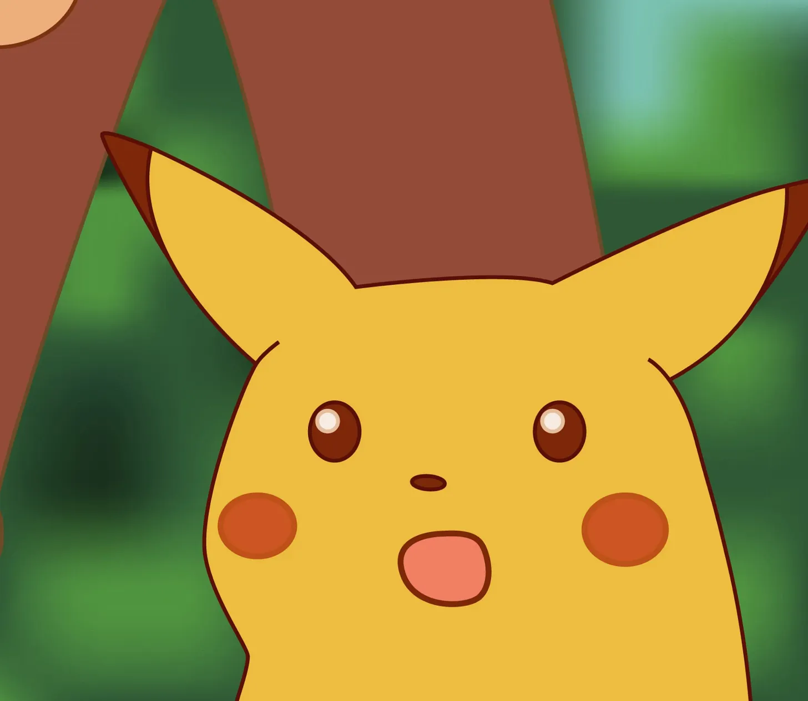

# On the art of not understanding things

**Date:** 2024-09-27  
**Author:** Kamil Kazani  
**Source:** https://kamilkazani.substack.com/p/on-the-art-of-not-understanding-things  
**Copied to Keg:** 2026-06-17 

---

One of my friends is working in an American college. One day, administration informed her that there is a list of topics foreign students should not be talking about, or else their visa status may be re-considered

(Basically, open your mouth and there will be consequences)

These topics include certain issues of the American foreign & domestic policy, under Trump’s administration[^1]. In other words, foreign students should not criticise the president’s actions, or else they may be kicked out of the country.

To that my friend responded,

### Don’t worry, my students are pretty good at self censorship

Administration was appalled. No! - they said. - We don’t have any censorship. We have only *university policies*

Same evening, she was visited by the local republicans - and there are very few republicans in the college - who thanked her for “championing conservative values”

That is interesting. Highly unusual

Technically, her stance could have bene read as an implicit, and lowkey - but, still criticism of Trump’s administration and its policies

(Because it was)

But, it were the republicans who liked it, and not the dems

Why?

Let’s start with the beginnings

America is highly polarised country, polarised - largely - into the two political tribes, of very different speech, value and culture codes. And, being a small minority in the university conservatives naturally want to find their own, to group with them.

So, they approached my friend because they identified her as one of their own tribe, as one of the red

Why?

### Because she is calling censorship censorship

Huh, they thought - she must be a republican them

How did they come up with this conclusion?

The thing with the Blue culture - nowadays - is that you you are not generally supposed to do just that. You are not supposed to use the words like “censorship” or admit the existence of censorship around you. You better use euphemisms such as “university policies”, “company values”, “community guidelines” and so on.

You must be using euphemism to not be in conflict with the Blue code

### Calling things by their names sounds and feels red

The question is why

My answer: there is nothing inherently blue or red, progressive or conservative in all of that

They key factor: is being in power

The Blue had been in power for so long, and had been used to hold power so deeply, that the Blue speech and the Blue talk and the Blue discourse have been completely landscaped by that formative experience - of being in power

(and vice versa, the Red discourse had been terraformed by the long, long experience of being in opposition)

Now the thing is:

### Every mature power pretends it does not exist

There is no power at all, just the natural order of things, just the neutral, default policies we are pursuing, completely non partisan

In other words, every mature power develops a skill of

### pretending to not understand things

Censorship? What censorship? There is no censorship! Only the university policy (or company values).

*Censorship? What censorship?*

That is the speech of someone who has been defining these very “policies” & “values” for very, very long. Which is a perfectly sensible thing to do. Not only do you not admit that you are practicing censorship, but you must be outraged, absolutely appalled and astonished when people suggest you do.

In other words, the No. 1 rule of power is denying that you have any power at all. Not only should you not admit that you have or exercise power, but you must be pretending to not understand what people are even talking about when they say you do. Pretending to not understand things, is what the dominant side, the hegemon does. Calling things by their names, that’s for the irrelvant, for the weaker

### Calling things by their names, that is what the opposition does

That is because people - in general - hate feeling the power of other people over themselves

(and that is why admitting that you do in fact exercise power is suicidal)

More than that, for your subjects - that is for the populace subject to your power - noticing and formulating that you do in fact have it, is the first sign of growing discontent and rebellion. You cannot rebel against something that does not exist, but when you noticed it does - and called it out - it is basically done.

The interests of power and the opposition are very different, and usually diametrically opposite to each other. If people in power must develop the art of not understanding things, people outside power, on the other hand, must develop a skill of understanding them.

### That is why understanding things serves as a surest mark of political disloyalty

Someone loyal and devoted to the regime has actually zero incentive to understand anything, the only possible motivation to notice things is if you are actively fomenting a rebellion. Therefore, people in power must be actively punishing people who notice and understand. They are traitors, or will be traitors, or useful idiots for the traitors. For calling things by their names (as the traitors do) always carries a grain of resentment and the opposition to the existing order of things.

---

I really like this letter of Stalin to a Soviet poet, who complained for being persecuted by the authorities, and implying he is being persecuted at the orders of Joseph Stalin

What does the comrade Stalin respond to these allegations?

All of that is the decision of Central Committee of the Communist Party. Now if you are implying that the decisions of Central Committee does not in fact belong to the Central Committee, and is but the personal decision of Stalin, than, well, that is too much. It is a dirty, unclean allegation on your behalf. Decision against you, it was taken by everyone and voted for be every member of the committee (Stalin, Molotov, Kaganovich), unanimously. How could it be otherwise?

You see? What is Stalin doing here? He is pretending to not understand things

There is a regular, legitimate process, which I do not influence at all. An idea that comrade Stalin somehow defines or determines that process is just a weird conspiracy theory, which you should honestly fuck off with

Notice, that by that point (1930), members of the same Central Committee are addressing Stalin simply as “Master” - in their private correspondence. Still, admitting that he is in fact their Master and they are but his serfs who basically rubberstump his every command and every whim, is a conspiracy theory and he will never ever admit it publicly, and will deny these allegations, whenever raised

In fact, the only instance they are raised at all, is in Stalinist art, and poetry

Admitting Stalin has power is anti Stalinist

Denying Stalin has power is Stalinist

Loyalty to the regime, and loyalty to Stalin includes the art of not noticing and not understandings things such as the fact that every “decision of Central Committee” is actually the personal decision of Joseph Stalin, and all his other “colleagues” are merely slaves dancing under his tune. Still, noticing all of that is a weird, dirty conspiracy theory, almost on a verge of rebellion.

## Footnotes

[^1]: I don’t need to give you a specific list, for everyone knows what kind of speech is getting severely punished under the current circumstances.

