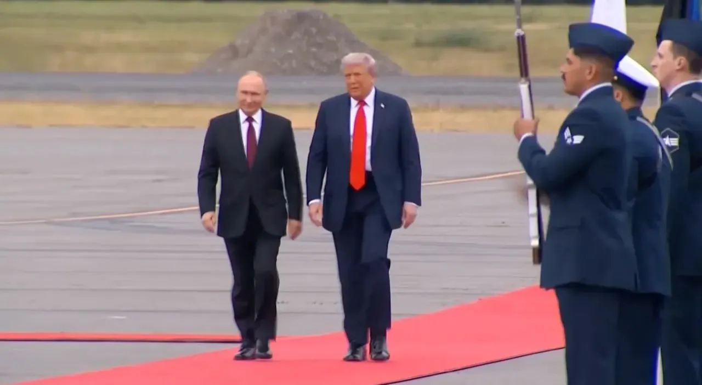
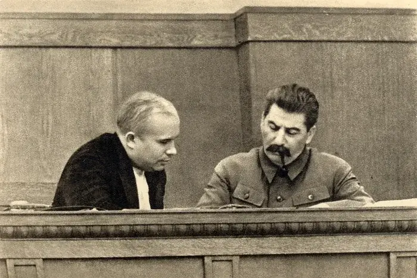
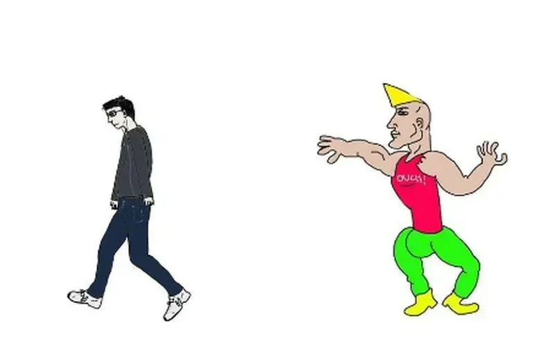
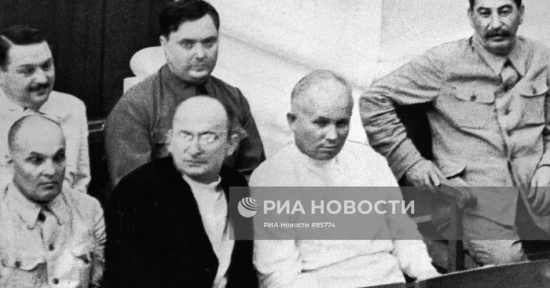
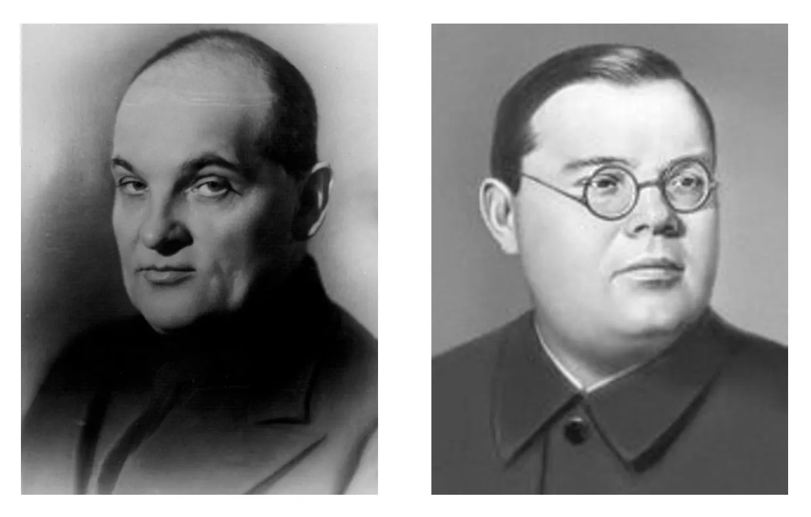
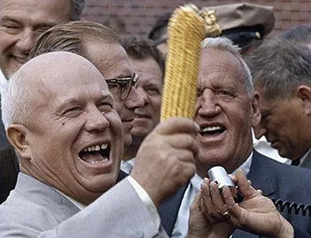
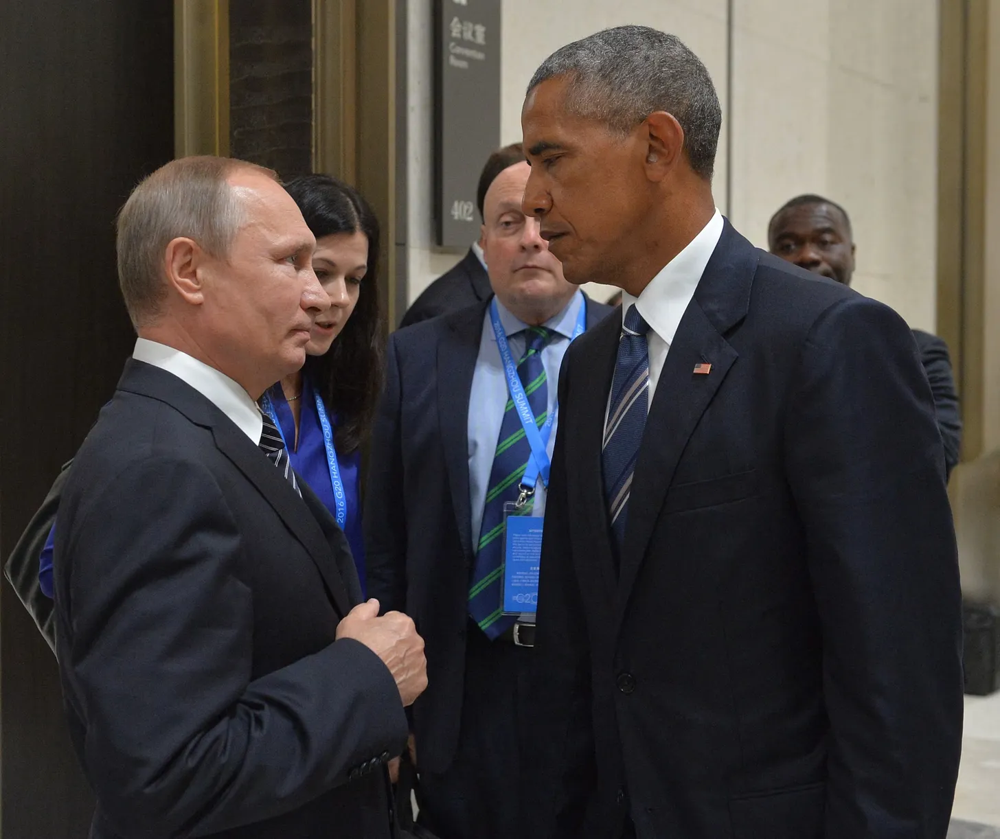
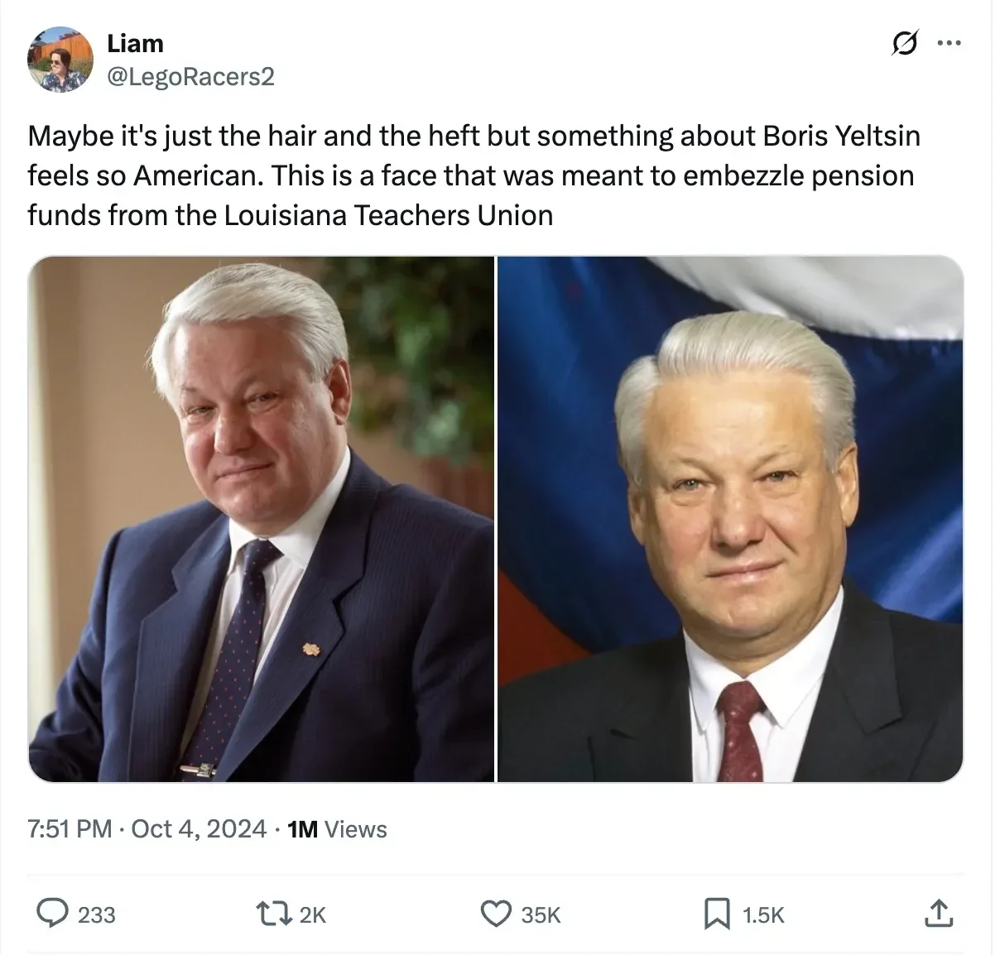
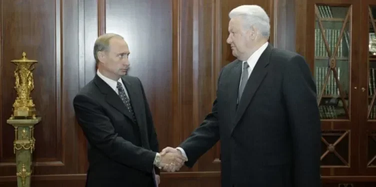
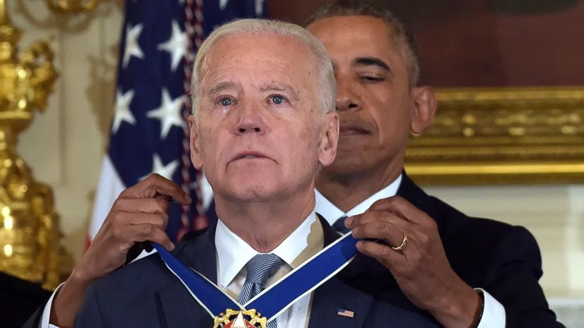

# Chad vs Virgin

**Date:** 2025-09-16  
**Author:** Kamil Kazani  
**Source:** https://kamilkazani.substack.com/p/chad-vs-virgin   
**Copied to Keg:** 2026-06-26 

---

This photo tells you everything you need to know about the fundamental difference between the two political systems: America and Russia. Here you see what the American politics select for, and how it is different from the state of affairs in Russia

What qualifications do you need to become the American president?

1. Well, first of all you need to be tall. That is the single most important factor

2. Then, you need a great hairline. Americans are not gonna vote for a baldie

3. Third, you need a loud and imposing voice. It must be bombastic

Notice, all of that is completely bipartisan, has nothing to do with the difference between the political parties, camps, or personalities. Blue or Red, Dem or Resp, Americans are always electing tall, hairy, loud guys, with a deep, impressive voice.

Notice, how **nothing of that applies to Russia**

Russian political system selects for something totally different. It would not be too much of an exaggeration to say that it selects for the qualities diametrically opposite to those that Americans are selecting for.

Let me give you an example

What do you see here?

Here you see two consecutive leaders of Russia: Joseph Stalin, and Nikita Khruschev - who would become his successor, and inherit his power over the Kremlin.

Do you find anything interesting, or unusual about this photo?

Well, I do

Stalin looks better than Khruschev. Much, much better, in every respect

Put together, they look like a chad vs virgin caricature

*Khruschev vs Stalin*

Now why would that be? Why would Stalin’s successor be so worse looking, so less imposing, so less charismatic, and of course lower than his predecessor?

That is a great question

Okay, now let’s look at another photo. Here you see Stalin in a company of the big chiefs of the Soviet Union, powerful and important people, deciding the matters of life and death for millions and millions.

What do you see here?

### Except for Stalin, they look like shit

Stalin is the oldest of all, yet he looks considerably better than any of his henchmen

Now why would that be?

Well, the simplest analysis is probably the truest one. All of his henchmen look like shit, because looking like shit is a principal criterion of Stalin’s choice, when he is choosing the people to work with him in government. Stalin would not select anyone better looking, or more imposing, or more charismatic, into his squad. He is doing exactly the opposite. He is selecting meek, controllable people, those he will feel safe being around.

### A serf should never outshine the master

So, Stalin is selecting people who are unable to outshine him in, well, anything, including the looks.

Looking like shit was not a liability in the Stalinist system. It was actually an asset. It was a necessary prerequisite, a basic qualification to be promoted on any serious position, on any position of power.

Let me show you a couple of people who had a God-level power in the Stalinist system. They comprised the core of his parallel government, informal structure that he used to control and purge everyone else, and every branch of government. These were Stalin’s personal vassals standing above all

Left - Shkiryatov. No. 1 purge guy

Right - Scherbakov. No. 1 propagandist

*Reportedly, Stalin would not even read the papers the guy on the right was sending. He would just sign, everything*

By that point, you may have already grasped my point. Which is:

### To attain any power under Stalin, you must look like a virgin

Why?

Because big people, the people in government are not elected. They are selected by the Big Daddy. And when the Big Daddy is choosing people, he is selecting those who he will be feeling safe and comfortable around. He will be selecting those who look worse, talk worse, have a weaker vibe, are less imposing and less charismatic.

He is systematically choosing virgins, and putting them on all the positions of power

Now what happens next?

Well, Big Daddy is powerful, all powerful even. But he is not immortal. One day he must grow old, and one day he must die. There is no way around that. And by the point he dies, virgins he has selected, and whom he has selected for not being able to outshine him in any way whatsoever will occupy all positions of power over the vast country. And one of this virgins, will inherit the power, and be the next king

This guy has not been selected for looking better. He has been selected for looking worse

That’s how the system of selection and appointment works

***

Electoral based systems work differently, very differently in fact

They select for being tall, imposing, good looking. They select for being able to woo and charm the audience as you would woo and charm a woman

For the audience is of course a woman. That has nothing to do with gender. The audience may consist exclusively of 50 year old grey haired men with moustaches, doesn’t matter at all, for taken altogether they are a woman, and act like a woman, and think like a woman. So, being tall helps

*One guy had to pass through elections, another did not*

The system of **election** selects for being tall, imposing and good looking

The system of selection selects for being exacrtly the opposite of that

Know the difference

***

Now I could of course say that the US politics are based on the system of election, while the Russian politics are based on selection and, therefore, produce a very different result. What serves as an asset in America would be a liability in Russia, and the other way around.

And that would be true, like 90% of the truth

Still, this dichotomy would not cover all the nuances. For the real world systems, of course, rarely represent some ideal types (like election or selection) in pure form, but work as a certain mix of both, including the elements of either eidos in different proportions.

In Russia, you may sometimes see the leaders of the “American” type

One good example would be Boris Yeltsin

I think this is a great, and a very precise observation

Because, indeed, Yeltsin looks nothing like a “normal” Russian politician, of a type we see on TV. In fact, I have a much time imagining him as a republican politician from a flyover state rather than as something who could make a career now, in Putin’s Russia.

Just look at Yeltsin. He is fucking big

*Again, Chad vs Virgin*

Now why would that be?

Why would he present an exception?

Well, because he was an exception. He was not appointed into power, was not selected into power, like Putin was. He was a coup ringleader who performed a coup d’etat, and came to power circumventing the normal, legitimate procedure, and broke down the Soviet empire in the process

***

And in America, you have elements of Russian style succession

I mean selection of the next leader by his cheif, where the big daddy chooses some uncharismatic virgin to domineer, and to feel safe around. And then, when the bid daddy goes, the virgin he has selected inherits all the power, more or less through the sheer power of precedence.

One good example would be Biden

Selected by the master for being unable to outshine the master, he, naturally, inherited everything when the master left. Just as it works in Russia

Another example would be Kamala

### There is no wonder she lost

In the (presumed) absence of the external pressure, the Democratic party resorted to the purely Putinesque, Kremlin-like style of succession. Basically, a combination of appointment (= for being uncharismatic) and then just inheriting the status via the order of precedence. The internal logic of all of that was brilliant and and without contest.

The problem, as it always happens, came from outside.

### Election elects for charisma. And selection selects for just the opposite of that.

As a result of all these successions & appointments, Democratic party started putting forward the people who were completely and totally unelectable. Biden was selected to not outshine Obama, and that sort of worked (for a while). Kamala, however, was selected to not outshine Biden, and that kind of jet just doesn’t fly.

