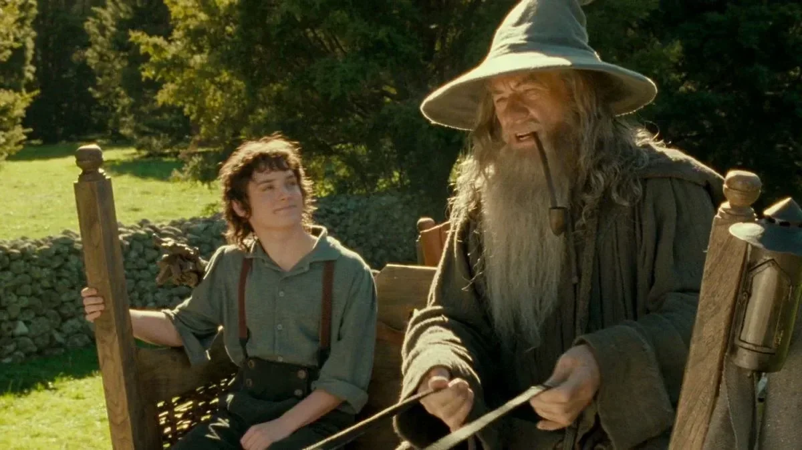
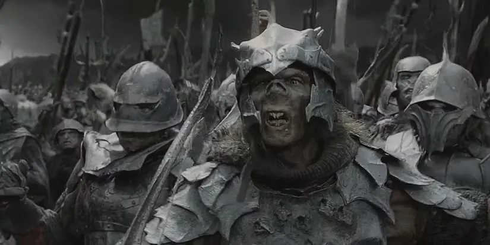
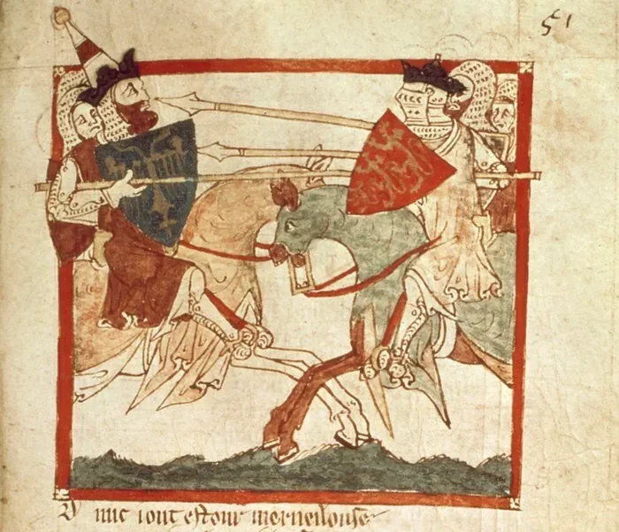

# The Hobbit Theory of Man

**Date:** 2026-06-14  
**Author:** Kamil Kazani
**Source:** https://kamilkazani.substack.com/p/the-hobbit-theory-of-man  
**Copied to Keg:** 2026-06-14 

---

One of the most curious intellectual developments of modernity is the rise of what I would call the *Hobbit Theory of Man.*

Here is what I mean by that

Traditional systems of morality - if you come from a Western culture, you may take Christian morality as an example - used to postulate that the man, as he is, is not very good. He has a dark side, a shadow side, that not only can, but most certainly will make him act evil; and not once, but multiple times, and in various contexts.

(Hence - “forgive me for I have sinned”-styled formulas. Nobody is asking whether you’ve sinned or not, just postulating that you did, with a 100% certainty. And that is because you are not presumed to be very good. You are presumed to have a dark side)

That very fact - humans not being that good, really - serves as an explanation of the problem of evil in a pretty much every universalist teaching that I am aware of. There is no great wonder that the evil is happening. It would be weird if it did not, for every man, and every woman without exception is sort of evil-ish, and it is this individual evilish-ness of absolutely everyone in the world that explains why evil exists.

Everyone is part-good. Everyone is part-evil. Everyone has a full potential to act in a good or in a bad way, and is doing both good and bad stuff in real life. Which - paradoxically and inconceivably for a modern person - implies that there is really no fundamental difference between the “good” and “bad” people. Goodness and badness is conditional, is circumstantial, and everyone of us is perfectly capable of both.

As a Catholic author once it put it:

> My friend, there are no good or bad social types…. Any man can be a murderer; any man, even the same man, can be a saint. [A Man with two mustashs](https://en.wikisource.org/wiki/Harper%27s_Magazine/The_Man_With_Two_mustashs)

Same man can be a murderer, same man can be a saint.

### Good and evil, is what people do, rather than who they are

(and a saint is not that different from a villain)

That is the view of a man adhering to the old, traditional morality. Morality assuming that the man, and I mean a normal, ordinary, a perfectly fine man - is always sort of dark-ish, and prone to darkness, and doing bad stuff again, and again, and again.

A very old, traditional premise that turned impalpable in the modern world

---

The (partial) evilness of absolutely everyone in the world no exceptions and no group excluded - that is something that a modern mind just cannot comprehend, nor digest.

Like, some people may agree with it in theory, yet vehemently reject it whenever it comes to the actual, practical implications of this idea.

In the modern world, it would pass as a “dark”, or “cynical” view on the human nature. The established, “non-cynical” perspective basically assumes that people are nicey nice, goody good, and basically devoid of the dark, shadow part.

Like, they may not be 100% perfect of course, but their imperfections are… not that serious. A minor mischief, at worst.

Yet, this Hobbit theory of mankind has a logical gap

### The evil exists

Evil stuff had been happening, is happening right now and, I believe, will be happening in the future. That is an empirical fact. And, a great part of what we are calling evil is being done by humans. That is also very difficult to argue with.

But how is it even possible? If the people (or, at least, normal, ordinary people) are so sweet, so nice, so devoid of any truly evil thought or intention, then how does the evil even materialise in this world?

And the answer is:

### Because of the outgroup

We are nicy nice, and goody good, but **there are some people who are not**

The evil exists because there is some great force of dark which - and that is a crucially important fact - we do not belong to. The Great Force of Dark is by necessity an outgroup, some other tribe. “Bad guys”

How are bad guys defined, well, that depends. May be race. May be religion, ethnicity, culture. May be just politics (“wrong political tribe”). May be something else entirely

(The increasingly common answer is just gender)

What is important here is that the Bad Guys, the dark force of evil are,

### Totally unlike us

That is the crucial idea, and I cannot overstate its importance

---

What is interesting about this perspective

It is false, dishonest, naturally suits for people who lack intelligence or courage for doing just a lil bit of introspection

(Imagining yourself as a goody good takes a special degree of cowardice & insincerity)

And it is super politically expedient. Not only you can mobilise the support for your crusade against the (imaginary) baddie bad tribe. But you can easily suppress any sort of scepticism or dissent in your own ranks

Like, why would you even question anything of that, any element of the picture? For one reason only - you must be a member of the outgroup

The lack of enthusiasm in hounding the outgroup exposes yourself as a hidden agent or partisan of it

Which brings us to our last point. The Theory of Conflict.

**

People fight. They fight constantly, and in many different ways. Why do they fight?

The answer that modern (or Neo-) morality is giving:

Every conflict in the world is merely an emanation of the great cosmic conflict between the force of light and the force of darkness. Goodie goodies vs baddie baddies.

Consequently, a fight between two guys taking place implies that one of them is good (and that means - serves the Great Force of Light). And another is evil (serves the Great Force of Dark).

All we should do is merely investigate who is the warrior of light, and who is the villain. That is the cornerstone of modern discourse.

But… hasn’t it always been so?

No, not really.

We are so used to this Neo-Moral theory of conflict (sweety sweet hobbits fighting baddy bad urukhais) that it is difficult for us to conceive anything else. But the traditional morality, and traditional ethos looked on all of that in very different way

One great example would be Le Morte d’Arthur.

In fact, if I wanted to demonstrate the difference between the Neo-Morality of our days and the traditional morality of yore, I could have hardly chosen two better samples of comparison than Le Morte d’Arthur; and the Lord of the Rings. For despite their lore, and their aesthetics may look vaguely similarish (knights, swords, and magic), the morals, and the mechanics of the world this knights are operating in, could not be more different.

(to be continued)

