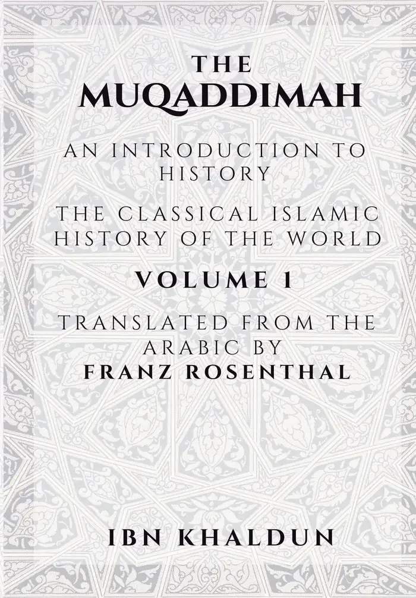
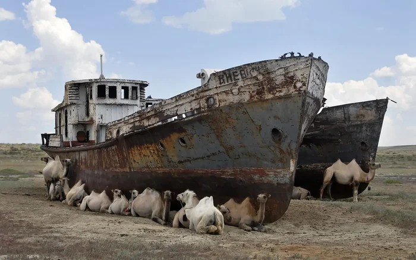

# How to get power

**Date:** 2026-07-20  
**Author:** Kamil Kazani  
**Source:** https://kamilkazani.substack.com/p/how-to-get-power   
**Copied to Keg:** 2026-07-31 

---

Recently, there has been a wave of Democratic Socialist candidates displacing their usually much older establishment predecessors. The results of Colorado primaries, I found quite symbolic. A sitting congresswoman DeGette got primaried by a 40 (fucking forty!) year younger Kiros.

*(What I found especially crazy is that Kiros was literally born in a year that DeGette first assumed office)*

And, that may be a good point for starting a conversation on the nature of political power. Or, more practically, on **how to win it**, pragmatically speaking.

Because some of the DSA candidates who won, indeed, tend to be extremely extremely strong. Like, extraordinarily strong, by any standard. But I can’t say that about everyone. Some of them are just alright, and that’s it. Nothing extraordinary.

So, it’s not about every single candidate being super strong individual player. It is about something else. These guys have won (a good deal of) political power, and won it at early age without necessarily being extraordinarily politicians themselves.

How?

First, I will give you a bit of theory, then, a bit of practical advice

Theory.

> Axiom: Power is never exercised (or won) by individuals. It is always exercised (or won) by factions. Power is always collective, factional. In the centre of it, there is always a group of individuals, tied with strong informal connections with each other. I call it, a faction.

Now once you have fully interiorised the axiom above as the first principle, you can deduce pretty much everything else from it.

For example. *If* it is the faction, rather than an individual that serves as a unit of political selection, then, it is only the factions - rather than individuals - that are even competing for power. Individuals, I mean those not united into factions, **are not even participating**. And you cannot win a race in which you do not participate. To even try winning power, you must belong to a faction.

Another thing. Success or lack thereof depends on many and many factors, a great many of which are completely beyond your control. Whether you win, or you lose, is determined by many things, many of which you cannot possibly foresee. There’s a great deal of randomness in all of that, a great deal of luck.

BUT

Whatever circumstances, whatever happenings there are, it is only the factions and their members **that can possibly benefit from them**. Like, yes, lots of unpredictable stuff happening, that brings tons of upside & downside all out of random. BUT. To collect any political upside at all, you must be a member of a faction, because it is only the members of factions that are in a race.

Not in faction → not in a race → nothing that happens can possibly help you

*It may rain, or it may not rain. But if you have not bothered building a reservoir, there’s no upside when it rains, for you.*

Finally. There’s lots of stuff happening, lots of stuff you cannot foresee, and you cannot control. You can hope it will rain upon your plot sooner of later, but you can not guarantee it, nor tell when it will happen.

(Lenin, famously, told young Communists that he, and the old guard, will never live to see the battles of the revolution. Notably, he told it in January 1917. This kind of stuff is impossible to predict and, therefore, impossible to plan)

Which means, that any serious, unironic bid for power must be necessarily a long run game. A marathon. You must be patient, must be able to wait. Can’t be discouraged by some minor, or even major twists of fate, and hardships along the way. You choose your faction, and you stand by it, through good times, and bad times.

Can’t be a hopper. You must commit

I know that this goes a bit against the common stereotype of ultra-machiavellian, cynical strivers. But if you look on the very successful strivers, such as Stalin or Mao Zedong, you will notice these were the guys who committed very early on. And once committed, they stood by their factions through good times and bad times, stood faithfully, suffered for it.

Tons of hoppers, tons of hitchhikers were joining each respective faction in good days, and leaving it in bad days. Stalin and Mao were not like that. They committed, and when the tides of history brought their factions up, they went up with them. But all those tons of hoppers, and hitchhikers did not.

Let me give you an opposite example. Because it is wrong to always cite examples of success only. Examples of failure, are at least as educative, or may be more.

You know who was an unprincipled, machiavellian schemer, a hopper, with no loyalties? Ibn Haldun was. The Maghrebian served many factions, and many cliques, at, at the time of defeat and hardship always betrayed the losing faction, to the winning one. Again, and again, and again.

But the tides of history, as I have already pointed out - are unpredictable. You can seldom tell if the defeat is final, or if the victory is. Who was defeated today, may get on top tomorrow, and vice versa. And he will never forget those who abandoned him in the hour of danger.

So, hopping, and scheming, and calculating, Ibn Haldun came to a point where no faction in Maghreb trusted him. No one wanted him anymore. And, although, he retained his life, he was excluded from politics, force retired basically, with no opportunity of return.

And that’s how he had the free time to produce Muqaddimah, the work of genius, that I strongly advise you to read. It is majestic, unbelievable. BUT. Had not Ibn Haldun be a scheming, unprincipled intriguer, had he not lost the trust of every political faction in Maghreb successively, he would not have been thrown away from the politics like a rabid dog, and would never have a free time to produce this majestic book.

So, the time of theory is over, now we come to the practical advice. What you should do to win power, practically speaking:

First, to win power, you must **join a faction**. Can’t be a loner. Need a group, need a collective, need to join it.

Second, you need to **commit to a faction**. Demonstrate your commitment. Do not hop on and off at the first sight of struggle or uncertainty.

Third, you must **do it very early on**. If you have committed early on, and stood with it faithfully through all the battles and losses, then there is a real chance that the tides of history might carry your faction up - at some point - and carry you with it. Again, this kind of stuff is impossible to predict.

But. If you are a loner, a coward or a schemer, who hops on and off at the first danger, this chance does not exist, and no possible tide can help you

*Tides, are dangerous, winds unpredictable. The ocean is full of hidden rocks, and underwater currents. But, all of that in mind, no tide can bring us any good if we are not sailing anywhere*