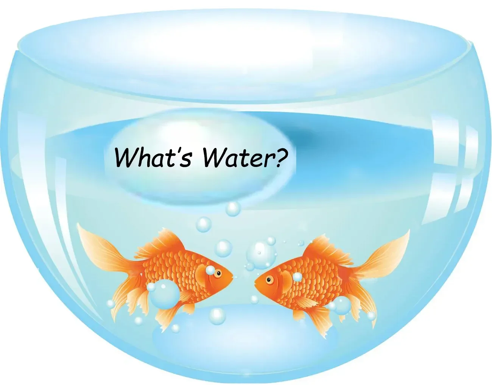
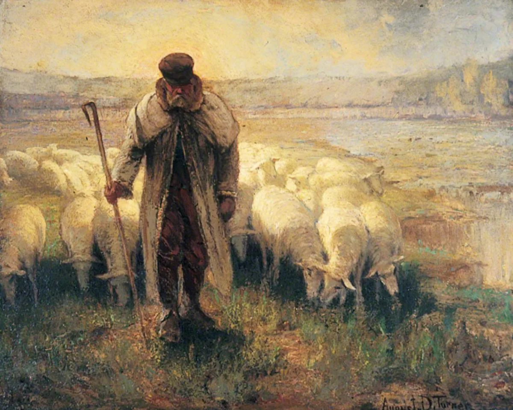
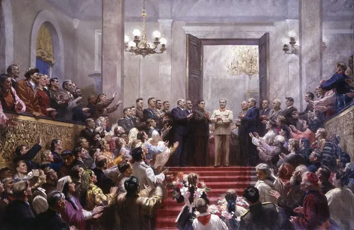
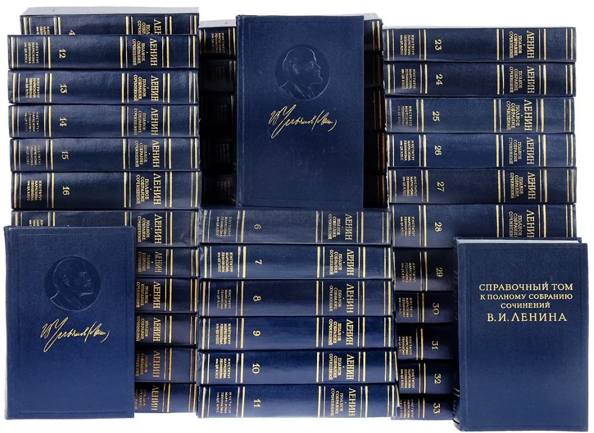
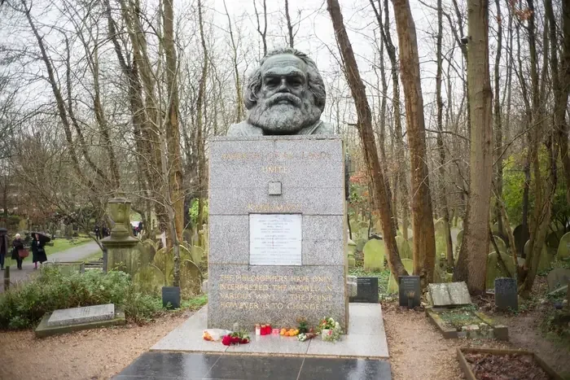
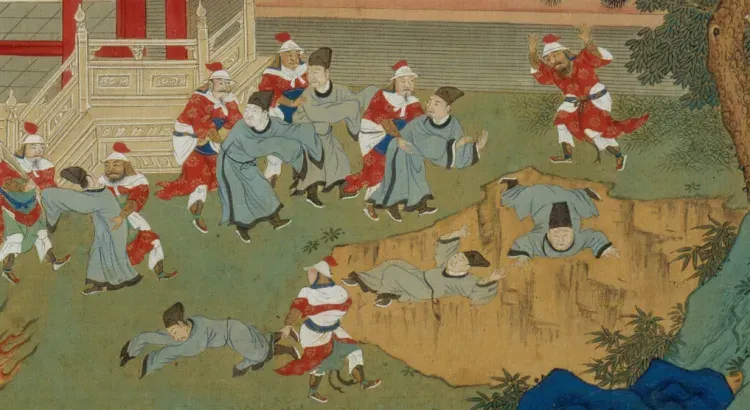
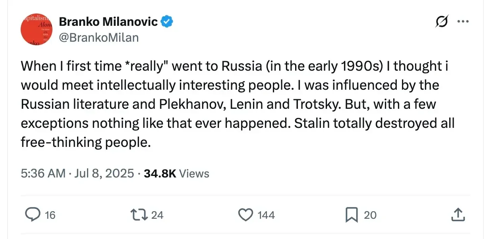

# Kill the Scholars

**Date:** 2025-08-02  
**Author:** Kamil Kazani  
**Source:** https://kamilkazani.substack.com/p/kill-the-scholars  
**Copied to Keg:** 2026-06-09 

> First thing you must understand about the fabric of social reality is that intellectuals matter

---

First thing you must understand about the fabric of social reality is that intellectuals matter

It is completely and totally false to assume that anyone on the earth can pursue some sort of a purely “practical” or “empirical” course of actions uninfluenced by any sort of abstract ideas, or any conceptual framework. That is just impossible and never happens in reality

Everyone has some sort of worldview. Everyone has some set of ideas. Everyone has some set of implicit assumptions and premises which they - very often - are totally unable to reflect on, seeing them as just an objective fact of reality.

Most people cannot see ideas and theories they are operating upon, just like a fish cannot see water

Everyone has some sort of a theory, everyone adheres to some set of abstract ideas on how this world works, what is good, and what is bad, what is wrong and what is correct, etc. Everyone has some sort of idea about how it is, and how it should be.

So, basically, in every single head, be it the head of a king, or the head of a truck driver, we have some set of an abstract notions, unreflected, and unregistered by their very bearer, the notion that have a direct influence on the course of their actions

Now the second thing you need to understand is how incredibly rare it is for a person to be the actual author of the ideas he carries in his head, and that are guiding him.

(For the most part, he is just not noticing them, at all)

For the most part, no one in the world has any sort of ideas other than those he has heard or read somewhere, other than those he has borrowed from someone else and, disproportionately, other than those he has absorbed in his formative years

(That makes everyone in the world, from a truck driver to an emperor a walking vessel of the ideas imprinted in his childhood and youth, for anything absorbed at a later stage of life carries a much slighter effect)

NOW

This creates a sort of generation dynamics for the cultural and ideological change. Boomers got imprinted with one set of ideas, they carry until their physical death, and  rarely ever amend them, whatever happens. Then boomers die. By that point, millennial generation that carries a very different type of imprints comes onto the stage. Again, they do not change or amend them, no matter what arguments or evidence is presented. Millenials die. Then zoomers come, and alpha, and so on, and so forth.

The cultural and ideological change in a society does not proceed from anyone “persuading” their opponents in anything, but from the fact that every generation carries a different set of ideological imprints, a different set of an unreflected, unregistered theoretical assumptions of how this world works, and “how it should be”, and than carries them to the grave, until a new generation brings a new set of ideas with them

WHICH

Raises a question of where do these ideas even come from?

Like, most people have zero ideas other than those they heard somewhere, usually in their youth. But where? From whom? You believe in what has been whispered into your ear, that is clear. But who is the whisperer?

There is a great temptation to say it is the “intellectuals”. Intellectuals pontificate and reason, the laymen listen and learn

That is exactly what Keynes would say. Every so called “practical politician” is in fact a slave of some long deceased economist, without realising it.

I really like this quote from the final chapter of his “General Theory of Employment, Interest and Money”, so I will give it in full, without condensing or cutting anything

Why? Because it gives us a great starting point for the further discussion, presenting “it’s all intellectuals” argument in an already condensed and eloquent form:

> Ideas of economists and political philosophers, both when they are right and when they are wrong, are more powerful than is commonly understood. Indeed the world is ruled by little else. Practical men, who believe themselves to be quite exempt from any intellectual influences, are usually the slaves of some defunct economist. Madmen in authority, who hear voices in the air, are distilling their frenzy from some academic scribbler of a few years back. I am sure that the power of vested interests is vastly exaggerated compared with the gradual encroachment of ideas. Not, indeed, immediately, but after a certain interval; for in the field of economic and political philosophy there are not many who are influenced by new theories after they are twenty-five or thirty years of age, so that the ideas which civil servants and politicians and even agitators apply to current events are not likely to be the newest

If you look at the Keynes’ quote, you will see that his description is perfectly matching the model I have just outlined above. The abstract ideas matter, for they become the mental models people - including the people in power - are guided by. For the most part, people cannot make up any ideas of their own, and just borrow them somewhere, unreflectively. Again, they mostly do it until the age of 25-30, which makes them the walking imprints of the ideological and cultural world of their youth, defining the generation dynamics of political and cultural change. So, in the end, it is the intellectuals who rule, and everyone else who listens and obeys.

And it is the last part, I disagree upon

The idea of some lofty intellectual class, leading the flock-like-mankind from their tower of ivory is not quite true.

Or rather, so imprecise, that it stops being true, just does not work as an anywhere accurate, and useful map of reality. Binary model with intellectuals preaching, and the flock obeying, obfuscates rather than explains.

Let me give you an example

Joseph Stalin, a dictator holding the absolute power over the USSR for several decades, was an avid reader, and has left an enourmous personal library. What is particularly valuable is that has left a library of books full of his personal notes, remarks, highlighted passages, his own thoughts scribed on the margins. Giving us a fairly good idea of what he was reading, what kind of ideas he was absorbing and what he was paying specific attention to.

One interesting observation of that is:

There is surprisingly little Marx in all of that

There is surprisingly little Engels

Despite Stalin, and the Communist movement itself drawing its legitimacy from the divine authority of Marx and Engels, it does not look like Stalin himself was paying very much attention in what Marx and Engels were writing, or took any particular interest in all of that. To put it in a simple terms,

### Stalin did not read Marx

BUT

Stalin read Lenin. There are dozens of Lenin’s books, his theoretical, political, polemical works, all commented, all highlighted, all read, and re-read, and re-read again, many times. Which implies that although Joseph Stalin was pretty much indifferent about these ancient sages like Marx & Engels, he effectively was a diligent, pedantic student of Lenin, and remained his student, for all of his life.

Stalin had his own set of ideas, had his own set of premises, had his set of pictures of how it should be. But they were not based on any direct study of what we would see as the “primary sources” of Marxism, as he does not seem to be giving a flying damn about all of that

They seem to be based on the careful, meticulous, reverent study of everything Vladimir Lenin has ever written

Stalin did not study Marx. He studied Lenin, and that is the end of it

And who was Lenin in that regard?

Who was he, in the grand scheme of things of the Communist movement?

Now, of course, we know him as a leader of the October Revolution and the ruler of the USSR. But that is not who he had been, for most of his life. He did not seize power, until his final years of life. For most of his life, he was a writer, a journalist, a theoretician, a public intellectual, working within the limits of Marxist tradition, as a follower, interpreter, and translator of Marx.

In other words, he was the one whom Hayek would have called a

### “Secondhand dealer in ideas”

The author who could provide us a more nuanced, and more realistic model of how the ideological and cultural indoctrination works is another great economist of the 20th c, Friedrich Hayek.

Hayek made an important distinction that Keynes failed to notice. While Keynes ascribed all the glory and all the credit for the experts in a field (economists, political philosophers). Hayek noticed - and noticed correctly - that is not the “experts” who make the difference. It is the “mediums”, whom he also called - somewhat disparagingly - the “secondhand dealers in ideas”.

That is a subtle and yet, a crucial difference that remained totally hidden from his opponent. Basically, a narrow “expert” - let’s say an academic economist - may ascribe great, enormous importance to his narrow, and specific arguments. And yet, there is no particular reason why his findings (true or not, that does not really matter) must have a direct impact, be it in a short, or in the long run. There is no particular reason they should matter at all, for the broader society.

The only way they could matter, is when they are appropriated, and reverbated, and reintegrated, and amplified by the “medium” class, thousandfold and millionfold. They, these ideas, and these arguments start terraforming the social landscape, inch by an inch, drop by a drop, slowly but inevitably. And - over the time - their influence can overcome pretty much any other factor, whatsoever.

So, basically, while we now see as a whole Marxist movement to be just an emanation of Marx, his legacy, and his personality, this is not how it works in reality. In reality, the person holding a dictatorial power over the USSR is in fact Marxist, but not in a sense that he is studying Marx, but in a sense that he is studying a second hand dealer in Marxist ideas.

That’s how it works

It is not that everyone just reads Marx and enlightens. That is not what happens.

It is that there is a relatively small number of “nexuses”, powerful re-interpreters, and re-translators, who define the ideological landscape in let’s say Russia. And if a (sufficient number of) these re-translators got infected by the Marxist ideas and start translating them, then the poison will be slowly accumulating, and accumulating, first invisible, then very much visible, and then defining the course of the country.

But again, it is not that Marx is translating his ideas from his graveyard in Highgate

It is that living second hand sellers, in Russia, or in Zurich do, and over the time, that defines what the next generations will be believing in

To put it in other words, ideological and theoretical landscape of a country is being slowly but inevitably terraformed by a very limited number of second hand dealers, rather than the “original intellectuals” or the “narrow experts in a field”

Who in the end, do not matter much

These dynamics - with a limited number of idea peddlars defining the course of a culture over the time - creates an almost inevitable tension between them and a political power. The conflict between the power and the second hand dealers is pretty much pre-determined, as the supreme political leadership does genuinely not understand why it should allow these lowly scribes to - basically - determine where the country and the culture should be directed, in a sufficiently long run.

Long time ago, I was sitting in the historical library in Moscow, and just scrolling through the catalogues of books. Scrolling, and scrolling and scrolling. There was not much information there except for the author, name of the book, date and place of publishing, etc. But over the time, and over hundreds of entries, I started noticing a pattern

There is lots of French books there. A lot of powerful, well-known, celebrated works that made an enourmous cultural and ideological impact far beyond the physical land of France.

BUT

### “For the most part, they have not been printed in France”

For the most part, they have been printed abroad

From Rabelais to Voltaire, a classical, eternal piece of French thought is more likely to have been first printed in Geneva or Amsterdam (or, in earlier times, in Sedan) rather than in Paris

In the earlier eras, that may be partially explained that the government did not like any books being printed at all (partially because of the pressure of hand scribes)

In later eras, however, its opposition is ideological

A bunch of traitors, peddlers and ideologues are slowly whispering their poison into the ears of the nation, and the poison is accumulating. So the government is trying to stop them, but not very successfully, for they are just printing their crap abroad.

And the crap these traitors, and idea peddlers, and foreign agents are printing does form the French canon, the canon of thought, and of literature

Because the social strata that is producing this canon in the first place, is naturally hostile to the state, and opposed to its political and social order

The conflict is natural, the conflict is lindy

Eventually, the poison accumulates, and terraforms the intellectual and political landscape anyways, whatever you do

For that to happen, a bunch of second hand dealers had been whispering into the ear of a nation, for generations

But is there really nothing you can do about all of that?

Not quite

In fact, a sufficiently powerful, and centralised, and hierarchical political structure can do a bunch of things to do with the influence of the naturally hostile second hand sellers

One good measure would be: kill all the scholars, burn their books

Notice that Joseph Stalin did exactly that upon seizing power

Over decades of purges, he slaughtered the educated classes, specifically focusing on the idea peddlars. Like the narrow experts staying in the limits of their expertise, that was sometimes tolerable (to a certain degree). But the generalists, preaching to anybody, was absolutely intolerable at all.

What effect did this produce?

This of course stabilised the power, stabilised the social and political order

As there was no independent second hand idea selling class in the USSR, those in power faced no competition from within the Soviet realm

Stalin destroyed all the free-thinking people. A very precise observation by a visitor from another post socialist country

BUT

and that is an interesting point

We return to where we have started

Everyone has some sort of the worldview. Everyone has some sort of understanding of how the world works, and how it should work, in the fist place. Everyone has some sort of theoretical premises, and axioms that remain unreflected and hardly even registered by their bearer, although defining his actions, and his decisions

Everyone, and there’s no exceptions at all

### That of course includes the Soviet ruling class

The ruling elites of the USSR had to have some sort of the worldview, had to have some sort of mental model, some sort of premises and axioms

Now they could not produce these axioms, for almost no one on the earth can. All they could is to absorb them from somewhere, and to accept them uncritically, from some sort of a medium class, from some sort of the second hand dealers

And they, of course did

But the thing is - after the Stalin’s slaughter of scholars and burning the books - ideological and intellectual landscape of the USSR became just so dull and uninteresting that it could not produce any systematic output that could interest - not even the general population - but first and foremost its own ruling elite

So, basically what Stalin did made perfect sense - in the short run, and was a brilliant tactical decision.

The governing subject has found the governed object too complex to be governed and reduced its complexity via slaughter, making it very much easier to rule

That was very smart

BUT

Once it happened, the governing subject (= which has to have some sort of ideas), started absorbing them from abroad

### And that was the primary reason why the 1990s Russia turned to neoliberalism

Recently, a friend asked me, how did it happen that economists, and specifically the neoliberal economists became such a powerful elite in the post-1991 Russia

I think part of the answer would be, that over the time the ruling elites of the USSR had nothing but disdain to the domestic intellectual product, and turned - 100% - to the intellectual product of abroad. How the world works, how it should work, premises, axions, assumptions, all of that was absorbed from abroad, and absorbed uncritically

As a result, the system of actual beliefs of the Soviet ruling circle was - by the 1980s - increasingly influenced by the neoliberal dogma, absorbed from the West

And that was a major reason why the economic reforms in the USSR turned the way they turned.

It is not only that the elites wanted to plunder the country, to buy castles and mega-yachts. Like, it is an element of the general picture, but only an element of it, whose importance is vastly exaggerated by the envious peasantry. For a scheme to work out, you need more than just the greedy and opportunist elites.

You need:

1. Belief that you are doing the right, correct and noble thing
2. Fanatical, disinterested, honest enforcers

We understand it in the context of collectivisation, but we somehow fail to register it in the case of privatisation. A scheme like - distribute all the large industry to the organise crime and rob the rest - will not work out without a sufficient number of determined, disinterested, self sacrificing fanatics who will do it all out of ideological conviction without any personal interest at all

However hard it may be to believe in it, the whole scheme of privatisation and shock therapy could not have worked out, unless for a nucleus of determined enforcers, doing that all out of personal conviction, and the fanatical belief in the economic “science”.

