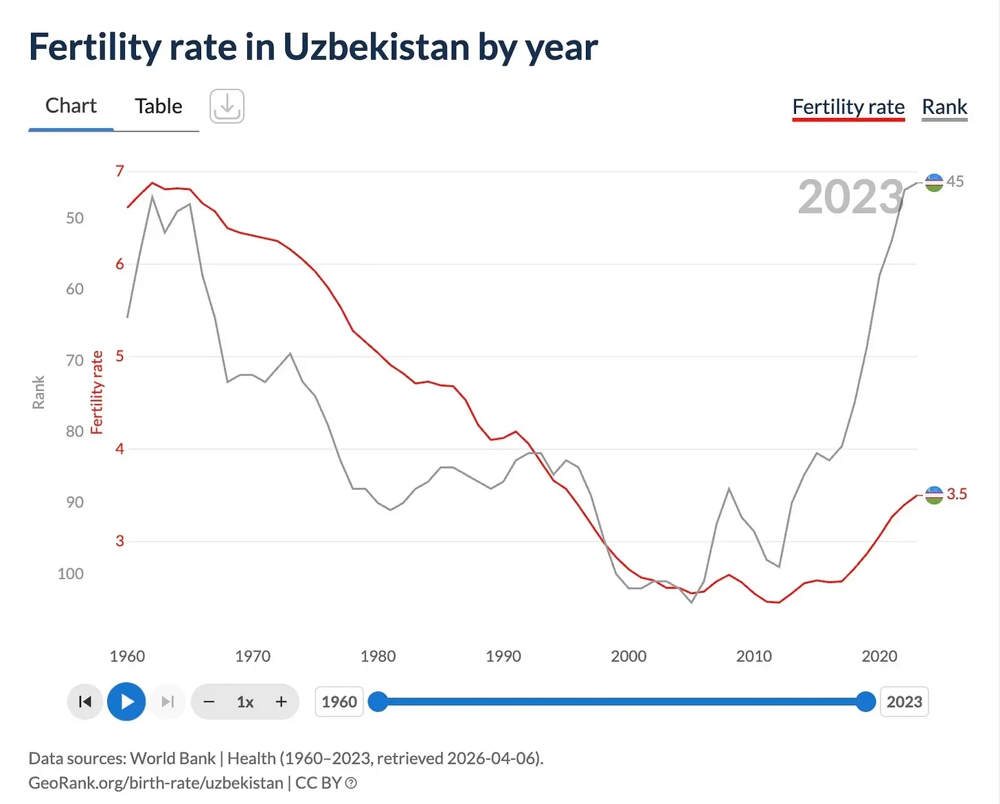
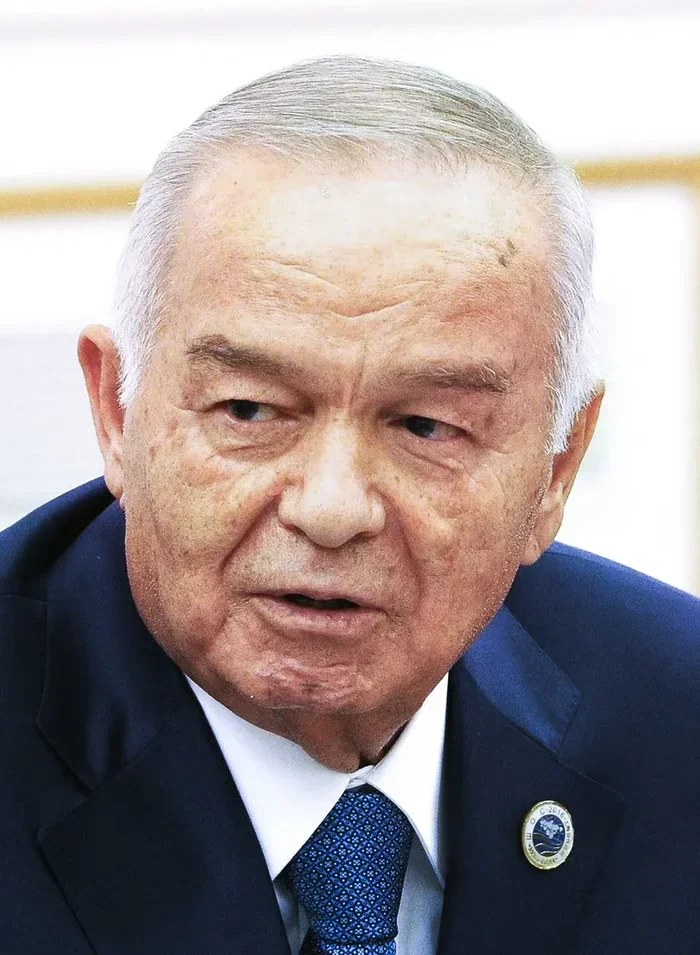

# On fertility

**Date:** 2025-08-02  
**Author:** Kamil Kazani  
**Source:** https://kamilkazani.substack.com/p/on-fertility  
**Copied to Keg:** 2026-06-09 

---

History is philosophy teaching by examples

Let’s look at this one example. The Uzbekistani fertility rate

All over the world, fertility is collapsing. Rich countries. Poor countries. Mid tier countries. Christian, Muslim, Hindu, Buddhist. Everyone is stopping to have children, everyone’s TFR is crashing into the ground.

Uzbekistan may be one of the only examples of the opposite pattern: when the fertility has actually increased, in the last few years. A quick search shows that of all the countries that have increased their TFR for the past decade (usually, the increase is microscopically small), Uzbekistan bounced back the most, and by far

Why?

You see, in many and many cases it may be difficult to explain the demographic patterns. The actual dynamics are complex, and include many factors. What is interesting about Uzbekistan, is that the reason for their demographic bounce back seems to be more or less straightforward.

In the year 2016, President Islam Karimov died

Immediately after his death, Uzbekistan experiences a demographic boom, absolutely unprecedented in the rest of the urbanised & industrialised world.

Islam Karimov (born in 1938) was a Soviet Party secretary (= governor) of Uzbekistan. After the collapse of the USSR, he naturally inherited power and made himself (a lifelong) president.

At this point, he was over 50 years old. A fully formed man, with the fully formed worldview. And that worldview was naturally shaped by the public discourse of the era. Which - back then - was pretty alarmist about the demographic explosion, and the population growth.

That is difficult to imagine for us now, but back in 1970-1980s, the increase in the population was seen as a major problem. Very soon, the population will explode and we will simply not have enough resources for everyone. We must do something about it now, or soon it will be too late.

(It is in this context that you should view the population control measures, of the late cold war era. From China to India, they had been battling what was seen as a major existential problem, and battling mercilessly. Everything from forced abortions and forced sterilisations to the administrative discrimination, came at hand)

So, naturally, having assumed the absolute power with the collapse of the USSR, President Karimov started enforcing the population control agenda with zealotry of a neophyte

#### And that is the first, and very important lesson. You may think that ‘men of action’ e.g. presidents and dictators will be somehow sealed off from the public discourse of the era. But they are absolutely fucking not. Everyone from Karimov do Deng Xiaoping was very much affected by what a bunch of public intellectuals in richer countries had to say.

To put it in simple words, Uzbekistan developed a policy of coercive population control, managed and organised by state and enforced primarily through its public healthcare system. You may dig some reports of human rights organisations, for they are plenty. The same hospital a woman would give a birth in, would forcibly sterilise her without her consent, and often even knowledge. And so on, and so forth.

Naturally, this policy was quite unpopular. And yet, it persisted through Karimov’s era, enforced by the iron hand of a dictator. For how long? Until his death

#### And that is the second lesson of today. After a certain age, people barely ever change their views, especially people in power. The views they have developed (or rather absorbed) in their youth, they will hold till their deathbed. Whatever happens, their worldview will not be updated

Then he died. And with his death, in 2016, the power naturally fell into the hands of his younger deputies and lieutenants. How much younger? About 20 years. That was the age difference between the old, and the new president of Uzbekistan

Now the same people who served Karimov, and enforced his agenda - were much younger, and formed in a different age, and shaped by different kinds of discourses. If they executed Karimov’s orders, that was solely because they obeyed the supreme boss, not because they believed in them. They were quite literally just following orders.

So when the big boss died, they did not see much rationale to continue his policy any longer. Because again, the population control enforcement (through forced sterilisations etc) was extremely unpopular, and always had been. So, it was just too tempting to give their own populace a concession.

In just a couple of years after Karimov’s death, the policy of coercive population control seems to be rolled back, and it seems to be rolled back pretty much completely.

#### People in power never change their views. A change in policy happens not because the person in charge changes his opinion (he never will), but rather because he dies - or is forced out of his office one way or another.

So now let’s summarise what we have just learnt:

1. People in charge do not take their decisions just out of blank. They take them, based on their worldview

2. Which they did not author (!). A person in charge, for example a dictator of Uzbekistan believes in many and many things. Most of these things, he did not come up with personally, did not discover or verify personally. Most of the ‘objective facts’ he believes in, he just heard or read somewhere

3. So, basically, the worldview of a dictator is largely just a collection of the ‘objective facts’ (= hearsays), that he heard or read from the public intellectuals of the era. It is from the public discourse of the era, that the entire worldview of a dictator is woven

4. Notice, that when I say public intellectuals, I do not necessarily mean academic researchers or whatever. Because I strongly and strongly doubt that he read academic papers. (In fact, very few people do). What I mean is some sort of a ‘podcaster’. Podcaster is a thing, you must be keeping in mind

5. After a certain age, a person in charge stops updating his worldview anymore, and stops absorbing any new podcasters’ talkpoints into his worldview. So what he remains with, is the absorbed podcasters’ talkpoints from his younger days, usually un-reflected. These are and always be, the objective facts for him

(Notice, that coming to power serves as a major ‘sealing off’ moment, as well. In his younger days, he listened to the podcasters not only because he was less rigid, but also because he was less busy. After coming to power, he usually won’t)

6. A change in policy will happen not because the person in charge updates his worldview (he won’t), but because he dies, and his younger lieutenants who will inherit his power after his death, do not share his agenda. Because again, they were raised in different age, and listened to different podcasts.

7. So when the old man dies, they feel free to roll back on some of his measures that they never believed in anyway. They were just following orders

---
