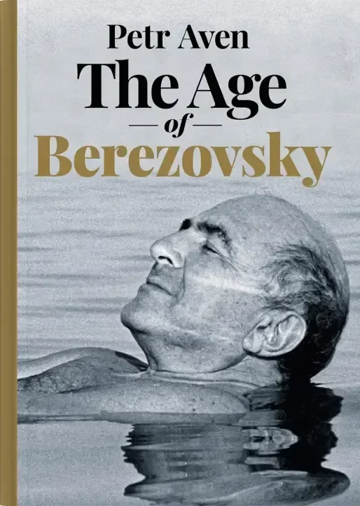
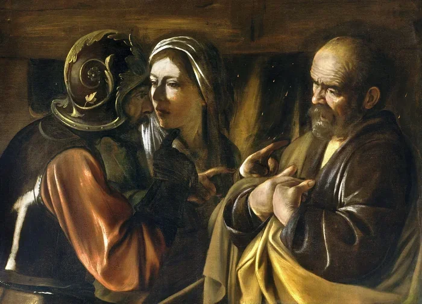
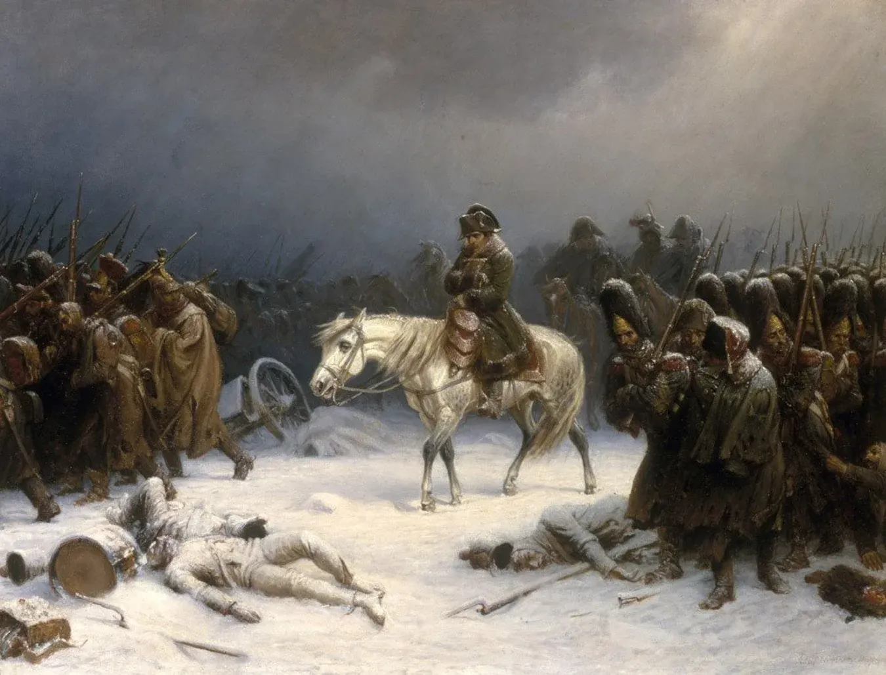

# Suffering from success

**Date:** 2026-02-27  
**Author:** Kamil Kazani  
**Source:** https://kamilkazani.substack.com/p/suffering-from-success?utm_source=publication-search
**Copied to Keg:** 2026-06-10 

---

I have really enjoyed this book, The Age of Berezovsky. Cannot recommend it highly enough. It is basically a series of interviews an oligarch Petr Aven conducted with businessmen, politicians, journalists and other public figures of the 1990s. The book is centred around the colourful figure of Boris Berezovsky, and serves as an amazing crash intro into the history of the Soviet to Russian transition, as well, as a very nice collection of primary sources on the era.

As the same events are being discussed with various people, and each tells you his or her personal version of what was happening, the final result feels a bit Rashomon-ish. By the end of the book, you can make an educated guess - what are the interviewees lying about and why. For example, if a notable public figure starts telling something like; Oh, I never really knew Berezovsky. Never even met him. May be saw him once or twice from the distance. No, we never really talked, then you know:

1. He is lying. Not a word of what he just said is true
2. He is lying, because he had been a very, very close associate of the late oligarch. And when I say associate, I actually mean a shill, a vassal. A servant.
3. Now as the former Berezovsky’s servant switched allegiance, and now serves Putin, any kind of association with the former boss is a liability now. Much like St Peter, he repeats a formula of triple denial. Never knew. Never met him. No, we didn’t even talk.

Now that is the beauty of this book. As all the interviews are put near each other, you can read them all and cross compare. And when you do, you will notice that each and every of his former pawns and bootlickers, tells exactly the same, there is not even much variation in how they put it.

You see it once. You see it twice. And the next time you see it, you know:

### Standard formula of triple denial

This book deserved a lengthy discussion & consideration. For a moment, I want to discuss just one minor aspect of it. The madness of Boris Berezovsky. Specifically, the story of how the ex oligarch lost all of his wealth.

When Berezovsky was forced out of Russia, he still had a lot of money. Being a rich men, he spent his cash in a very strange, incomprehensible way.

Lots of it he spent of supporting various political groups, and factions. That part, people could at least understand.

But other kind of stuff was really weird. For example, he bought a random football club in Brazil, investing some obscene (exact figure is unknown, but by all accounts, obscene) quantity of money there. That was so random, and so weird, that it drew a lot of public scrutiny in Brazil, being seen as some money laundering scheme. Not even his friends could understand.

That is how his friend, Felshtinsky describes his dialogue with Berezovsky, on this Brazilian scheme:

> **Felshtinsky**: Borya, why? All right, Abramovich bought himself a football club. But that doesn’t mean that you have to buy yourself a football club, what’s more in Brazil

**Berezovsky**: Of course not… What’s the football club got to do with it? That provided access to the president. **They promised to give us the whole country**

Sounds mad. Absolutely crazy. Worse of all, it sounds just dumb

No president of Brazil would (and could not!) give him “the whole country” no matter how many football clubs he bought. Looks like a stupid way to spend all your money, on stupid schemes.

Is it though?

In fact, getting an access to president - by any means necessary - so that he “gives you the whole country” was a perfectly reasonable plan, and a perfectly reasonable expectation… **based on his previous life experience.**

For it was exactly what happened with Berezovsky himself. In fact, it serves a good summary of what was happening in Russia through the 1990s:

1. You get close with the President, you earn his trust. You clean his shoes, if necessary.
2. And he will literally give the entire country, away to you

What is being called “privatisation” of state-owned enterprises, was effectively **the distribution of public assets to well-connected individuals.** And, as long as this distribution is taking place, one should not spare any effort, nor any expenses, to build connections including you into the scheme of public assets distribution.

(That is exactly how it worked. Another nice memoirs of the era, describes how Yeltsin’s daughter was dining on her dacha, with her husband. Nearby, the young Boris Abramovich was busy grilling the barbecues and serving them on the masters’ table. For they were masters of the moment, and you should do anything to get close with the masters of the moment. Anything at all)

Any investment you made in the process will return back hundredfold, and thousandfold. So, it would be stupid to care about any expenses, allowing you to get in touch with powerful people…

… As long as the free distribution of public assets is taking place.

### As long as there are (seemingly) infinite public assets to distribute

Once they were gone, the game was basically over

And now the thing is:

For an individual, like Boris Berezovsky, a crazy, unlikely, impossible scheme has actually worked out. You get into the President’s room - by any means possible - and he gives you everything.

**Now that is your lived experience**

And - once it happened - it defines the rest of your life. For you won’t be able to do anything else, seeking to recreate this scheme that worked out once again, and again.

(It was in fact a one time event, and will not repeat in your lifetime. It was possible only under a very particular set of circumstances: the breakdown of a planned economy, with a massive quantity of functional, valuable assets to distribute. Won’t happen again. Nobody will just give you another country, no matter how much you try. But you won’t be able to accept that)

So once the scheme worked out (for you) and worked out marvellously, it defines your worldview, and your model of the world. It informs your understanding of how the thing works, and will shape all your actions till your deathbed.

***

So what it tells us about human nature. Whenever you try to understand (or prognose) human actions, you should be very, very cautious to use the word “objective” in your analysis.

*“Objectively speaking, that is a dumb thing to do and he is a smart person, so he won’t do that”*

That is a good example of crap analysis, that does not apply in real life.

And that is because we are not discussing some celestial beings, eternal and omniscient, flowing in the ocean of pure knowledge. We are talking of meatbags, walking upon earth.

Objective truth exists of course, but **meatbags do not have any access to it**

They don’t know very much. They don’t even live that long.

Birth. Peak. Decline. Death. All in a blink of an eye.

Now what informs their actions is not some kind of “objective truth” (which they don’t have access to) but their subjective life experience, especially experience of their formative years & of their peak successes & peak traumas. That is what they base their decisions upon

For that reason, great success is usually a constraint, and a limitation, for you won’t be able to change the behaviour that have once given you this success, no matter how much the circumstances change.

Hence, stupid failures of great people. They try to re-create their past successes again, and again, but - under new conditions - that line of behaviour simply does not work anymore

In fact, highly successful people are more prone to madness than the normies, for the highly successful people are the ones that made a crazy bet and it worked out. Hence, they make a [WRONG] conclusion that it just works, objectively speaking, and keep making it again, and again, until they just get bust.

*One more military campaign will absolutely do it.*

