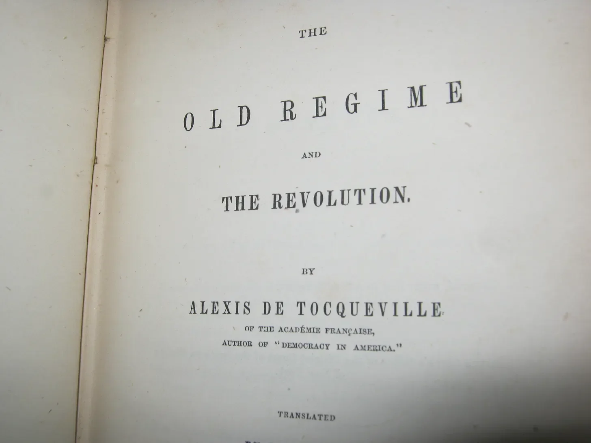
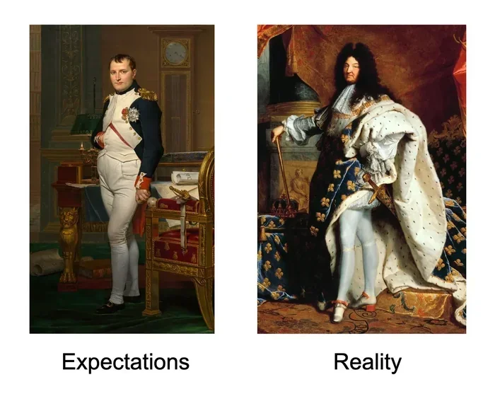
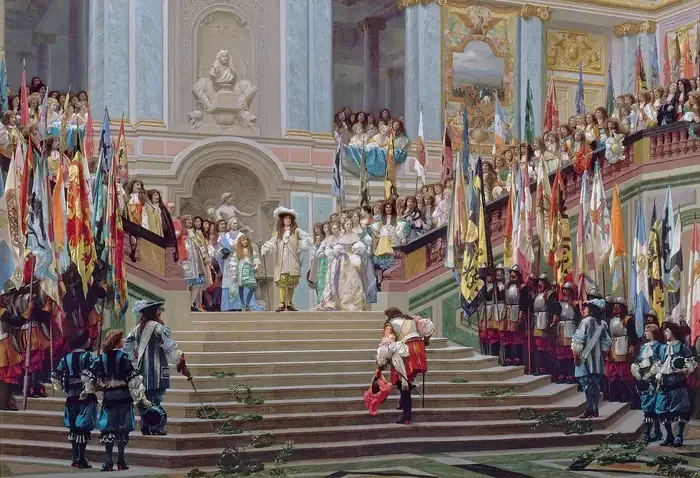

# The Old Regime and the Revolution

**Date:** 2025-08-02  
**Author:** Kamil Kazani  
**Source:** https://kamilkazani.substack.com/p/the-old-regime-and-the-revolution   
**Copied to Keg:** 2025-10-11 

---

Today, I am going to talk about Alexis de Tocqueville, the single smartest and sharpest author who ever wrote on the French Revolution[^1].

The funny thing about all of that, is that he never really intended to write about the revolution. He aimed to write a book on Napoleon. Yet, when he got into the life and career of Napoleon, he felt he needed to study the revolution, for you could not understand Napoleon without the revolution. And, once he focused on the revolution, he inevitably faced the question:

### How did the revolution become possible in the first place?

And to answer that question, he - quite predictably - had to dig into the history of pre-revolutionary France. And so he did, and digged into it very, very deeply.

So that’s how it happened that the book, originally conceived as a biography of Napoleon, ended up focused on the administrative reform of the Sun King, Louis XIV.

For it was in the political and administrative reform of Louis XIV that Tocqueville saw the root causes of the great revolution. The part on Napoleon, he never finished

***

Now having buried himself into the archives of ancien regime, and having spent years there, consuming the official correspondence, manorial accounts, protocols of the royal council, and of the provincial estates, political treatises, newspapers, court materials and so on and so forth, Tocqueville came to a paradoxical, yet inevitable conclusion.

French revolution became possible for one reason, and one reason only. The French revolution became a logical and inevitable result of the French monarchy. In other words:

### All the preparatory groundwork for the revolution had been done by the kings of France.

Bit by a bit, the kings of France dismantled the old medieval order, subjugated and hollowed out all the medieval institutions of power, suppressed and emaciated all of the old medieval elites. Bit by a bit, nothing was left of the old medieval constitution of realm except the dead letter of the law, while the spirit of it was completely extinguished, and replaced with a dumb submission to the royal despotism. Bit by a bit, all the primary actors in the kingdom unlearnt how to exercise their own political agency, and acquired the habit of bending before the will of state Leviathan.

And that is, how bit by a bit, they built the structure of governance so centralised, so domineering, so all-powerful, that it - in the end - became ultra fragile. For once you submit all classes and all institutions in the country to the will of supreme ruler (which means, central bureacracy in Paris), your entire regime - and not just your regime, but the entire socio-political order - becomes brittle, like a piece of glass. For when you build a centralised, top down structure of governance, all you need is one strike, just one strike to take it out, entirely. And once you do, what you have is a vast country with a learnt habit of despotism, with a learnt habit of sumbission, that will submit itself to the will of new rulers just as eagerly, and as unquestioningly, as it used to prostrate before the will of the old ones.

For the revolution is not when the power breaks down, but when the omnipotence - built by the previous regime! - drops into the new hands, and the obedient populace follows the new leaders, and obeys their every order and every whim.

(That is why the concept of revolution feels so magic and so appealing to the power hungry, ambitious folk. For the dream of revolution is the dream of omnipotence)

For the revolution is not the crazy mob doing whatever it wants - that is called mutiny and does not produce any significant or lasting effect[^2].

The revolution is an army of droids, marching in line

*The army of droids will march anywhere you send it, all the way to Alexandria, Lisboa, Moscow*

Now for the new ruler to seize ominpotence, the omnipotence must have existed in the first place. For the new powers to command absolute obedience, the country must have already learnt obedience, under the previous regime. For the new clique, to take charge of the army of droids, the people must have been already turned into the obedient droids, by the previous clique. Long story short, for the revolutionaries to seize central power, the power must have been already centralised.

That is why to understand the root causes of the French Revolution, you need to understand the centralising policies of French kings, culminating in the administrative reforms of Louis XIV.

So that is where our discussion starts

And that will be our starting point

For when we discuss the “old regime”, and how it was overthrown by the French Revolution, we usually miss one subtle, yet crucially important point. Which is:

### What was before the old regime?

For before the “old regime” - that is the absolute monarchy - there used to be a very different medieval regime that the monarchy had destroyed, hollowed out, and built the edifice of absolutism upon its ruins.

> NB: The concept expressed in paragraph above is crucially important, and can, perhaps, be best summarised in a concept of “ancient constitution”. The normal, ancient constitutional order is getting stomped over by the royal absolutism, and that is not good, and we perhaps must do something about it. We will return to this concept, and not once but many times, when we will be discussing the Dutch Revolt, the English Civil War, and, well, pretty much any anti-absolutist movement in Europe until 1789.

> Until the (very late) phases of French Revolution, pretty much any anti-absolutist movement in Europe, was enflamed not by an idea of change, but by the idea of return, restoration. It is the king, and his bureacracy who are acting as “innovators” (which is a bad thing), and we want merely return to the good old medieval order - how we imagine it. That was the logic of Dutch, English and - last but not least - early French revolution which was replaced by an idea of dismantling it all to the last brick and building the new edifice from the first principles, unburdened and unrestrained by the past, only very, very late on.

## Medieval constitution of France

Now how did the France look before the old regime?

The best way to put it would be,

### It was an aristocratic regime with elements of democracy

This kind of definition may sound weird, bizarre, and that fully reflects the strange and bizarre organisation of the medieval world, not yet hammered into a uniform structure through the efforts of a centralised super-state.

There were cities and towns, many of which had effectively functioned as republics, whose internal politics often reminded of the ancient city states of the mediterranean world. Much like in antiquity, the actual mode of governance varied, and varied widely. Some of the French towns used to be more democratic, others - were more oligarchic. But all (well, most) functioned as the republics nonetheless.

There were rural communes - that often had a significant degree of self governance and internal democracy. There was church, there was clergy. There were all sorts of hard to define, weird medieval institutions such as the parliaments (that will be covered later).

BUT

Over most of the French territory, the real power belonged to the aristocracy. By and large, it were the landowners of noble pedigree that acted as the political leaders, as the military leaders, as the judges and administrators, and - putting it simply - as the overlords of their social inferiors over most of the country. Noblemen took charge of the countryside where most of the Frenchmen lived, and most of the French had some kind of a feudal overlord, to look up to[^3]

But am I right to call them French? Not quite, for the middle ages, that sounds as a horrible anachronism. Back then, most of the kingdom’s population did not see themselves in terms of some uniform “French” nationality, but rather associated themselves with their towns, communities, counties and provinces. That is where their identity resided, and that is where their political loyalty belonged to.

You are first and foremost the subject of Dauphine, of Brittany, of Provence, governed by the local laws, subject to the local feudal overlords, judged by the local parliaments. Pretty much every institution that affected your everyday life was local or regional, while the power of the far off king in Paris was more of… theoretical, despite its great symbolic value.

That had been a fuzz. A highly heterogenous, difficult to govern fuzz

Now through the 1500-1600s, all this medieval fuzz was meticulously and systematically dismantled by the kings of France. It was the king, and the royal bureaucracy who acted as the great revolutionaries, hammering the old medieval order, into a new, hyper-uniform and hyper-centralised structure, with no parallels in Europe or in the world.

The growing absolutism crushed each and every obstacle on its way, that could have defied its power. Of these obstacles, they saw three:

1. The power of nobles

2. The power of cities

3. The power of judiciary (parliaments)

These were the three main challengers to the crown - from the crown’s perspective - and three main threats to the royal authority. You will get the logic of French domestic politics much, much better, when you take into a consideration that almost all of the political efforts of French kings had been focused on curbing, neutralising and submitting these three, to his will and his authority.

This was a long process, that took centuries, and effort of many kings, until it finally culminated in the administrative reforms of Louis XIV, who broke the back of all medieval institutions and subjugated them to the crown.

How did he do it, exactly?

Oh, that’s a very interesting question

You see, in theory, he could have acted directly, in an openly “revolutionary” way, abolishing and dismantling the old institutions that had been too autonomous from the crown. In practice, however, this path was rife in danger, for there is nothing more risky and more uncertain than replacing the old ways with the new.

In practice, Louis took a longer, more circumventing route. He didn’t really abolish anything of the listed above, nor - on paper - take much of their autonomy. On paper, these ancient medieval institutions kept prospering in all of their might and glory.

Instead of abolishing all of these institutions rooted in the law, in tradition, and in the medieval constitution of France, he started building a parallel institutional structure not rooted in anything of that. He did not abolish the old system of governance, but built the parallel government - rooted in nothing except his personal will - and transferred all the power and all the real decision making there.

Let me give you an example

Before Louis XIV reforms, the provinces of France were governed (and yes, actually controlled and actually governed) by their - surprise! - governors. These governors had always been great nobles, of powerful families, and of noble pedigree. Appointment to these prestigious and lucrative offices had always been a matter of political negotiation between the great houses of France, and the French crown.

So, what you have is rich, important people of great power, and great prestige, all connected to each other, and connected to the provinces they govern, connected to their local elites and populace by the multiple personal and familial ties. People who command extreme level of respect, and command great loyalty of the people, and have a huge support base on the ground.

And now, on top of that, they have a badge, and an official royal office, and a royal leave to govern the province, and to take all the important decisions there, by the king’s name.

Well, that seems to be… too much. All of that combined, **such people become uncontrollable**, too independent from the crown and too free in their decision making. They become irreplaceable. Imagine that the crown has a conflict with such a governor (whom the crown appointed, itself!). They have some kind of a quarrel. Now imagine that the governor goes to the extreme and takes arms against the crown.

Whom will the locals support?

Now it turns out, that very and very often they will follow the governor, whom they see as their born ruler, and their feudal liege. Mobilising his personal network, his familial network, his informal ties, he can turn the entire apparatus against the government

If he’s alone, then the crown can of course easily overpower him, and cut his head off. But what if it is dealing with an alliance, a coalition of such great nobles, controlling provinces, having their personal armies and their personal retinues and - last but not least - occupying all the important positions in the official army of the king?

Well

That does not look particularly good

Of course, the situation looks more complex than that. Of course, the aristocracy can never be fully united, nor homogenous. Of course, it has its own cliques, and interest groups, and conflicts, and personal feuds. Of course, you can never raise all great nobles of France against the king, and - even that somehow happens - you can not help many of these nobles switching positions every 10 minutes depending on who will offer them more spoils.

Of course, what you have on the ground is not so much the universal mobilisation against the king but rather the mass slaughter between various competing cliques and aristocratic factions, who hate each other at least just as much as they hate the royal power and probably more

Still, all of that makes the crown wary enough of the noble power, and eager enough to curb its might and its influence. As the great nobles heading the provinces present a great threat to the royal regime, then these great nobles must be stripped of their power and influence.

But how? Like how you do that, practically speaking? You have just said that these noblemen are dangerous, and that collectively they present a force that can topple the crown, and now you suggest just stripping them of all their high offices? What do you want, another rebellion, now the one that will do away with the dynasty, for good?

Well, Louis XIV’s decision was more cunning than that. He did not strip the noble governors from their offices, and he in fact kept appointing the noblemen to that particular position, maintaining its purely noble, aristocratic status. What he did was more interesting

**Instead of abolishing the old office, he created a new one, and transferred all the real power, and all the real decision making there.** He kept the prestige, the status and the pomp with the old guy, but he gave all the real practical power to the new guy

The old guy was called “governor”, the new guy was called “intendant”

If governor was a great noble, from ancient family, the intendant never was. He was mostly a young, middle class (that is bourgeois, ignoble) official, from the junior ranks of the royal council in Paris. So, basically, a young clerk, of no great family, no great riches, and no great power, totally dependent from the mercy of the king. A Mr. Nobody, a totally replaceable, totally controllable, and totally subordinate noname

So what we do is we send this young noname to the province - where he is a foreigner, and an outsider - as a royal comissaire. And all the real power, all the real might, and all the oversight over the province is transferred to this Nr Nobody, totally obedient, totally dependent, and who can – and will - be replaced at any moment the royal council wishes

How much power will we give to that Mr. Nobody?

### Yes

He gets all the power there is, and more

In the beginning, these intendants were purely financial officials, responsible for tax levying and tax collection, only. But then, time after time, they were added new, and new, and new powers, until they were running absolutely everything, in the most dirigiste manner you can think of, and in the way unimaginable in any other country of Europe.

BEFORE the reforms, all the real power, and all the real administration belonged to the landowners. Whatever the king says, people were seeing the landowners as their natural masters, heeded, and obeyed to them. The further you were from the city, and the deeper you got to the village - where almost everyone live - the less of the effective royal power you would see, and more of the power of the lord of the manor. To him belonged the power, to him belonged the justice, to him belongs the policing, to him belonged the punishment.

(Now that was more or less the universal rule, and that’s how it used to work in every single country of Europe, from the free parliamentary England to the despotic & slave-owning Russia. Everywhere, the noble landowners constituted the ultimate power on the ground, irrespective of the general character of the regime)

AFTER the reform, all you had was the chain of command power.

How did the new chain of command look, in a French province?

So, on top you had an intendant, sitting in the provincial capital. That is a Mr. Nobody, a young middle class guy - and never a noble - sent from Paris - and never to his native province, by the royal council. A total and absolute outsider, with no roots, and no stake, and no kin, and no friends on this place, a complete transplant, fully dependent upon the king, and whose all power, consists in his badge.

Below him, are the sub-intendants, whom he delegates into the particular counties. Now these sub-intendants have a complete power over everything. All the village communities defer to them. All the populace defers to them. They are responsible for policing, for the administration of justice, for the corvee labour, for the tax collection, for keeping the order, and long story short for everything. Should the locals argue, he will send their bailiffs. Should they argue even then, he will send the dragoons.

Bit by a bit, and iteration by iteration the French countryside was being taken from under the feudal jurisdiction and put under what was effectively a permanent martial law, administered by the royal appointees, totally independent from the local nobility, from the ancient traditions, and the ancient custom. And, usurpation of power by this new hierarchy of royal appointees came at the expense of the old aristocracy.

These reforms, that of course were not completed in one year, or in one decade, or even in one reign, were **to strip nobility of all of their power on the ground.** Previously, the lord of the manor was a natural leader and a natural chief of the populace, who exercised power over them, commanded their respect, punished and judges them as he wished, and could rally them for a cause he chose, because again, they saw him as their natural lord and their natural liege.

But then, bit by a bit, every bit of this power was stripped from the lord of the manor. His power to police, to judge, to command, to punish, all of that was transferred to the royal appointed officials (with no roots in the provinces) and, ultimately, relied upon the military power, again, provided by the king. Should a problem arise, a lord could only complain to an intendant, who - if persuasion would not work - would send dragoons. Which meant, that the peasantry no longer saw a nobleman as their lord and their liege. They did not depend upon him, did not heed to him, did not listen to him.

For them, he became just another rich living dude in the castle, a useless rent-seeker to whom they owed money, well, for everything. So, basically, there is a millionaire living in a big house, whom you owe money. You owe him for milling, you owe him for sowing, you owe him for using the roads, you owe him for selling your goods on the market. Extremely petty, and extremely irritating, and of course breeding the extreme hostility to that dude. Who - other than that - has no power over you, and it is only a royal appointed official, and the royal sent troopers who shield him from your wrath.

Upon the completion of reform, France was the country with the least potent, the most emaciated, and the most politically neutralised aristocracy in Europe. Once the lords were stripped of their power over the peasants, they could not rally them against the king anymore. But - as the future would show - they could not rally them for the king either. In fact, they could not even keep the order on the ground, should the royal government not be able to. They could not do anything. Thus, stripping nobles of their power over the peasants - the French Crown prepared the ground for the violent upheaval that was to do away both with aristocracy, and with the French monarchy.

---

Towns. The towns may be the single most important and the most overlooked element of the medieval political landscape. You see, thinking of the middle ages, we tend to frame their political order as feudal or aristocratic. So, basically, there is a king, there are dukes, princes, barons, all these important, high born dudes with lands, and castles and private armies, and together they govern this land, and rule everyone

And, this picture is true. In a sense that it does really represent a very important feature of the medieval political order and represent it accurately. I mean the vast political power and social prestige of large landowners commanding their own networks of power and their own private armies that taken altogether could very much present a real political danger to the king. All of that is true

And yet, there is something more that these conventional pictures do not represent. There has been more to the medieval political order and to the medieval constitution than just the kings, barons and knights. The actual political order was bizarre, heterogenous, much more complex and less uniform than whatever we can imagine today. And - were I to point to the most important and the most overlooked part of that political order (and of medieval constitution) I would name the cities. The cities and towns. That is an immensely important element of the picture that we are always and ever forgetting

There has been lots and lots of cities and towns, in every medieval country, including France. Their political orders, and their internal constitutions varied, and varied widely, Again, as I said, medieval political order was bizarre, weird, eclectic. Some of these towns were headed by the aristocratic lords, and obeyed to them. Others obeyed to the church, and to the ecclesiastical authorities. Yet, many and many of cities and towns were in fact independent, autonomous republics, in all but name. Very often extremely democratic in their spirit, and their constitution

Yes, I know that may sound weird for the modern ear. So, you have a hereditary monarchy, governed by a king. Below, this king, you have lots and lots of aristocrats, and bishops, and barons, holding the extreme and often absolute power in the countryside. But - among these holdouts of royal, noble and ecclesiastical power - you have oases of republican and democratic life, independent townships and communes - where, disproportionately, economic, cultural, and intellectual life is concentrated.

Surprisingly often these townships and communes function as a polis, as a town of antiquity. You have the list of citizens (and it is difficult to acquire a citizenship). These citizens - of a city - participate in the meetings, and conventions. They vote for the laws, they vote for the proposals, they establish their constitution, they elect their magistrates, they vote on a budget. Again, the actual distribution of power between the common, poorer citizenry and the city oligarchy could vary from time to time and place to place. But the elected character of power, and the based on everyone’s consent nature of law, and the governance of a town based on the resolution of its citizens was pretty much the universal rule, in most medieval orders, and in most medieval countries.

Lots of cities were independent republics, and larger and the more important cities almost invariably were. For as the power, and the wealth, and the populace of a city grew, it were more and more likely to slip from the power of its lord, laic or ecclesiastical and gain the power of self governance from the jaws of the feudal order. Now add on top that in the middle ages the power of the king was more theoretical than real, and the further from capital, the more theoretical. So, the royal city was in fact nothing else, than an independent republic - in every country of Europe

Now two trends converge. One trend, is that as the time went by the actual structures of power in French cities were growing more and more oligarchic. Whatever was written on the paper, and in the city charters, the actual control was increasingly grabbed by the narrow business & administrative elites who were seizing all the actual governance for themselves, while the power of broader masses of citizenry were becoming more and more theoretical. Again, that was a common trend, universal for most European countries. A 17th French or a Scottish city is considerably more oligarchic and less democratic than the same city a couple of centuries ago. As the time goes by, you get more oligarchic and the real power is increasinlgly seized by just a few

Now on top of that, on top of a medieval urbane commune suffering an increasing oligarchisation and seizure of power by a few, on top of all of that, you have the absolutist reforms of Louis XIV. For Louis XIV rightfully decided that independent, autonomous cities, they too present danger for the crown, and set a resolution to curb their power and their autonomy.

Just like with the noblemen, nothing of their actual power and their actual prestige was diminished on paper. In theory, you still had towns, who still exercised autonomy, still held elections, still voted for the laws and still administered their budgets. In practice though, nothing of that hold true in reality. For every bit of authority, and every bit of actual power was exercised by the royal appointed intendants and the intendants appointed officials, while only the pretence of the medieval republican order was allowed to continue, largely for ceremonial purposes

Like, a town hold elections. An intendant ordering them whom they should elect. A town is holding votes, on an issue. An intendant prescribes what the vote must be. A town decides on an annual budget. An intendant gives them detailed instructions, how much money they should spent on what. Not a single bit of the actual town governance was left for their own discretion, and the royal seizure of authority went to the most minuscule details. Like, not a single bit of charity, not a single bit of hospital, or school or church or whatever could be allocated any money at all unless by the direct command of the intendant. So, basically, it was an intendant who was a busy body making every single decision in every town of France, while the town assembly, and the magistrates and the self government acted merely as the rubber stamps whose sole role was to cheer and agree with everything.

While on paper, lots of towns retained some elements of their medieval constitutions, by the 18th c. all of this became a hollow letter. The free assemblies of the citizen were powerless, the magistrates were but the pawns of the appointed government officials. The whole structure of self governance and of local republicanism was totally hollowed out

Now add to that the following paradox. At the beginning of Bourbon centralisation, France used to be a de-centralised, multi-central country. It has lots of large cities, of which Paris is not even the largest (the largest is Lyons), and these cities exercise self governance, and have rich urban life, and rich political life, and rich intellectual life. Even the second tier cities have typographies, and publishing houses, and operate as the hosts of ideas, and of local intellectual and political elites. As of 1500, France is multi-centric, in each way possible

In a couple of centuries, the landscape is totally changed. Paris is the largest city of France, and largest by far. Even more importantly than that, it is the sole city of France, in a proper sense. Everyone else bounds to Paris, and looks up to Paris, and seeks for the guidance of Paris, and there aren’t no alternatives centers to Paris nowhere. In terms of fashion, in terms of intellectual fashion, in terms of politics, in terms of belief, it is the one and only law giver to France, and - by and large - to all of Europe, and everyone else mimicking and copying Paris in the most slavish respect conceivable.

There are no alternatives centers, there are no alternatives centers of though, everyone is wearing what Paris is wearing, everyone believes in what Paris believes, everyone talks of what they talk in Paris, and everyone is obeying to the nonames sent from Paris, just like the most obedient slaves, and there is no alternative to that ever. In the 1500, France has many city states, they see themselves as their own heads, in 1700, it is Paris, and Paris only, and all the rest are reduced, and reduced in complexity, and in political freedom and in intellectual freedom to its slaves and lackeys. It is very important to understand that the revolution would have become impossible without that slavish obedience to the one and only center of thought, fashion, politics anf governance in France, for the revolution is not the triumph of chaos but the triumph of training and obedience.

---

Now let’s do the judiciary. One thing you need to understand about early modern France is that it was the country with the unusually large, unusually powerful and unusually politically important political institutions. If in other countries, political life was largely centred around the representative institutions (e.g parliaments, in England), in France it was disproportionately clustered around the legal chambers called parliaments, especially as the role of the elected bodies diminished.

Parliaments were medieval legal bodies seen as comparable in their pedigree and prestige to the crown. Parliaments, and especially the Parliament of Paris, were the guardians of the country’s law, and of country’s constitution. Each royal decree, each royal judgement had to be registered in the parliament of Paris, to become the law, and their refusal to register it could be a problem.

In fact, we constantly see the king sending his laws to the parliament of Paris, and the parliament refusing to register them, and sending back its rebuttal, and then king sending them a new version, and them sending a new feedback and then again, and again, and again. Sometimes, the king could just back off. But if he did not, and if he was determined to execute his will, he could visit the parliament personally and order the judiciary to register it. That was the end of discussion, and they had to obey

But they could still send angry remonstrances, protesting against the illegal actions of the king. In fact, they constantly did. That is one paradox of the old French monarchy: the extreme level of royal despotism, combined with just as extreme freedom of speech (within a certain context).

Parliaments commanded a massive respect amongst the populace. In this respect, they often became the foca of the popular protest. Indeed, the Civil War of mid-17th c - that became the formative life experience for young Louis XIV - all started from the inconsiderate royal minister attempting to arrest two officials of the Paris Parliament. This infringement of parliamentary authority triggered the mutiny in the capital, and loss of control, and the mutineers capturing Bastille, and the number of greatest nobles switching to the mutineers, and the king himself and the royal family becoming the captives for the mutineers in their own palace[^4].

The king could not dismiss the parliamentary officials. The king could not arrest parliamentary officials. The king could not judge or sentence them, they could only sentence each other. And they of course were extremely unwilling to do that, no matter the circumstances. The parliaments could register the royal laws or they could choose not to. They could agree with the royal decisions, or they could write remonstrances. And, as they commanded respect and obedience in the towns, they could easily become the foca of the popular dissent and, eventually, of the rebellion.

That being said, these were quite bizarre institutions, from the modern perspective. To illustrate their bizarrenes, I will quote the case of Nicolas Fouquet, Louis XIV minister of finances. Suspecting Fouquet of corruption, and suspecting him correctly, the king wanted to arrest him, and seize his property. Yet, he could not do just that. As a procureur of Paris parliament, Fouquet exercised full legal immunity, and could not be tried other than by the parliament members who would be of course extremely reluctant to convict him. For this very reason, the king decided to use a small little trick

He let Fouquet know that he is going to appoint him as his first minister. Yet, he believed that the position of the head of the government - who was a royal servant - was incompatible with his position in parliament, an alternative institution. So, he had to choose between the two. Gullible, naive Fouquet, bought this lie, and sold his position in parliament for the nice fat lump sum of money and gifted it all to the king. (You see, these positions, granting full legal immunity and that even the king could do nothing about, could be bought and sold, for money). And once he lost his position, and the immunity, the king arrested him straight away, and decided to get conviction

And here our epopee starts. For 11 long years, the French crown was trying to get Fouquet convicted. And for 11 long years, despite the extreme administrative pressure, and harassing, and blackmail, and getting new and new bodies of jury instead of old ones, it could not. For the entire legal class of France, united by the esprit de corps, and by the corporate feeling, stood against the crown, refusing to sentence Fouquet. Part of the reason was that while Fouquet was obviously guilty of corruption, the king did not accuse him of corruption and tried instead to sentence him for the obviously bogus, made up crimes of treason. And there was no way the king of France could get the sentence he wanted

After 11 long years, trying every way to secure the conviction he wanted, and failing in every way, the king of France got tired, and used his last dirty trick. He decided to forego the law completely, and just jailed Fouquet illegally and extrajudicially, in a fortress, where Fouquet would spend the rest of his days. The parliaments were furious, the legal class were furious, yet they could do nothing about the king just using an extrajudicial procedure to get rid of a man he wanted to get rid of.

I give you this long story, for it is quite illustrative of Louis XIV solution to the question of parliaments. Much like with nobility, and with towns, the king did not abolish, nor dismiss the old medieval institution, but rather supplemented it with an alternative system of extrajudicial justice. So, basically, you have one “normal”, regular system of justice, administered by parliaments, according to the strict spirit of the law. And you have another, parallel system of justice, totally illegal, totally extrajudicial, administered by the king and his appointed officials by their own whim

The parliaments are of course unhappy about this parallel, extrajudicial system of justice, based purely on the raison d’etat, the will of the king, and the petty caprice of royal officials, but there is nothing they can do. That is partially because all the royal officials are exempt from the normal, regular system of justice, completely and not subordinate to the parliaments in any way. So there are the parliaments, whom king cannot sentence, and there are the king’s servants, whom parliaments cannot sentence, and everyone else is kinda squeezed between the two. But - overall - the parliaments can only protest and remonstrate

Now I must add that from all the political institutions of medieval France, the parliaments were the only ones the crown could not completely hollow. All others were reduced into the slavish obedience, and to the most lacqyeuish countenance possible. Parliaments, however, kept remonstrating, and protesting, and issuing their opinions, and causing lots of head ache in other ways, until - in 1771 - the crown did not just abolish the parliament of Paris, dismissing its officials. This triumph of the royal caprice, and royal tyranny may seem like a success, and it was. Yet, strategically, it produced some unwanted implications for if the institution as old as the crown, as prestigious as the crown, and as legitimate as the crown in the eyes of the populace could be abolished by a decree, than well, anything could be abolished by decree. As did really happen, twenty years later

Now what else do you need to know about justice. I am writing about the regular, normal system of justice presided by parliaments - slow, cumbersome, corrupt, but ferociously free and disobedient to the supreme power - but you should understand that by and large only the rich and powerful had the access to this system. The great majority of the population simply lack financial resources to use the options it provided. And, if we are speaking of countryside, where the great majority of the population lived, then the peasants they lacked this option even theoretically.

The thing with peasants, is that the great majority of French population (and that is peasantry) lacked access to the normal, regular justice, and, therefore, was governed extrajudicially. Of all the European nations, a French peasant had the most freedom and the most protection from the landowners, and was the most independent from the large landowners, for the crown undermined their grasp over the peasants very systematically. But again, that did not mean that getting freed from his feudal liege, a peasant somehow transferred beneath the rule of law, and by law. Not at all. Getting freed from the feudal, he got completely dependent upon the royal officials, their every whim, their straight out illegal decrees and orders. The peasant was policed, sentenced and punished extrajudicially, and there was nothing he could really do. By and large, the French countryside lived under the soft (or not so soft) martial law. At the depth of night, a village could be surrounded by troopers, who would enter at dawn, to seize the males and execute all the will of a royal official, swift, merciless, unappealable anywhere, according to his personal judgement, and nothing else. When we are talking about the revolutionary justice, and its madness, and its cruelty, we should keep in mind that the great majority of the French populace lived under this revolutionary justice for like, forever. A commissar comes, and his gunmen. And he does to you what he wants, how he wants, whenever he wants, and there is nothing you can do, and there is nowhere you can complain to. What happened in the revolution, is that this irregular, extrajudicial regime, under which peasantry (that is, almost everyone) lived, expanded and encompassed everyone, including the upper elites high above.

So, let’s summarise what we have learnt today. Prior to the revolution, we had the French crown, gradually hollowing the medieval constitution of France. It was gradually hollowing all the principal medieval institutions, such as the nobility, the towns and the legal class, diminishing their powers (but not abolishing them), and supplementing them with an alternative, parallel system of commissairocracy. In theory, you had a medieval country ruled by the princes and dukes, and the lord of the manor, and the parliaments, and all the bizarre medieval social and legal bodies. In practice, all of that was systematically stripped of any effective power and control, and instead all of the power and control was transferred to the chain of command of centralised state, headed by the king and his royal council in Paris (never of noblemen!), who sent his young, middle class delegates (whom the nobility hated!) to rule over the provinces of France, and who headed over their own bureaucratic hierarchy, down to the very, very bottom all the way to the individual villages. And these were these, foreign, appointed, no-name-ish, faceless ignoble bureaucrats, whom everyone else was effectively subordinate to, and whose every decision was taken as the ultimate, unappeal-able, final letter of law.

Such was the reality of France, well grasped by a Scottish adventurist who made a brilliant career in France, John Law. You do not understand, he wrote, that France is ruled by twenty intendants, and there’s nothing else. Dukes, towns, parliaments, that is all completely hollow, powerless. Twenty intendants are ruling France, twenty satraps sent from Paris, and the rest of the country is reduced to the complete and total obedience.

Now here we come to the next chapter of our verse. And that chapter is the revolution and why it happened. And to understand these direct rather than indirect causes of the revolution, you must understand - first and foremost - that the aristocracy was unhappy. Indeed, aristocracy was the single unhappiest class of the pre-revolutionary France. For the expansion of royal absolutism proceeded again first and foremost at the expense of aristocracy and on the ruins of the old aristocratic order.

Well, it is not that only aristocrats had reasons to be unhappy. Many others could be discontent, many others could feel they lost something, many others could feel there is much space for improvement in the existing scheme of things

BUT

The great majority of French population could do absolutely nothing about all their grievances. For the populace did not participate in politics, the populace was absolutely sidelined from the political life, and it did not feel like it had any leverage at all. It didn’t feel like it could do anything. The aristocracy, on the other hand, felt like it could. Now by the aristocracy I don’t mean, of course, some poor landless nobles in the far off provinces. When I say “aristocracy” I refer the great nobles, to the princes of blood and - first of all - the extended family of the king.

## Footnotes

[^1]: and that I know of

[^2]: The old monarchic regime lived through the pretty much 24/7 hungry revolts for centuries, and saw no problem with that. For the popular mutiny is just a white noise, it poses no danger to the power.

[^3]: Now it is not that some French lived under aristocracy, and some under the democracy. No, it was more complicated than that. For even the aristocratic, feudal institutions, governed by the ancient custom - included the elements of electoral democracy, sometimes in the most unexpected ways.

Consider the 15th c ducal kitchen of the Dukes of Burgundy, as described by Huizinga:

“Q: How does one proceed to nominate the chief-cook of the ducal kitchen?

A: When the office of chief-cook is vacant at the court of the prince, the master of the household calls all the kitchen servants to them one by one. Each one solemnly gives his vote, attested by an oath, and in this way the chief-cook is elected.

Q: Who is to take the chief-cook’s place in case he is absent: the ‘spit-master,’ or the ‘soup-master’?

A: Answer: Neither; the substitute will be designated by election”

(Huzinga. The Waning of the Middle Ages)

[^4]: indeed, this brief summary of the events of the fronde, makes it look like a small repetition of the French Revolution a century and a half later.

## Biblography

Alexis de Tocqueville, The Old Regime and the Revolution (1856). Translated by someone who should get credit.