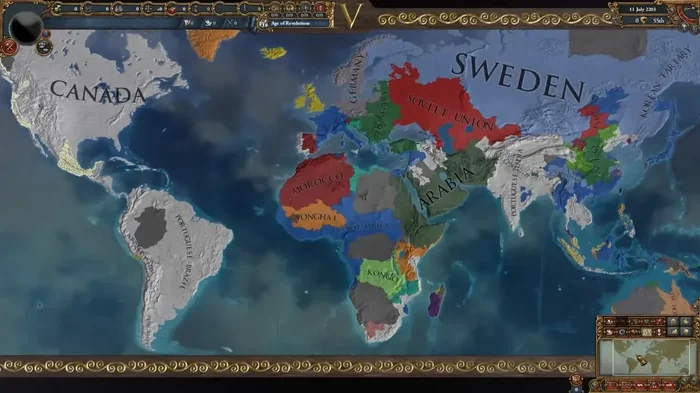
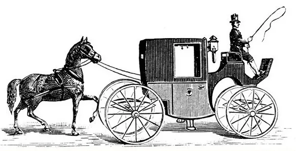

# The Poverty of Realism

**Date:** 2024-03-10  
**Author:** Kamil Kazani  
**Source:** https://kamilkazani.substack.com/p/the-poverty-of-realism   
**Copied to Keg:** 2026-06-26 

---

No political theory in the world is less real than the so called “realism”.

Why?

Because it ignores the domestic politics.

“Realism” explains literally every big political decision with the foreign policy concerns. Powers compete for hegemony, and their rivalry triggers international conflicts. Why did Russia, or China, or the United States did this or that? Because of their relation to another state. Obsessed with the foreign policy, “realism” looks at this world exclusively through the lenses of the interstate competition.

*The realist vision of politics*

Now what would be the blindspot of this approach? The intrastate competition, of course. That is the domestic politics. Seeing the state as a basic unit of politics, “realists” effectively treat is a monolith with no internal structure or dynamics. This is what makes realism so shockingly delusional.

The thing with the powers is that they are run by the **powerful**. That is, by the powerful people and interest groups. So, to understand the behaviour of a power, you must first investigate concerns of the powerful.

## What you should know of the powerful?

1. Nobody becomes powerful by accident

2. To become powerful, you must first win the power

3. And then you must defend it from all kinds of the pretenders

4. Defending the power takes at the very, very least 99% of your attention

5. If you cannot fulfil this bare minimum, you will be ousted out by a more single-focused pretender

Our basic assumption about the powerful must be that they are focused solely and exclusively on defending their power. Otherwise, they would have been ousted out long ago. If they are not, this indicates they are absolutely power-obsessed.

As the powerful are preoccupied with guarding their power, their attention is necessarily focused on defending their position at home. **That means that the goal of their policy must lie in the domain of domestic politics.** Foreign policy, on the other hand, constitutes merely an instrument for securing one’s position at home.

### Domestic politics is the goal

### Foreign policy is an instrument

*The "realists" get it wrong*
