# The Procedurality

**Date:** 2022-5-24  
**Author:** Kamil Kazani  
**Source:** https://kamilkazani.substack.com/p/the-procedurality  
**Copied to Keg:** 2022-06-24   
**Copier Note:** Ends with either ruthless meanness or black humor   

---

Captain Farid Chitav and 11 his subordinates from Russian National Guard (Росгвардия) refused to go to Ukraine. Their regiment from Krasnodar was ordered to Ukraine and they objected. They said that they don't have a foreign passport and thus can't cross a Russian international line legally

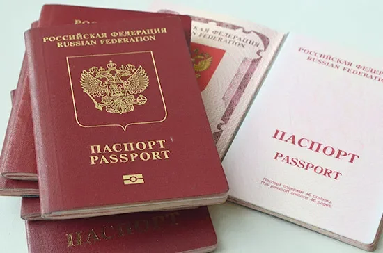

They said that crossing a Russian international line without a foreign passport (you need for travelling abroad) is illegal and constitutes a felony 322 УК РФ. Thus they can't go. What happened to them? They were all fired. Now they are suing their commandment for firing them illegally

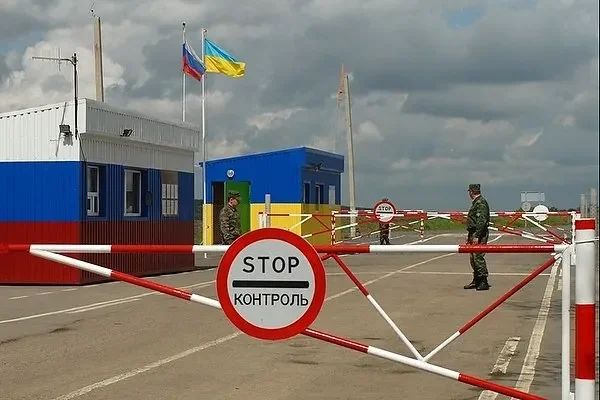

That's very important case for understanding Russian state and well, almost any state in this world. When we are analysing its practices we often use imbecile, worthless categories like "legal/illegal". Let me introduce much better term - "procedural"

Practices of state, including the Putin's state may not be legal. They absolutely can break Russian law on every level. But that does *not* mean they're random or chaotic. Nope. They're very procedural, to the far greater extent than most people can imagine

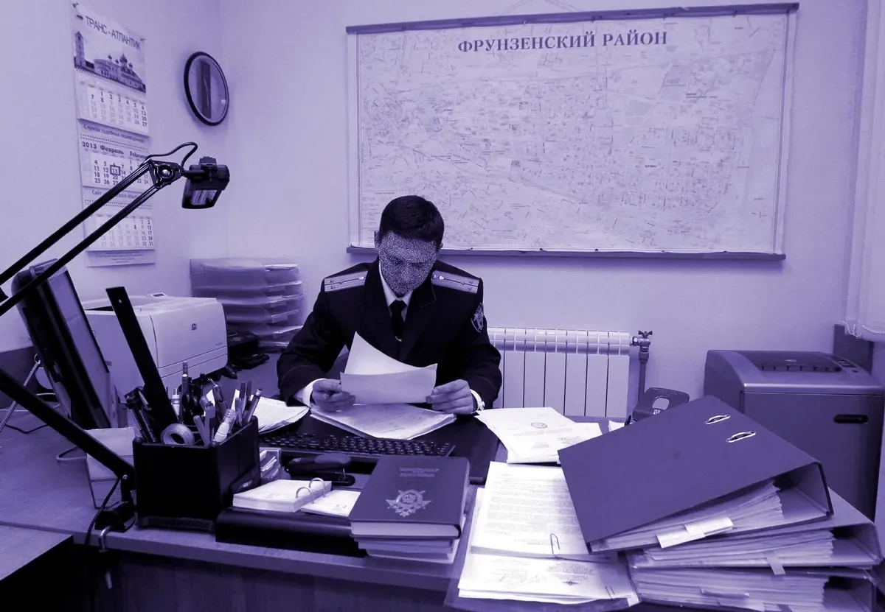

We often describe Kafka's works as absurdist. But they're not absurdist at all. Kafka was a highly competent and successful bureaucrat valued by his superiors. His narratives are logical. Except it's not human logic, it's procedural logic, logic of a machine

Consider Stalin's purges. They're often described as illegal. Yes, Stalin's state security broke Soviet laws on every level, constantly. But that doesn't mean their actions were chaotic or fully capricious. Nope. They followed the procedural logic of bureaucracy

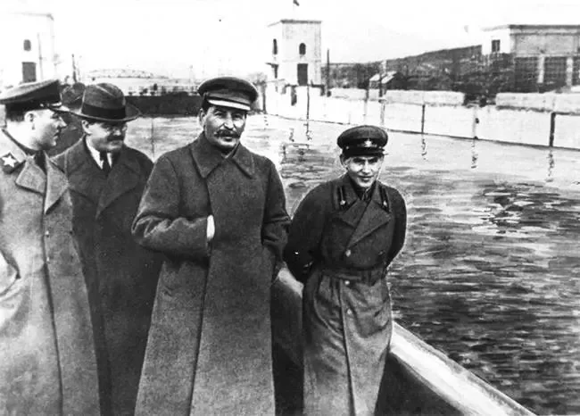

What was the procedure of Stalin's purges? To convict someone, you need to get a confession, "The Queen of all evidences" as Vyshynsky told. After you did get it, you can do whatever with a convict. But you still must get it, there's no way around that. He must confess himself

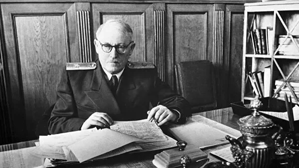

Of course that created a vast grey zone. It was difficult for the state security to convict you without confession. So they would interpret it very, very broadly. If you say something (however innocent), they can qualify as a confession, you're done. So just shut up or deny everything

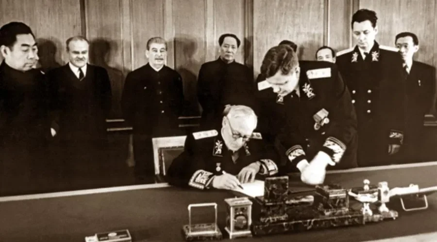

A real case. In 1935 NKVD got an anonymous letter that a bunch of Kazan University students are gathering for political talks. One of them is mocking Stalin and Communism, others laugh. Of course, all of them were arrested and interrogated - what did happen exactly?

The guy who joked about Stalin denied everything. His several other friends denied, too. Nope, he's a true Communist and would never mock Stalin, no way. Only two guys responded - yeah, he indeed mocked Stalin, we heard it. Guess what? These two went to jail, others were released

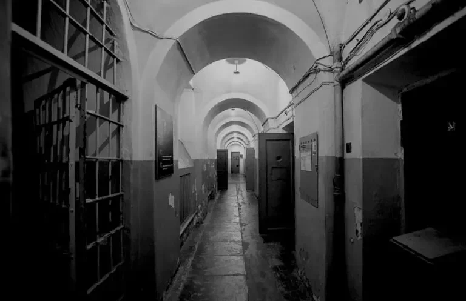

From a human perspective this doesn't make sense. Obviously these two were more willing to cooperate with NKVD and betray their friends? And yet, only they were punished. From procedural perspective it makes total sense. You need to get *anything* that passes for a confession

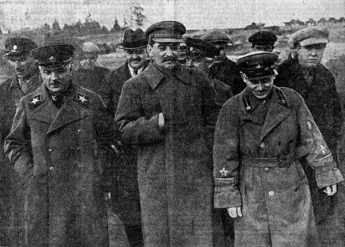

"I didn't mock Stalin" - doesn't pass for confession

"I never heard him mocking Stalin, he's praising him every day" doesn't pass

"Yes, he mocked Stalin all the time, he's a traitor" - it is a confession. You just confessed you listened to the treasonous talk. To the GULAG you go

Again from a standpoint of human logic that's crazy. You jailed these two for listening to treasonous talk but released the one who did this treasonous talk? Yeah, but he didn't confess. Procedural requirements are not met. They did. Procedural requirements are met. Go to GULAG

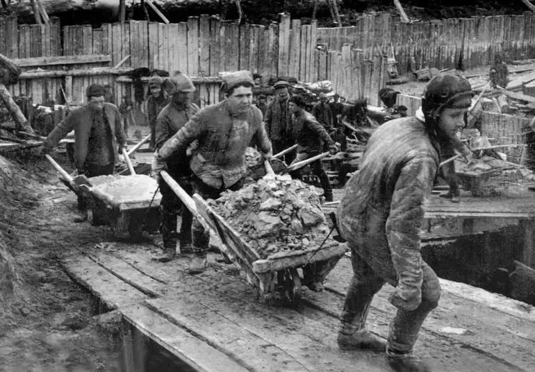

NB: do NOT apply human logic to bureaucratic procedures. "That doesn't make sense, that's crazy", no, it's you who are crazy. It's insane to believe you are dealing with humans. Nope. You are dealing with gears of bureaucratic mechanism, working according to a procedural logic

Let me give you another example. In 1937 the Great Purge and mass arrests started. One guy in St Petersburg belonged to hereditary nobility. He knew he'd be arrested. And they'll be extorting confession. He can deny everything, but they can torture him to death. That's suboptimal

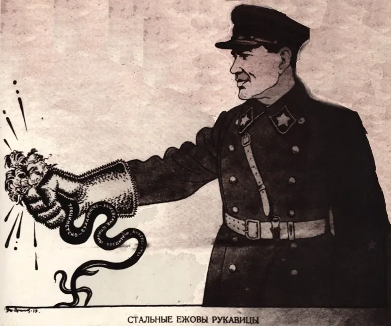

He acted smarter. During the night he went to a store, broke a window. Got inside, filled his bag with valuable stuff and waited for police to come. They came, arrested him. He got 5 years of jail for robbing a store *as a regular criminal*. That's how he survived the Great Purge

If he lived his regular life, he'd be arrested as a political criminal. That's the end. They'd investigate him for more political crimes, adding more charges. But now he chose a different track. Regular criminal track was so much better than a track of a spy/counterrevolutionary

Again that doesn't make sense from a human perspective. If he did a robbery, why can't he also be a spy? But procedurally speaking, it makes total sense. Normal criminals are prosecuted by the regular police. Politicals - by the state security. These two different tracks don't cross

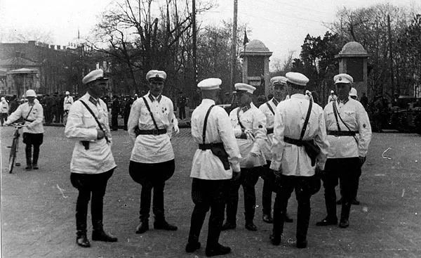

So you either wait till state security comes to arrest you for a political crime. Then you are done. Or you can go commit a regular crime to be arrested by regular police. Then you get on a regular criminal track and will be safe in jail. The NKVD won't come for you, you're saved

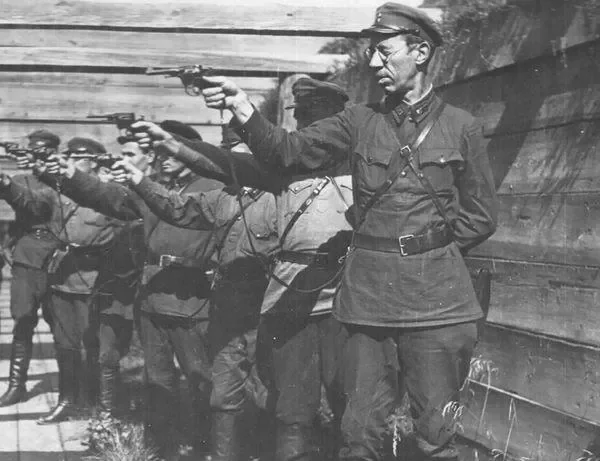

You must fully understand that you're not dealing with humans but with a machine. It's working procedurally, according to a certain algorithm which is ofc full of bugs. Which can be exploited. That's what constitutes much of difference between the poor and the rich in any country

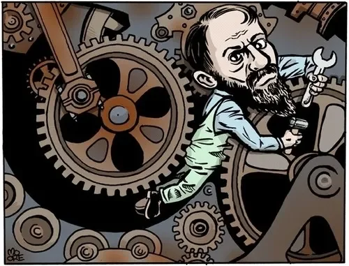

The poor stupidly believe they're dealing with humans. Thus they "follow the rules" and get fucked. Absurd as it may sound, they may even feel proud for following the law, following the common procedure without demanding any special privileges. Of course these idiots will suffer

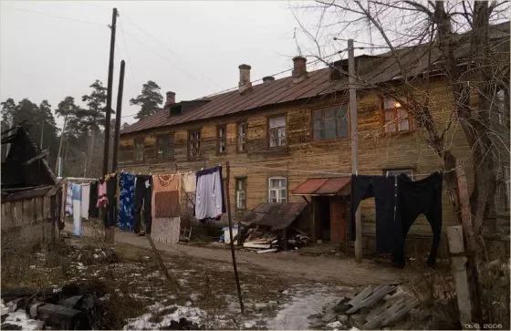

The rich know they're not dealing with humans but with a procedural mechanism. It can and must be hacked, you just need to find a bug. And they will actively look for it. A rich *will* demand a special treatment and make a case why he deserves it. And they often get it

Consider the Z-invasion. Who was sent there? Well, children of imbecile broke ass bumpkins who are so brainless that they actually follow the law. Well, if the law says everyone should serve in the army, defend the country, who am I too object? Thus they feed their children to Moloch

Rich children don't get to the trenches no matter what is written in the law. Why? Well because smart people don't give a fuck about the law. For a smarter, successful person the law is not a moral imperative, but a stupid algorithm to be hacked. And they'll figure out how to hack it

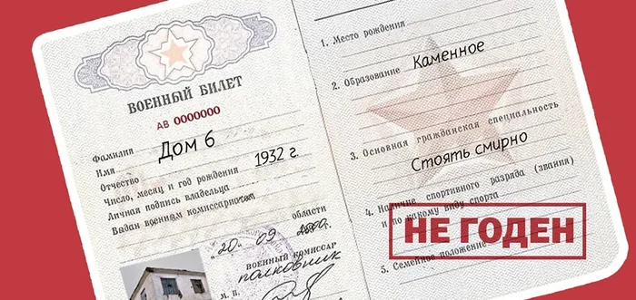

Let's sum up. Legality/illegality is a bad tool for analysing human institutions. Too much moral pathos, too little substance. Much better concept is procedurality. Policies may not be legal, but they absolutely are procedural and thus have bugs which make them easy to hack

Rich smart people correctly understand this procedural nature of human institutions. Thus when dealing with them they have only one question - how to hack them? They are actively looking for bugs, find them and get what they want, in the forms of "privileges" or special treatment

Dumb and poor on the other hand do not understand this procedural nature of institutions. They're so stupid that they see not only human qualities but even a sort of moral authority in a soulless machine. Of course they get fucked

That's how it should be

