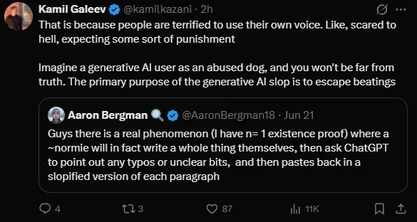

# Notable @kamilkazai Tweets on x.com

**Date:** 2025-08-02  
**Author:** Kamil Kazani  
**Source:** https://x.com/kamilkazani viewed from Emmanuel Schalk's twitter login.  
**Copied to Keg:** 2026-06-09 

**Oct 29, 2025**  
In response to question about Ukraine being able to give Russia a symbolic vistory:
> No. Status & prestige is a zero sum game, and the war - at this point - is being fought for status and prestige. The only thing Ukraine could do to *permanently* end the war is kneel. That includes accepting their fault for the war, and paying some reparations to Russia

**Dec 20th, 2025**  
In response to a comment accusing Kamil of ignoring the political interests of Siberian natives
> Siberian natives are a low status, low prestige and with a (partial) exception of Yakuts completely powerless minority with no leverage in any form at all. Either under Putin, or under the “democratic” (= majoritarian) system it is more or less irrelevant what they are thinking

**June 15th, 2026**  
In response to the following comment:  
*The most manipulative but effective thing I’ve ever done in my life was when I read an article about how children moderate their behavior to protect their self-identity, so if a child believes he’s smart, for example, he’ll intentionally study and try to do well to protect his image of himself.*

*Anyway, I would pull children aside with behavioral issues at church and tell them, “David (obviously fake name), you’re such a kind person and so good at listening. I can see that in you. Thank you for always listening.” “Little Annie, thank you for taking such good care of the babies around you. You’re going to be such a good big sister. Can you be in charge of watching Sally?”*

*They would ALWAYS behave afterward. ALWAYS. Worked like a charm. Morally questionable because it wasn’t initially true, but I kind of willed it into existence. Tbf, I did think that they had that in them or I wouldn’t have tried.* 

*Will publish longitudinal results of this method once my kid is old enough to report back.*

Kamil Kazani:

> And the truth is, that everyone in the world needs (and will have!) a positive image of themselves. Everyone, no exception. And yes, that includes the outgroup as well. The outgroup too needs to see itself as fundamentally good, and will see itself this way no matter what you do   
Lots of politics nowadays, is focused on choosing some sort of an outgroup and making them feel bad about themselves. And not just bad, but irrevocably, eternally bad, with no escape
 
(usually justified by some sort of 'pain' they caused to others, in the past)
  
That is the most common kind of political demand in today's world, *and that demand is absurd*
 
It is very important to understand that. Your pain is not worth that much. If you want to make a real world change, you need first of all stop making absurd demands
  
What you can do, is suggest them another *positive* image of themselves. Which makes perfect sense. They need positive image, and they have it, but you can give them another, provided that it's also positive
 
Positive self-image (which they have) can be replaced by another one

**June 28th, 2026 #1**  
In response to another tweet mocking someone's personal experience.
> The most important thing you must keep in mind is to never ever sneer. Never ever. In fact, if you register a sneer in someone’s comment, that means the comment is dumb & they are as wrong as they could be
> 
> Sneer -> dumb as hell

**June 28th, 2026 #2**  
In response to someone complimenting a Mandani's political skills 
> 1. Lots of people don’t believe in anything
> 2. Lots of people who believe in something find it necessary to act performatively repulsive
> 3. Having convictions and *not* feeling obliged to always ostracize, like, everyone, is extremely extremely rare
>
> (like unicorns)

**June 28th, 2029**  
> The dumbest accusation of all is an accusation in hypocrisy
>
> True consistency requires - at the basic minimum - omniscience and omnipresence (+ also, probably omnipotence). Short of that, every life lived is full of hypocrisy and self-contradictions, in words and actions

**June 30th, 2026 #1**  
In response to someone who has observed a writer going through the effort of writing a paper with their own voice and then choosing to replace their voice with an AI voice.
> That is because people are terrified to use their own voice. Like, scared to hell, expecting some sort of punishment
> 
> Imagine a generative AI user as an abused dog, and you won't be far from truth. The primary purpose of the generative AI slop is to escape beatings

**June 30th, 2026 #2**  
Discussing the autobiography of Vasily Vasil'evich Nalimov (1910-1997), a prominent Russian mathematician and philosopher.
> When in Gulag, V. Nalimov saw a large group of teenage girls, who escaped home from the forced labor, and were all gulaged
> 
> It goes without saying that they were all distributed among the administration, guards, and thieves-in-law immediately upon their arrival to Magadan
> 
 > Very interesting book of memoirs. Recommended:

**July 2nd, 2026**  
Kazani has, at least for me, interesting opinions about how people lie and how they are incapable of lieing when it is opposite their inner beliefs. On this day he tweets something cynical for me but probably standard for most political players.
> 1. It is permissible to lie for a good cause
> 2. Every cause is good
> 3. Lie is always permissible

**July 13th, 2026**  
Reposted a personal attack against a public figure.
> Everyone, remember:
> 
> No argument starting from 'he is' is worth listening to. Every time, you here these two words, just mute or throw it to the trashbin
> 
> That is an ironclad BS marker> 1. It is permissible to lie for a good cause

**July 15th, 2026**  
Reposted a twitter user's post describing Stalin as dumb because he didn't find philosophers interesting.
> That is basically how he obtained power. Everyone thought this guy is dumb, so no one got alarmed until his power became absolute & total. And even *then*, many (like Trotsky) simply could not believe
> 
> Stalin was not dumb. It's human opinions that are dumb. Reject human opinions
> 
> Actually, this is not an exception, but rather the rule. Every time, political succession is determined by the consensus of the elites, they always choose the least alarming (-> weakest, dumbest, least charismatic, most timid) candidate
> 
> Occasionally, they get it wrong

**July 18th, 2026**  
Responding to the following post "Might be superficial observation of mine but EastAsians don't seem to be given over to navel-gazing or inward reflection in the way Westerners are prone to"
> No, I don't think this is true
> 
> People are the same everywhere
> 
> If it looks otherwise, that is because of the cultural & linguistic barrier. Once you start talking to them, you realise that people in Shandong, in Phoenix and in Makhachkala are all exactly the same
> Circumstances are different, yes
> 
> People are not

**July 18th, 2026**  
Responding to the following post: 
"It’s become impossible to ignore the way that people online make fun of my opponent for things that have nothing to do with her policies or politics. It’s unkind and unhelpful. If you support me, please stop. 

Focus on the issues: Congresswoman Stevens has welcomed corporations and special interests to support her. She votes to send our money abroad while Michiganders struggle. She’s bought by DTE, Blue Cross, Big Tech, and Big Pharma who pick our pockets. AIPAC, Trump-aligned billionaires, and corporate PACs are spending $50,000,000+ to support her. 

THOSE are the issues. We don’t need to be unkind to be honest."
> Daily reminder
> 
> For a politician, acting like an asshole is ten thousand times preferable to apologising. The former may be a downside, sometimes, a big downside. It depends. The latter is an immediate & guaranteed catastrophe
> 
> Best thing you can do, is to be firm & polite. Look at Zohran Mamdani, who towers over the pathetic American political landscape like the mountains of Uganda. Much to learn from
> 
> But. If you can’t be firm & polite, be just firm. That may suffice. Or not. Again, it depends
> 
> The most important thing is to never ever ever be overly accommodating. That is a guaranteed catastrophe, in 100% of cases. People may follow a fool, they may follow an asshole, but they will never ever follow a whimp

**July 20th, 2026**  
In response to previous post about Chess Legend Kasparov being pro-Israel.
> So, basically:
> 
> 1. Eastern Europeans are desperate for pride & self respect
> 2. They know self respect is best won in Levant by killing brown people
> 3. And won by people like us, our friends & neighbours from Odessa, Gomel, Krasnodar
> 
> That is the best story of success they have
> I would say that Israel is so popular in Eastern Europe - that is, to the east of Berlin Wall - because the image of us being real whites killing the dirty natives (and killing easily!) resonates with the deepest desires of an Eastern European soul

Later Kazani responds the following comment:  
"At least for the eastern Europeans that were under the Ottomans, I think a big factor is also a historical enmity with Muslims, which in today’s politics is amplified.  I could say here most Bulgarians are not gonna be sympathetic to Muslims."

> No, this kind of explanation is never true. Historical grievances do not explain modern conflicts. They are always activated or deactivated based on the *current* situation and current necessities, or just current vibes