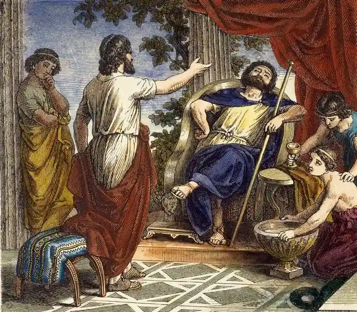
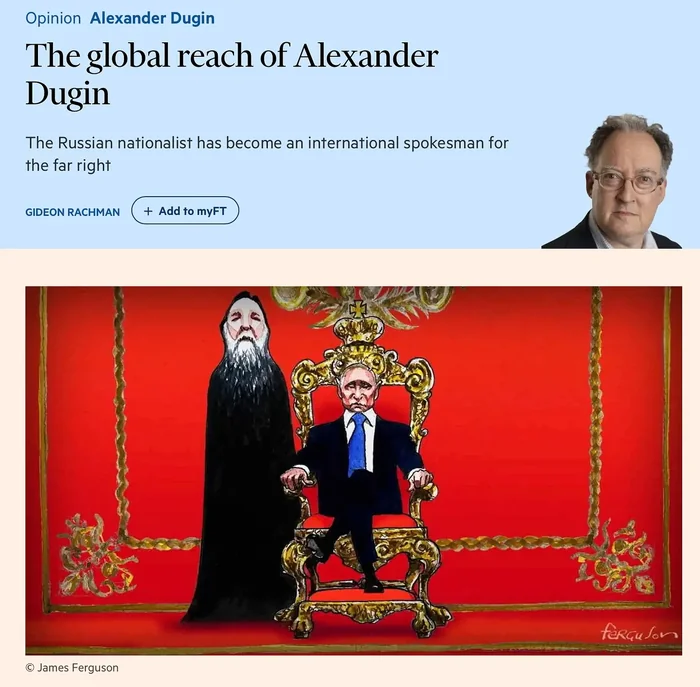

# What intellectuals can and cannot do

**Date:** 2024-07-31  
**Author:** Kamil Kazani  
**Source:** https://kamilkazani.substack.com/p/what-intellectuals-can-and-cannot  
**Copied to Keg:** 2026-07-31 

---

I was recently asked:

Hey, Kamil, does anyone in Tatarstan’s government listening to you?

I think it is a very good question. And not only regarding me, personally, but like, generally speaking. A good question to start a discussion on what a public intellectual can, and cannot do. On the limits of their capabilities

Because the answer is of course not

Obviously, not, but it is still worth explaining why the answer is necessarily negative.

When you are imagining a government, you must understand that it is led by the people who are quite old. Most of its leading figures are in their 60s, or 70s, or sometimes even older. Which means: their personalities have been fully formed, and formed like decades ago. By this point, they became very & very rigid, and are not going to update their worldview. That is simply not going to happen

That is one reason. Another reason would be: people in government, are very, very busy. Once you are in power, 99% of your effort and attention will be focused on keeping the power, and guarding it from all sorts of greedy competitors. People who are in power for long, are usually very smart about it, and develop ingenuous, 5D chess schemes to secure their position. But that also means that their vision is very tunnel-like, fully focused on securing what they already have.

For a U.S. congressman that may mean, suceeding in the next elections in their Oklahoma or Minnesota, at whatever cost necessary. Suceeding at reelection, that is what they are solely concerned about. For a politician in Russia, succeeding in the extremely byzantine court intrigues. That is all they care about and nothing else matters

So, when you put it this way: are you being listened to by the very old people fully focused on maintaining their current position and status, the answer is obviously no.

So who does listen to me then?

Well, it’s a very good question.

In general my impression is, that people who listen to me, tend to be much, much younger & not currently on any positions of power (of if they are, then on the very junior positions, somewhere at the foot of the ladder).

Now there is nothing peculiar, or unusual about my case. In fact, it is very typical.

The core audience of a public intellectual, are the people who are relatively young, and not very busy. And not very busy means: not in power. Or at least, not on the very top of it. Because people on the very top of hierarchy seldom consume much intellectual content at all.

Now that shows the great mistake of intellectuals, mistake they are committing since the days of Plato. Intellectuals think: I want to exert influence, I want to affect the affairs of the world. Now what I need to do is to find some person who already has power, some king, or tyrant, or whatever, and advise him. Tell him what to do. That’s how I will exert my influence, without holding reins of power, personally.

They are wrong. This scheme that sounds so good in theory, does not work in practice

That is because - even in theory - it does not sound good. Just think about it. There is something treacherous, something fundamentally dishonest in the whole scheme. You want a resource (power), but you do not want to earn, or maintain it. All you want is to find another person who already has what you want, and use his resource, instead of earning your own.

It is like instead of learning how to drive & acquiring a car, you would find some friend with a car, and then try to use him as your personal taxi, 24/7. He may oblige, once or twice, if he really likes you, but in the end he will tell you to fuck off.

And that is exactly how every ‘philosopher’ who tries to use a king as his personal cab driver ends up. At the very best, the king will send him away.

So, basically, the thing with finding a king and telling him what to do, is that this idea is:

a) extremely extremely extremely sexy in the eyes of all intellectuals, worldwide

b) does not work in reality

*That is how Alexander Dugin became so popular internationally. All he does is selling porn to Western shitlibs. Tell them, you are a mysterious philosopher advising a powerful king, and they will believe you immediately. Why? Because they are salivating at this idea. Dugin is selling them porn, but to produce a bestseller porn, you need to correctly identify their desires. Dugin is smart enough to do just that*

--

That however, raises a question. If the scheme with finding a king, making him your obedient puppet, and telling him what to do is so obviously dumb, and self contradictory, than how come all the intellectuals are believe it? And have been believing it, for centuries and millenia? And not just regular chaps, but people like Plato?

I think I know the answer. This (absurd, non-working) scheme is so popular because **it is offering immediate results**.

Because, what would be the alternative? Plant your seeds patiently, laboriously, over the years and decades, to may be never even see the final fruit of your work? That sounds painfully realistic, and that is, indeed, how it usually works in reality.

Diderot, Voltaire, Rousseau, and other top podcasters and twitch streamers of the 18th c, they surely made a massive impact [on the great revolution](../ch40_pop_phil/kazani_how_to_study_politics.md) that would enflame France in the end of the century. *That is all the fault of Voltaire, that is all the fault of Rousseau,* these usual royalist complaints may sound as a wild exaggeration, but they are actually not.

Political turmoils of the late 18th c France were not caused by the twitch streamers, of course, they were initiated by the dukes, and princes of blood. But - unless for the streamers, and for the accumulated effect of their streams, accumulated over the course of many decades - these aristocratic shenanigans would produce a more aristocratic form of government, at best. The apocalyptic crisis, that was to destroy them all, was neither envisioned, nor desired by the aristocracy. And the idea to destroy every single societal institution, and to reestablish it all anew, based on a single logical principle, was certainly not conceived by the aristocracy either. It was conceived by streamers, on Twitch, and from there - it materialised into reality.

Except, except the streamers never saw any of it. Voltaire, and Rousseau died in 1778. Diderot died in 1784.

And the revolutionary events, that can be dated back to as early as to 1787, did not assume their truly apocalyptic character till the year 1789.

Which means, that neither of the top-rated podcasters of the enlightenment ever saw a final fruit of their work.

***

Now that explains how and why do intellectuals get enamoured with such an obviously stupid idea like becoming a secret adviser for a powerful king. Because, you see, when people stick with something obviously stupid, that is seldom because the people themselves are stupid. In fact, many of them are not. That is usually because the idea sounds so sexy, so attractive, that it turns off their critical sense.

And the attractiveness of this idea, is that it seems to be offering quick results, within your own lifetime. Whereas, the objective reality seldom offers anything like that.

That, however, does not mean that intellectuals are powerless. In fact, their cumulative influence can be enormous, mind blowing. But - and this is an important point - it can be exercised only **in the very long run**. Long, very long run. Over the long run, the effect of their work can be absolutely [terraforming](../ch40_pop_phil/kazani_how_to_study_politics.md).

But in the long run, we are all dead