# Why does Russia attack?

**Date:** 2026-02-08  
**Author:** Kamil Kazani  
**Source:** https://kamilkazani.substack.com/p/why-did-yeltsin-destroy-chechnya  
**Copied to Keg:** 2026-06-30   

---

In 1991, Moscow faced two disobedient ethnic republics: Chechnya and Tatarstan. In the political discourse of the era both were viewed and treated on pair, as two very similar cases. Both were the Muslim majority autonomies that refused to sign the Federation Treaty (1992), insisting on full sovereignty instead. In both cases, Moscow was determined to force them into obedience one way or another

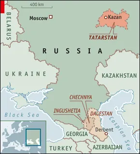

Still, Moscow’s policy towards these two could not be more different. Chechnya was invaded, its cities razed to the ground, its leader assassinated.

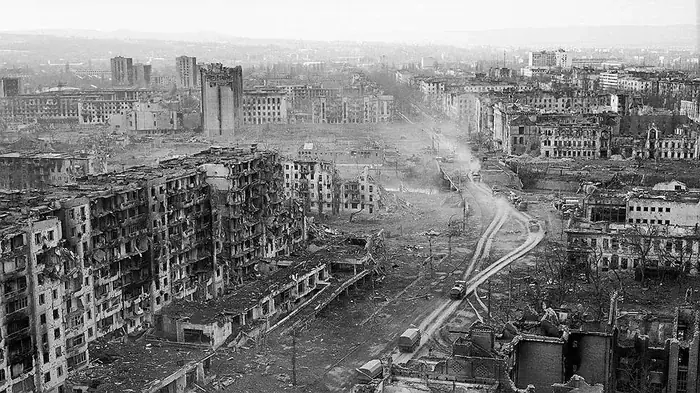

Tatarstan, on the other hand, managed to sign a favourable agreement with Moscow that lasted until Putin’s era.

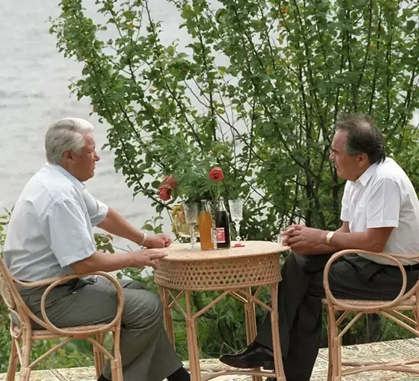

The question is - why.

Retrospectively, this course of events (obliterate Chechnya, negotiate with Tatarstan) seems to be logical and nearly predetermined. But it was not considered as such back then. For many, including many of Yeltsin’s own supporters it came as a surprise, or perhaps even as a betrayal.

Let’s see why:

By the early 1991 - in the last days of the Soviet Union - both Chechnya and Tatarstan were run by their respective “First Secretaries”. That is Communist officials leading the local Communist organisation and running the region in the name of the Party.

Tatarstan was run by Shaymiev, Chechnya - by Zavgayev.

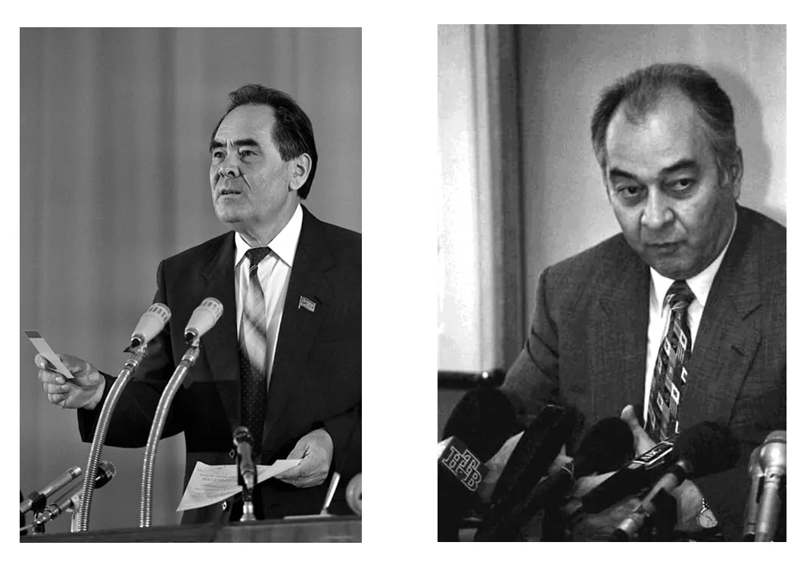

*Shaymiev (Tatarstan) Zavgaev (Chechnya)*

That was the era of fierce and largely undercover struggle for power in Moscow. In that struggle, both Shaymiev and Zavgaev cautiously supported the enemies of Yeltsin, assuming they would win.

They were both mistaken.

In the events of August 1991, it was Yeltsin who took over, and assumed power in Moscow.

*(Now the thing to understand about Yeltsin, is that he had been yet another First Secretary, now of Sverdlosk Oblast - who ended on top in the struggle for power)*

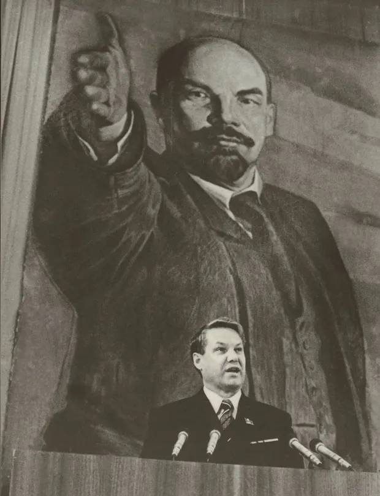

Yeltsin (Sverdlovsk)

So what we have is a bunch of First Secretaries scheming, plotting, entering into coalitions against each other, some of these coalitions winning, others - losing. In August 1991, Yeltsin won, and ended on top.

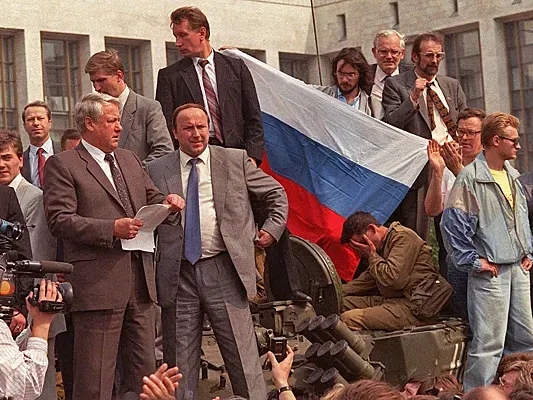

Now simultaneously with a coup in Moscow, there was another coup happening - now in Chechnya.

Dzhokhar Dudaev had been a Soviet general. Specifically, an airforce general commanding a division of strategic bombers

*(which were supposed to carry nuclear weaponry in case of the world war)*

A high ranked, well-trusted and well-networked Soviet military of Chechen ethnicity.

Who was recruited by Yeltsin, as a tool against the anti-Yeltsin leadership of Chechnya

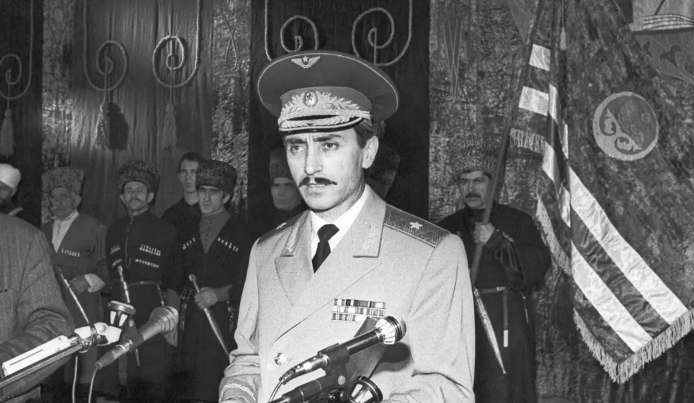

In May 1991, Yeltsin’s own deputy brings Dudayev to Chechnya, as an ice-breaker against the local Communist leadership.

With Yeltsin’s help and assistance, he quickly builds his own power base, acting as a counterweight to the local First Secretary (obedient to Gorbachev).

When the August 1991 hits, the First Secretary of Chechnya stands with the anti-Yeltsin’s forces, while Dudayev declares for Yeltsin. In a few days of protests, he takes power from Zavgayev and assumes control over Chechnya.

So, when the Russian tanks rolled into Chechnya, turned it into a pile rubles that came as a surprise to many Yeltsin’s supporters, in that time. Based on the experiences of 1991, they were used to see Yeltsin and Dudayev as the allies in a sort of a democratic revolution. Some of the pro-Yeltsin political partisans would expected him to deal with Dudaev, and to unleash his wrath on Shaymiev. When he did it exactly the other way around, they were genuinely surprised.

Punish a friend, deal with a foe,

That’s how it looked to the political partisans in Moscow

But let’s try to make out a theoretical model, explaining the actions of Yeltsin

I suggest the model of mandala. The model of distributed political authority parallel to what we had in the classic and medieval South and Southeast Asia

Basically, there is a kingdom. Let’s say Thailand

Today we would draw it with a uniform colour, as a monolith

But that wouldn’t be true or accurate, historically speaking

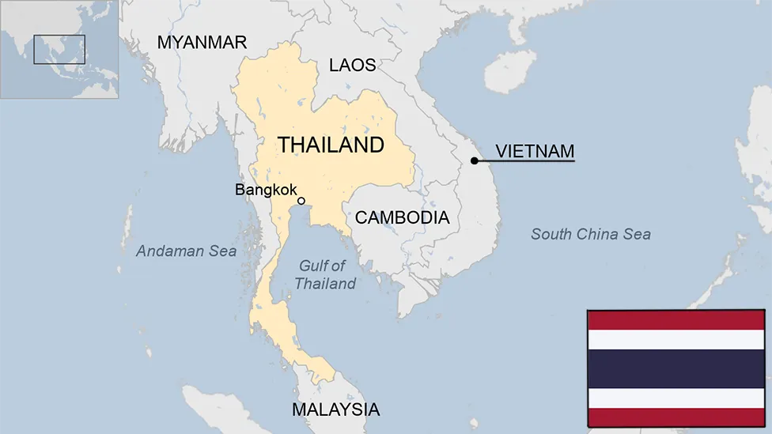

Historically, Thailand would not be uniform. It had a structure

You have the metropole. Then you have core provinces. You have external provinces. You have tributaries. The further away from the centre (imperial centre), the looser the control

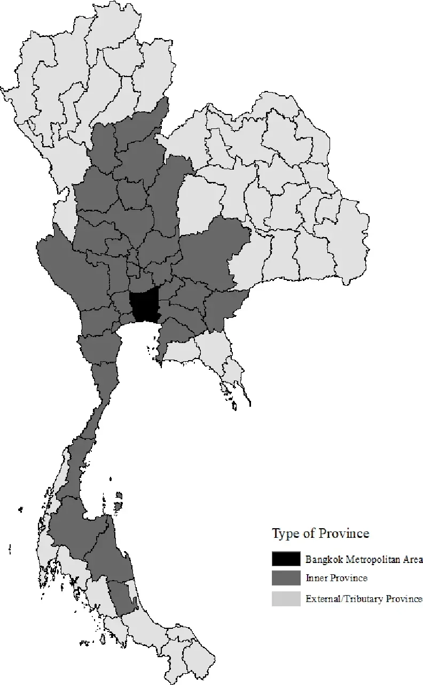

So, basically you can represent Thailand as a number of districts, presided by the district of Bangkok, and all involved into the bilateral relations with Bangkok. Some of these districts enjoy more autonomy, others - less

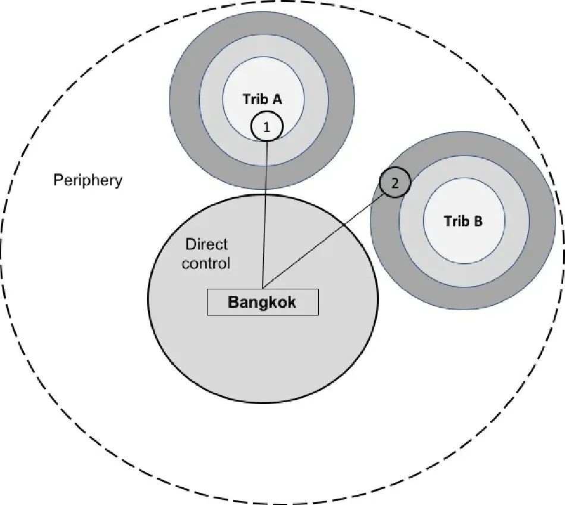

Now let’s apply the same scheme to Russia

The suzerain district of Moscow has bilateral relations with vassal districts of Chechnya and Tatarstan

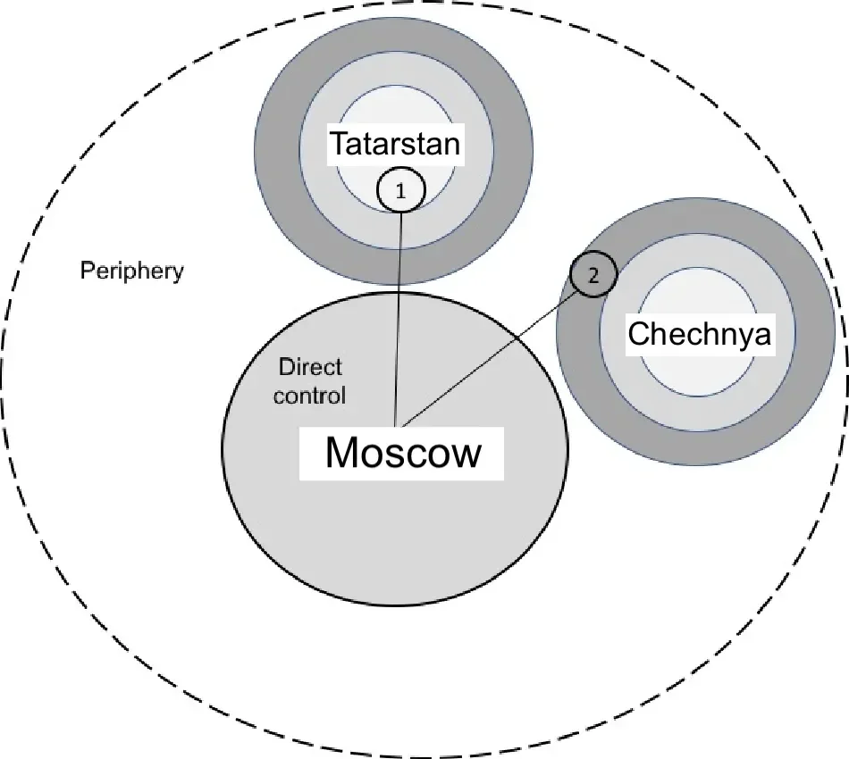

Now the thing to understand - and this is a very important thing to understand - is that the relations between these districts are not purely diplomatic, and may not be fully understood in terms of relations between a chief in Moscow and a chief in Chechnya

There’s more than that in a picture. The thing with a vassal district - let’s say Chechnya - is that the internal developments in Chechnya affect the internal political balance in Moscow, whatever two leaders think of each other and whatever their personal relations are.

How so?

Through the power of impressions

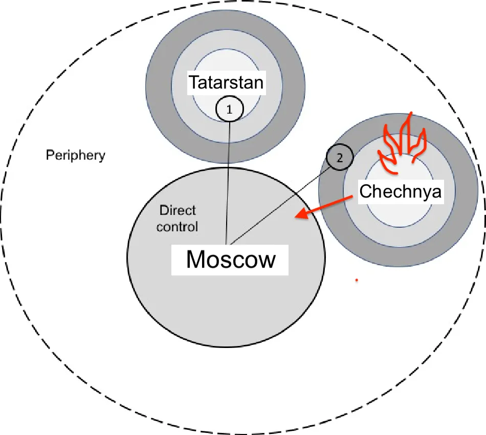

People are governed by impressions, and governed to a far greater degree that almost anyone would be ready to admit. One reason of why Moscow might want to destroy a vassal principality is not that its leader is “unfriendly” or is dealing with the foreign enemies, but simply that the internal happenings in that district produce bad, destabilising effect in Moscow.

What Muscovites see in Chechnya can and does affect the political situation in Moscow.

And what do the Muscovites see in Chechnya?

They see that the **military can do a political takeover.**

That a general can overthrow the local political leader, and assume his place. And it works out. Nothing special happens, the life just continues.

### A military general can execute a coup and get away with that

That is the main political takeaway the Muscovites draw from Chechnya

And, what is the worst of all, the Muscovite generals do

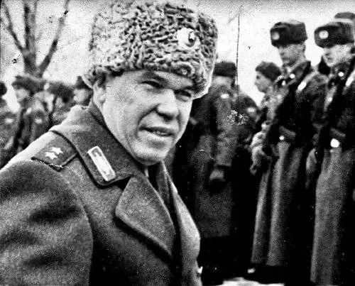

Since 1917, the main problem of any political regime in Russia had been control over the army. Every regime, and every political leadership was absolutely paranoid about not allowing even a thought about the potential military takeover. The military must absolutely submit to the civilian leadership, and not be allowed even a grain of power. They knew very well, that if they give them a bit of power, they would take all.

So, they went at great length not to give any.

*(Such as establishing the all-powerful, all-permeating, million-numbered state security force, with its own structure of governance, and its own heavily armed troops, trained for controlling the military and suppressing any attempt of a military coup)*

And Yeltsin knew very well, that his only threat is the loss of control over his own military

And that was a problem with Dudaev

He took a pro-Yeltsin stance. He overthrew an anti-Yeltsin party secretary

BUT

The idea that a military can overthrow a politician and take his place - in any - absolutely any district of Yeltsin’s mandala was a direct challenge, direct threat to the Yeltsin’s rule over the district of Moscow. Because it was giving wrong ideas to his own generals.

Chechnya had to be destroyed. Dudaev was not killed because he was a Chechen, or because he was a separatist. He was killed because he was a Soviet general who has displaced a local First Secretary in one of districts of the mandala, thus greatly alarming the First Secretary in the district of Moscow.

Chechnya had to be destroyed because it showed a successful example of a military coup.

Again, comparison with Tatarstan can be very telling.

In the events of 1991, the President of Tatarstan Yeltsin took anti-Yeltsin stance. Yet, that did not prevent their later rapprochement, because the internal happenings in Tatarstan did not disturb the political balance in Moscow. Shaymiev, after all, was a First Secretary (of the Communist Party). And Yeltsin was another First Secretary. That one First Secretary is ruling over Kazan, did not directly undermine the power of another First Secretary over Moscow.

## Conclusion

If I were to give a short summary of this text, I would say that people are governed by impressions, and tend to imitate what they see. This makes the supreme power wary of the impressions the subordinate districts are allowed to make. One major reason of why the supreme district of Moscow may be hostile to its subordinate district, is that it is simply showing a bad example to others, including to Moscow itself. A military coup, for example, does not just destabilise one district, but destabilises the entire mandala, including - worst of all - the capital district itself.

Now another thing to consider is that the frontiers of imaginary mandala of Moscow go far, much further the official, legally recognised frontiers of the Russian Federation.

