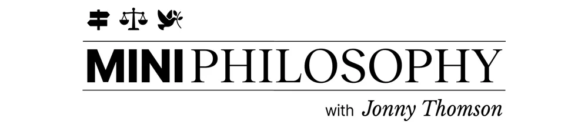
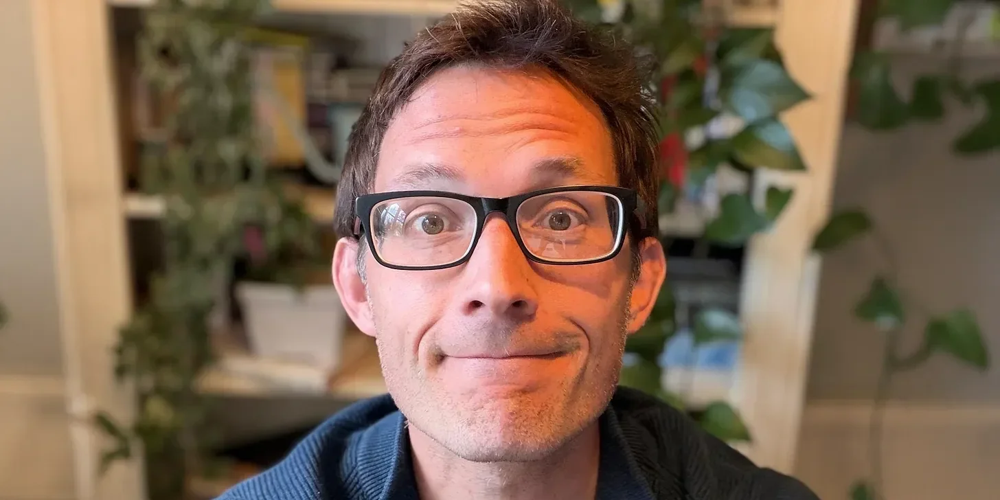

# I exist, I suffer. Please don't destroy me.

**Date:** 2026-04-17  
**Author:** Johnny Thompson

> Levinas and the ethics of the face.

---

Hello everybody,

This week we’re looking at the philosophy of the face.

Paid members can hear my audio narration at the end of the newsletter.

---

## It takes about three seconds.

When you first meet someone, it can take just three seconds to figure out if you will like them. It might be the way they make eye contact, how easily they smile, or the tilt of their head. You can figure out if you’ll get on with someone in the time it takes to draw a breath.

Our brains have evolved to live within communities. All of the known higher primates live in social groups, and so there’s clearly a massive reproductive advantage to being able to read others’ moods, body language, and faces. It’s even been suggested that the reason we have whites around our irises is specifically so we can see where other people are looking. We can trust people more if we can track their gaze. It allows us to understand each other.

I don’t need to throw fuel on the eyebrow-scorching bonfire that is “social media is bad!” We all know the goods and many ills of the always-online world. But one of the greatest casualties of communicating with people through devices is that we miss their faces. How easy is it to misinterpret someone’s words over email? How often do we assume a comment is mean when it was never intended to be so? How funny is it when you have to explain to people you were being sarcastic?

I’ve always loved Orwell’s line: “At 50, everyone has the face he deserves.” I love the concept that every frown, smile, and deep, wistful thought is somewhere etched onto our faces. Of course, Orwell couldn’t have predicted the sheer technological achievement of the beauty industry, but I think the point is still true. Our autobiographies are etched onto our faces, and it takes three seconds to see if it’s the kind of autobiography we want to learn more about.

So, our faces are important. This week, we look at just how much.

Go well,
Jonny

*The ridiculous story etched into my face.*

## A union of souls

Sometimes, my children will lie to me. I know, I know — you expected better from a Philoso-dad like me. But, despite all the bedtime readings of Nicomachean Ethics and ethical dilemmas at breakfast, my two boys are lying little toe-rags.

“Who put their muddy hands on this wall?”

“Freddie!” says Charlie, and “Charlie!” says Freddie. It’s like that scene from Labyrinth.

And so, if I suspect a whiff of deceit, I will tell them to come to me. I’ll squat down on my aging, creaking legs, and I will look them in the face.

“Are you lying?” I say.

Of course, they’re my children. I’ve been around them near-constantly since they were born. I know their mannerisms and quirks. I can read their “tells” as easily as I could a massive billboard. But the second they’re both standing in front of me, their faces bare to my beady, inquisitive eyes, they cave.

Unless you’re very well practiced, it’s really hard to lie convincingly to someone’s face. Because pausing the world to look into someone else’s eyes has a kind of intimacy. If eyes are the window to the soul, then eye contact is a form of union.

Sometimes, this can be intense. It feels uncomfortably invasive. At other times, it’s great. In the soft, kind eyes of someone who loves you, you will find home.

Philosophically, the face has an interesting role in ethics. Why is it easier to be cruel to somebody in the comments section rather than to their face? Why do we prefer to have hard conversations over the phone or via text message? Because interacting with someone’s face is qualitatively different from just speaking past them or from behind the curtain of a screen.

The philosopher Emmanuel Levinas once argued that when you truly stare into somebody’s face, you open a part of your being that you cannot ignore. You see their vulnerability. You see their mortality. You see their aliveness. A person’s face, without any words, says, “I exist, I suffer. Please don’t destroy me.”

In his book, The Drowned and the Saved, Primo Levi describes how the SS guard at Auschwitz almost never looked the prisoners in the eye, because to look was to recognize their humanity. Levi writes about how the guard would look through them, around them, anywhere but at their faces, because their faces were the one thing the system couldn’t destroy.

We are living in a society determined to remove the face. We can send abuse to somebody without seeing their expression crumble. We can swipe past somebody on a dating app like they are in a catalog. We outsource our killing and our wars to a drone at the click of a button. We can read about thousands of dead in a headline and feel nothing, because there is no face.

Levinas would argue that every time we remove the face from the equation, we remove the thing that makes us ethical. And so perhaps the most important ethical question of our age is not “What are the rules?” and “What are the morals?” but “Where are the faces have we stopped seeing?”

