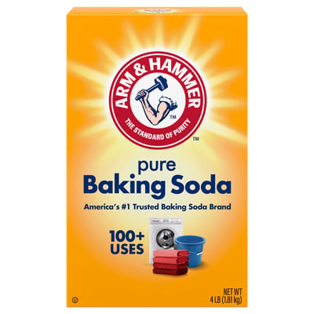
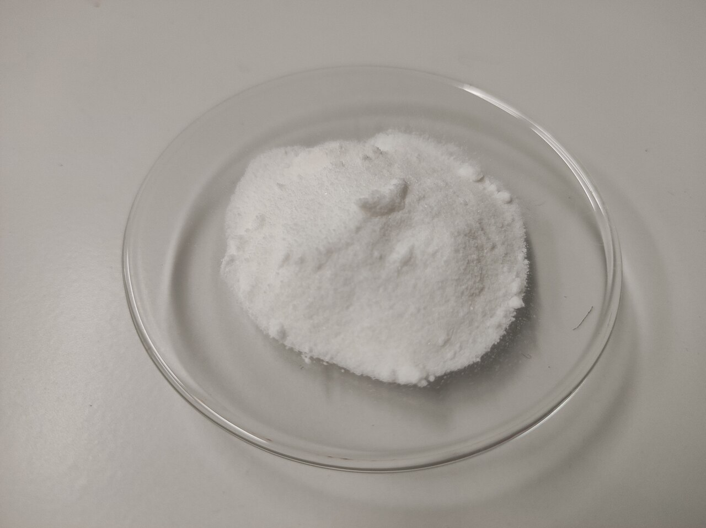

# On Buying and Giving Baking Soda

**Date:** 2026-06-14  
**Author:** Emmanuel Schalk

`Give, share, take sodium bicarbonate.`

---

Sodium Bicarbonate, also known as "Baking Soda", is the most important commodity for Kegology. 

Before I tell you why let me talk about personal experience. 

I use it to keep my children healthy. It's good for cleaning the dishes, the kitchen surfaces, the laundry. It's used in baking. It very effective and very cheap. It can be stored almost indefinitly and put in any container. One day I'll figure out how to make toothpaste with if it. 

Let's talk about why it is not the dominate cleaning agent.

If it's so cheap and so effective why are there so many other cleaning products? Well some of the other products are more effective in different scenarios. But mainly it's because those other products don't really cost that much and they smell better.[^1] Which is nice but can be ignored.

Let's list the reasons why sodium bicardonate is awesome:

1. It is useful to every household.
2. It can be shipped easily and has a distant expriation date.
3. It is a powder that can be combined or divided easily.   
4. Making it is easy. It's been done for more than 200 years.   

The only other commodity that is comparable is salt.

You might ask: *Ok, great. Why do I care?*

> ### Because it's the easiest way to start an local economy with your neighbor.

It's a commodity you and your neighbor can usefully use to every day. Everybody needs clean clothes, a clean kitchen, a clean bathroom. It can be easily divided and shared, A tupperware container of sodium bicarbonate can put in other containers of whatever size with just a spoon.

Now the reasonable question would be: *Ok, but why would I want to do that?*

Here's the answer:

> ### Because it would help your family[^2]'s future.

That's kinda dramatic. But its true. Consider all the households that buy products with dollars or money easily converted from dollars. Assume 2 billion households worldwide. Assume that each of those households buy on average 1000 different products a year[^3]. Thats 2 trillion product-household connections that are defined by the dollar. If that number were to be reduced to 1.5 trillion the dollar would be less important.

How could you reduce the number of product-household connections? By not buying as a household but buying for more. Buy more sodium bicarbonate and ask your neighbors to accept it from you and use it. If your neighbors ask you to accept some from them say yes. Nothing wrong with mixing to batches of sodium bicarbonate.  

Baking soda is so cheap it's possible for a middle class family to buy the monthly baking soda needs for 100 families. It's the best product to create a connection. A raceway. 

"Raceway" is term used in industrial settings to describe connection that takes things from one place to another. A raceway can move gases or liquids in pipes, carts on a track, boxes on a conveyer belt. When a raceway exists it's possible to move physical material from point A to point B. 

> #### Stronger the raceways with your local neighbors are, the weaker the external authority is.

If you don't have any raceway with your neighbors, if you don't share anything at all, Baking Soda is a great way to start. Maybe salt is a better one. Everyone needs salt. But salt has a problem: it never goes bad and it's easy to inspect. 

Why would it be good that Baking Soda can go bad and it's difficult to inspect for quality? 

> ### Because that means you have to have trust. 

Baking soda can be low quality. When it's low quality it's not an effective cleaner. It fails to clean clothes. 

Right now I get my baking soda from CostCo. I trust CostCo's quality. However nobody in my life is the Face of CostCo. I am trusting the regulatory authority of the United States government. I don't know the head of the FDA. So really the Face I trust for the quality of my Baking Soda is the President of the United States. But if my neighbor gives me Baking Soda. My trust is now in my neighbor. I don't know who he trusts. Maybe he knows the head of the FDA, or he's a chemist and he does his own tests of the product. But now he's the Face of my Baking Soda. And when my Baking Soda works, and I use it every day so I'll notice if it doesn't, my trust in my neighbor grows.

And what if I use Baking Soda mixed from all my neighbors? And it works. What does it mean if my clothes are clean?

> ### It means I can trust my neighbors. 

If I can trust my neighbors and I have a minimal viable raceway with them. Something very important is now true. 

> ### We can build a new future.

The first part can be scary. It requires diving into a new world. Going to your neighbor, knocking and saying "Please take some sodium bicarbonate from us and use it."

Maybe next you'll say "Let's buy butter in bulk, give me some money, I'll give you your share when it comes in."

It'll be a new future. There will be fewer transactions and the central authority will have less insight into what is happening in the world. 

Give, share, take sodium bicarbonate. 

---

## Footnotes

[^1]: I have no professional experience selling or marketing clean products. I just think this is pretty obvious. 

[^2]: Family is whoever in the world you love and sacrifice for.

[^3]: I don't know a better number