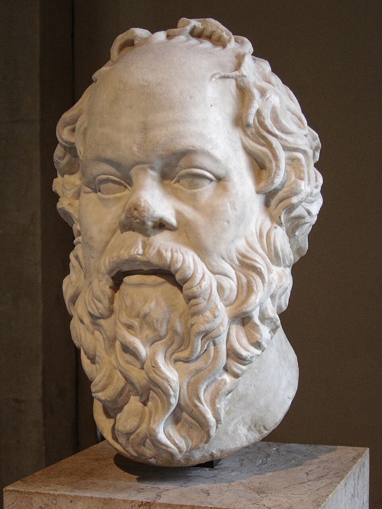

# Kegology's Wheel Model of Power

**Date:** 2026-06-09  
**Author:** Emmanuel Schalk

> What do you want?

---

Reality is infinitely complex. Any model of reality will be wrong. But some models are better than others. 

KegWheel Theory is a model of understanding power and predicting how to affect change. The easiest introduction to the concepts of KegWheel is from the writings of Kamil Kazani. The quickest primer is Kazani's article on the [Mechanics of Revolution](../ch40_pop_phil/mechanics_of_revolution_kazani.md).  

As with any grand theory the hardest thing is deciding where to start.

### Start with Family

The primary unit of history is the FamilyUnit. Ronald Syne wrote ""In all ages, whatever the form and name of government, be it monarchy, republic, or democracy, an oligarchy lurks behind the façade."[^1] Families can have one dominate personality but is better to think of families rather then personalities.[^2] The trusted advisors can often have enourmous influence. Kazani claims that one of the people in the Yelstin family portrait above made Vladamir Putin king. It wasn't Boris Yelstin. Do you know which one it is? Do you know his name? I don't.

### "...Status & prestige is a zero sum game..." Kamil Kazani on Twitter[^3]

Define the term *'prestige'* the way Kazani and others do. It is something a family either has or doesn't. It cannot be shared.  

There are families that have all the prestige. If they cooperate no other families will ever have prestige. The coalition will rule forever. However thse families do not trust each other and are in competition. To gain an upperhand a family can decide to get help others outside of power. The non-prestigious family provides a service and the prestigious family invites the non-prestigious family into power. 

Define the term *'invitation'* as the act of giving prestige to a family. Always done in service.

This invitation is only extended when the prestigious family has no other choice. Expanding how many families have prestige is dangerous. The fewer players in the game the easier it is to win.

### The KegWheel

Any system of centralized power can be represented as a KegWheel. A wheel that turns. Families go up in prestige, families go down in prestige. New famlies can enter power and gain maximum prestige and old families can exit power and lose all prestige. Most of the time the oligarchy is remarkable stable. The advantages of prestige are considerable. There are an endless army of those without prestige who will do absolutely any service for chance of getting prestige[^5]. Promises don't even have to be made, the implication is obvious. 

Before Beto O'Rouke became a congressman he joined a group of us who played Ultimate frisbee in El Paso, TX. Suddenly our small group had multiple new people interested in playing. They were perfectly nice people, some like Jay were very good, but they weren't there for ultimate frisbee. They were there in case Beto O'Rouke became president. But he never did. Maybe because Barack Obama never gave him an invitation the same why Obama received an invitation.

Here's an important insight I gained from reading Kazani:

### If a family feels they are losing prestige they will sow chaos.

I'm unable to remember which article talks about this. But the concept is that if there is chaos then that means there a chance the a family's decline could change. No one knows the future and chaos makes the future more unknowable. So of course chaos may could make the family fall faster. But better to try then not. *Stay rich or die trying*

Kegology Term *'Fall'*: The opposite of a invitation, when a family loses prestige, usually because no other family with prestige wants to invite them.

To be clear having money and prestige are different. Those with money will try to buy prestige and may succeed. But it's not automatic or even likely. There is little incentive for those with prestige to sell it, better to break promises and just keep asking for more money. Relationships matter more than money.  

On the flip side:

### If a family feels they are gaining or keeping prestige they will increase the power of govt.

If a Family is confident of their prestige helping the government become more powerful makes sense. They have a share of the pie and if the pie gets bigger their slice gets bigger. 

### What to do if you want something and you're without prestige. 

Don't do what Plato did. From "Wisdom of Lenin" by Kazani:

> Plato of course wanted power. Nearly all intellectuals do. But - wanting power - he was childishly naive and childishly delusional about how he will get it. For what was his plan?
>
> 1. Approach a tyrant, a man in power
> 2. Become his advisor, a power behind the throne
> 3. Use the tyrant to execute your plans & your agenda
>
> The plan is incredibly common (countless intellectuals would try it in centuries after Plato), and incredibly naive. Because obviously no man in power needs a 'philosopher’ who would be telling him what to do. That is an absolute self delusion on behalf of a philosopher. A tyrant needs servants, he needs slavs, he - if he is mentally healthy - needs a jester. But philosopher? No, he does not really need one.

*Plato is a Top 5 philosopher, but don't let the beard fool you, He was also a toddler.*

Instead, proposes Kazani, if you want prestige earn it. Start with a podcast.[^4] One day you may be useful enough that someone with prestige will invite you in. However...

Not only is that plan of action unlikely to succeed it probably also corrupting. Remember the title of this section is *What to do if you have an agenda* not 'What to do if you want power'.

You don't have to be in power to get your agenda enacted, you just need those in power to enact the agenda. Lobbyists can succeed.

1. Gain the support of the families going up by treatening to make the total power of the KegWheel less. Make their pie smaller.
2. Neutralize 

### An agenda is things you want. Families going up with prestige will give you those things if it increases their prestige and the general power of the KegWheel. Families going down will 

Closing statement connects to tagline.[^2]

---

## Footnotes

[^1]: Ronald Syne (died 1989), Historian and Author of Books on Roman History. 

[^2]: Basically all leaders have family they trust. To understand how someone of prestige got that prestige Kazani in [The Able Family]("../ch40_pop_phil/kazani_the_able_family.md") 

[^3]: Taken from conversation about Ukraine [Kazani Twitter Posts](twitter_kazani.md)

[^4]: [Wisdom of Lenin](../ch40_pop_phil/wisdom_of_lenin_kazani.md)  

[^5]: [The Vassal Strategy](../ch40_pop_phil/skallas_the_vassal_strategy.md)  

## Biblography

#### Easy reads:

How power is structured: [Mechanics of Revolution](../ch40_pop_phil/mechanics_of_revolution_kazani.md)  
The real work of leadership: [How Stalin Came to Power](../ch40_pop_phil/how_stalin_came_to_power_kazani.md)  
How slavish devotion is perfectly reasonable: [Suffering from Success](../ch40_pop_phil/suffering_from_success_kazani.md)  
How slavish devotion is perfectly reasonable: [The Vassal Strategy](../ch40_pop_phil/skallas_the_vassal_strategy.md)  
Why Plato's power behind the throne plan fails: [Wisdom of Lenin](../ch40_pop_phil/wisdom_of_lenin_kazani.md)  
Why and how thinkers matter: [Kill the Scholars](../ch40_pop_phil/kill_the_scholars.md)  
Tyranny protects power: [Why Putin killed Navalny](../ch40_pop_phil/kazani_putin_navalny.md)

#### Foundational Texts:

Totality and Infinity (1969) by Emmanuel Levinas  
Levinas's writings on Time as explained by second-hand dealer of ideas Partially Examined Life [Episode 146: Emmanuel Levinas on Overcoming Solitude](https://partiallyexaminedlife.com/2016/09/05/ep146-1-levinas/)  
Lecture printouts and notes from 2012 Levinas class taught at UTEP by Jules Simon

#### Philosophical Father
Dr. Jules Simon, Professor of Philosophy at University of Texas at El Paso, retired.   
(I haven't had a chance to show him Kegology, hopefully he can make some time for me.)
