# Kegology Theory of Power/History

**Date:** 2026-06-09  
**Author:** Emmanuel Schalk

> Are there kneelers in the wheelers?

---

Here's a footnote describing the foundations of KegWheel[^1]. Read it if you want. 

Now where to start? Let's start with the most important concept in Kegology. 

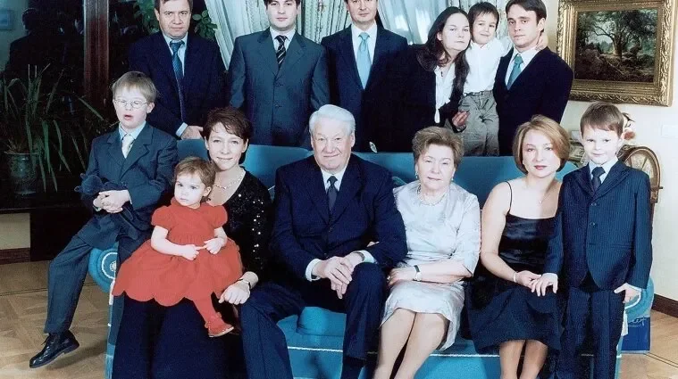

### Start with Family

The primary unit of history is the Family. Ronald Syne wrote ""In all ages, whatever the form and name of government, be it monarchy, republic, or democracy, an oligarchy lurks behind the façade."[^2] The oligarchy can be best understand as a bunch of Families. A Family can have a dominate personality as letter but is better to think of families rather then personalities[^3] because the trusted family members of a leader can often have enourmous influence. Kamil Kazani claims that one of the people in the Yelstin family portrait above made Vladamir Putin king. It wasn't Boris Yelstin. Do you know which one it was? Do you know his name? I don't. Still I know the Family: The Yelstin Family. A Family that had **prestige** but then it fell from power.

#### "...Status & prestige is a zero sum game..." Kamil Kazani on Twitter[^4]

Let's define the term *'prestige'* the way Kazani and others do. A Family with Prestige has status, influence, power. It is something a family either has or doesn't. It cannot be shared. 

The Families that have all the prestige are those in power. If they cooperate no other families will ever have prestige. The coalition will rule forever. However (most of the time) these families do not trust each other and are often in conflict. The conflict can be reasonable or unreasonable. Petty jealously, revenge or lust can motivate a conflict. To gain an upperhand a family can decide to get help from others outside of power. The non-prestigious family provides a service and the prestigious family invites the non-prestigious family into power. 

#### An 'invitation' is the act of giving prestige to a family that has none.

Logically this invitation should only be extended when the prestigious family has no other choice. When they feel they are in danger of losing prestige. Expanding how many families have prestige is dangerous. The fewer players in the game the easier it is to stay in the game. Let's visualize these dynamics with some diagrams:

### The Wheel

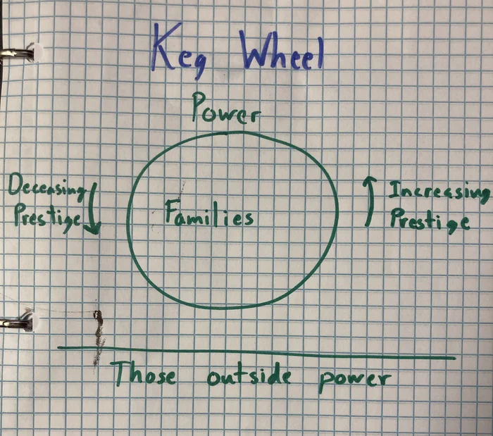

Any system of centralized power can be represented as a Wheel. A wheel that turns. Families go up in prestige, families go down in prestige. New famlies can enter power and gain maximum prestige and old families can exit power and lose all prestige. Most of the time the oligarchy is remarkable stable. The advantages of prestige are considerable. There is an endless army of those without prestige who will do absolutely any service for a chance of getting prestige[^5]. Promises don't even have to be made, the implication is obvious.

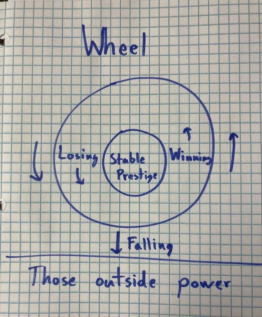

As the Wheel spins there are families that are winning and families that are losing. On the other hand some families lose so much they fall out of power. There is also the "stable" section of the Wheel where families have prestige but their influence does not increase or decrease.  

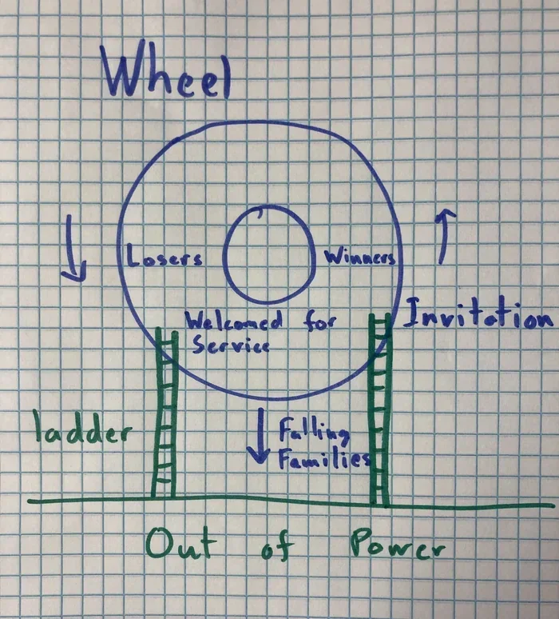

Families only invite those out of power into power when they can provide a service. Something useful to them. That is represented here as a ladder. Those out of power must have a large ladder to even be considered for invitiation. The obvious example is money. Money is not equal to prestige. But if someone in power wants money then a a ladder made of money can result in an invitation.

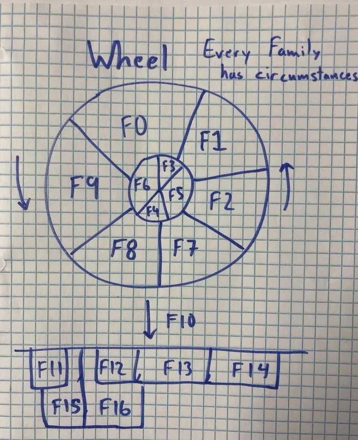

Here's a diagram showing what the Wheel could look like with distinct families in power, falling out of power, and totally outside of power.

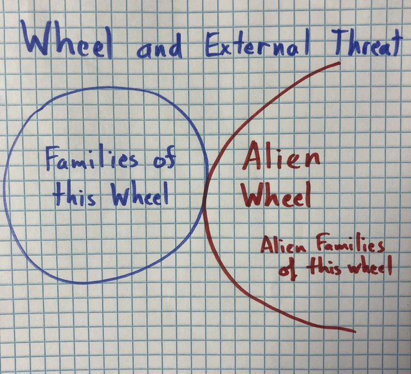

Here's what it looks like when a Wheel touches another Wheel. Each system of power requires institutions, customs, language so precise that they can only be described as "alien". 

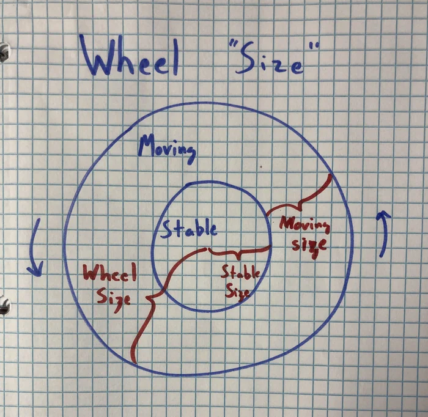

Let's introduce a few terms here. For every Wheel we can describe

1. Wheel Size: The radius of the Wheel. Represents how powerful the wheel is.
2. Stable Size: The radius of the stable part of the Wheel. Represents how powerful the stable part of the wheel is.
3. Moving Size: The width of the moving part of the Wheel. Represents how powerful the moving part of the wheel is. (Moving_Size = Wheel_Size - Stable_Size)

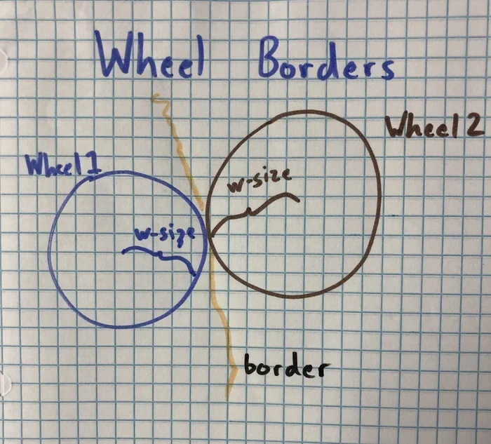

Between two Wheels that touch they can create a border. All systems of power want to have a border to define the alien and the non-alien.

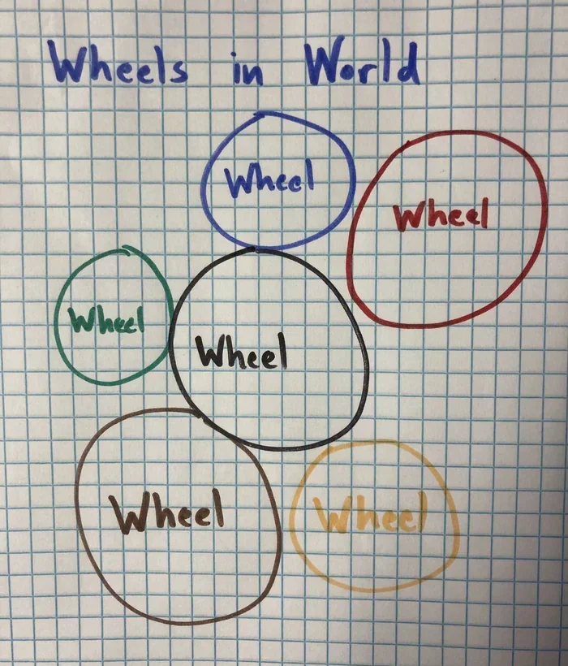

Here's a scenario where many wheels of different color exist in touch. (Please excuse the circles that don't actually touch others, if they're really close they're meeant to touch.)

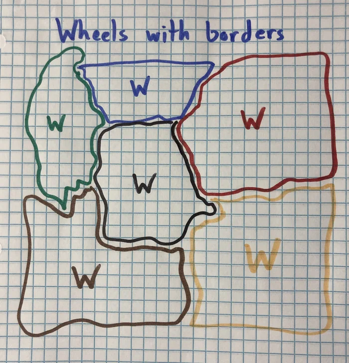

Here's the same scenario with many borders. Notice the space between borders. That's a feature that is important, because borders can become their own space that's weirdly part of both wheels and not.[^6] Wheels exist against each other. 

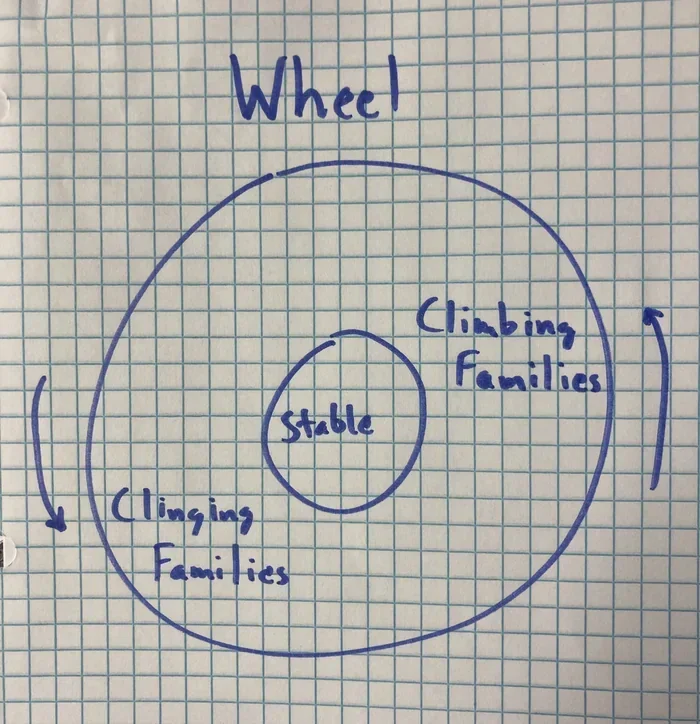

Going back to the Wheel: As the wheel turns there are winners and losers and the stable. The winners are climbing and the losers are clinging. What are they climbing? Each other of course. 

- Winning families are climbing on top of the stable families and losing families. Stable ones can take it. Losing ones can't. Climbing on top of losing families isn't very effective. Because they're going down. Climbing on stable ones is effective.
- Losing families are clinging to stable families and winning families. 

**How to get The Welcome.** 

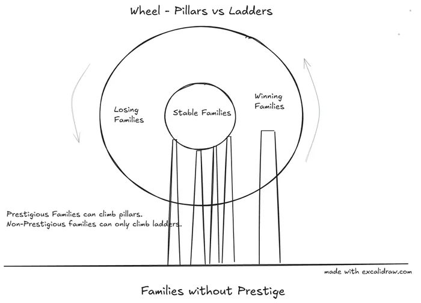

A family with prestige will only consider inviting another family into power if they have a "load-bearing" ladder. Something the prestigious family can climb. The welcoming family is climbing on top of the invited family and invited family is clinging to the welcoming family. Naturally this means that if you're trying to climb from out of power into power you can't go any higher then the welcoming family. For now. 

From this point on use 

These are the mechanics of the the KegWheel. Next part will address what it's good for. 

---

## Footnotes

[^1]: Reality is infinitely complex. Any model of reality will be wrong. But some models are better than others. KegWheel Theory is a model of understanding power and predicting how to affect change. 

The easiest introduction to the concepts of KegWheel is from the writings of Kamil Kazani. The quickest primer is Kazani's article on the [Mechanics of Revolution](../ch40_pop_phil/kazani_mechanics_of_revolution.md). 

Fundamentally KegWheel is not motivated by Kazani's cynical worldview but by Emmanuel Levinas's MetaEthics. The source of all truth is the Face of the Other in front of me. It can get pretty complicated so leave it for later. I just wanted to declare this. It is important to me.

[^2]: Ronald Syne (died 1989), Historian and Author of Books on Roman History. 

[^3]: Basically all leaders have family they trust. To understand how someone of prestige got that prestige see Kazani in [The Able Family](../ch40_pop_phil/kazani_the_able_family.md) 

[^4]: Taken from conversation about Ukraine [Kazani Twitter Posts](../ch40_pop_phil/kazani_twitter.md)

[^5]: [The Vassal Strategy](../ch40_pop_phil/skallas_the_vassal_strategy.md)  

[^6]: I grew up on a border so I have strong opinions about these things. 

## Biblography

#### Easy reads:

How power is structured: [Mechanics of Revolution](../ch40_pop_phil/kazani_mechanics_of_revolution.md)  
The real work of leadership: [How Stalin Came to Power](../ch40_pop_phil/kazani_how_stalin_came_to_power.md)  
How slavish devotion is perfectly reasonable1: [Suffering from Success](../ch40_pop_phil/kazani_suffering_from_success.md)  
How slavish devotion is perfectly reasonable2: [The Vassal Strategy](../ch40_pop_phil/skallas_the_vassal_strategy.md)  
Why Plato's power behind the throne plan fails: [Wisdom of Lenin](../ch40_pop_phil/kazani_wisdom_of_lenin.md)  
Why and how thinkers matter: [Kill the Scholars](../ch40_pop_phil/kazani_kill_the_scholars.md)  
Tyranny protects power: [Why Putin killed Navalny](../ch40_pop_phil/kazani_putin_navalny.md)
Levinas and the Face intro: [I exist, I suffer. Please don't destroy me.](../ch40_pop_phil/thompson_i_exist_i_suffer.md).  

#### Foundational Texts:

Totality and Infinity (1969) by Emmanuel Levinas  
Levinas's writings on Time as explained by second-hand dealer of ideas Partially Examined Life [Episode 146: Emmanuel Levinas on Overcoming Solitude](https://partiallyexaminedlife.com/2016/09/05/ep146-1-levinas/)  
Lecture printouts and notes from 2012 Levinas class taught at UTEP by Jules Simon

#### Philosophical Father
Dr. Jules Simon, Professor of Philosophy at University of Texas at El Paso, retired.   
(I haven't had a chance to show him Kegology, hopefully he can make some time for me.)
